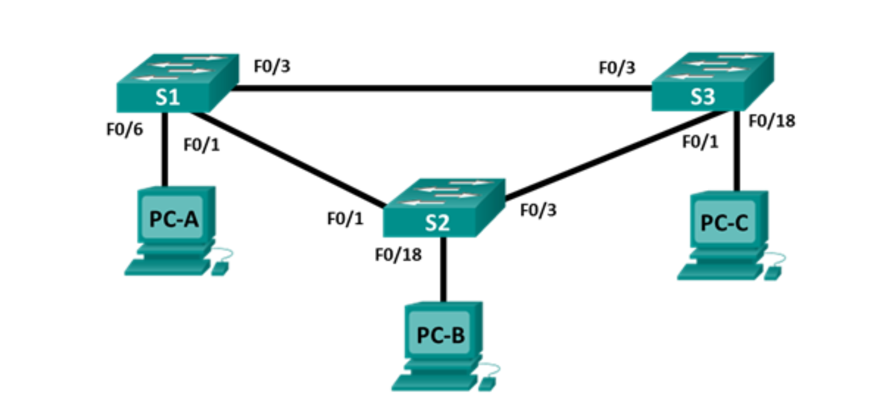

Лабораторная работа. Настройка расширенных сетей VLAN, VTP и DTP
---------

Топология
---------

Таблица адресации
-----------------

| Заголовок таблицы | Интерфейс | IP-адрес     | Маска подсети |
|-------------------|-----------|--------------|---------------|
| S1                | VLAN 99   | 192.168.99.1 | 255.255.255.0 |
| S2                | VLAN 99   | 192.168.99.2 | 255.255.255.0 |
| S3                | VLAN 99   | 192.168.99.3 | 255.255.255.0 |
| PC-A              | NIC       | 192.168.10.1 | 255.255.255.0 |
| PC-B              | NIC       | 192.168.20.1 | 255.255.255.0 |
| PC-C              | NIC       | 192.168.10.2 | 255.255.255.0 |

Задачи
------

Часть 1. Настройка VTP

Часть 2. Настройка DTP

Часть 3. Добавление сетей VLAN и назначение портов

Часть 4. Настройка расширенной сети VLAN

Общие сведения/сценарий
-----------------------

По мере увеличения количества коммутаторов в сети усложняется управление сетями
VLAN и магистралями. Протокол VTP позволяет сетевому администратору
автоматизировать управление сетями VLAN. Автоматическое согласование магистралей
между сетевыми устройствами управляется динамическим протоколом транкинга (DTP).
Протокол DTP включен по умолчанию на коммутаторах Catalyst 2960 и Catalyst 3560.

В этой лабораторной работе вы настроите магистральные каналы между этими
коммутаторами. Также необходимо будет настроить сервер и клиентов VTP в одном
домене VTP. Кроме того, вы настроите расширенную сеть VLAN на одном из
коммутаторов, назначите порты для сетей VLAN и проверите сквозное подключение
к этой же VLAN.

**Примечание.** Используются коммутаторы Cisco Catalyst 2960s с Cisco IOS версии
15.0(2) (образ lanbasek9). Допускается использование других моделей коммутаторов
и других версий Cisco IOS. В зависимости от модели устройства и версии Cisco IOS
доступные команды и результаты их выполнения могут отличаться от тех, которые
показаны в лабораторных работах.

**Примечание.** Убедитесь, что все настройки коммутатора удалены и загрузочная
конфигурация отсутствует. Если вы не уверены, обратитесь к инструктору.

Необходимые ресурсы
-------------------

-   3 коммутатора (Cisco 2960 с операционной системой Cisco IOS 15.0(2) (образ
    lanbasek9) или аналогичная модель)

-   3 ПК (Windows 7 или 8 с программой эмуляции терминала, например Tera Term)

-   Консольные кабели для настройки устройств Cisco IOS через консольные порты

-   Кабели Ethernet, расположенные в соответствии с топологией

Часть 1. Настройка VTP
------

#### Настроить S2 в качестве сервера VTP в домене CCNA с паролем cisco.
S2(config)# vtp domain CCNA
S2(config)# vtp mode server
S2(config)# vtp password cisco

#### Настройте S1 и S3 в качестве клиентов VTP в домене CCNA с паролем cisco.
S1(config)# vtp domain CCNA
S1(config)# vtp mode client
S1(config)# vtp password cisco

#### Проверьте конфигурации VTP, введя команду show vtp status на всех коммутаторах.
S3# show vtp status
VTP Version capable             : 1 to 3
VTP version running             : 1
VTP Domain Name                 : CCNA
VTP Pruning Mode                : Disabled
VTP Traps Generation            : Disabled
Device ID                       : 0cd9.96d2.3580
Configuration last modified by 0.0.0.0 at 0-0-00 00:00:00

Feature VLAN:

VTP Operating Mode                : Client
Maximum VLANs supported locally   : 255
Number of existing VLANs          : 5
Configuration Revision            : 0
MD5 digest                        : 0x8B 0x58 0x3D 0x9D 0x64 0xBE 0xD5 0xF6
                                    0x62 0xCB 0x4B 0x50 0xE5 0x9C 0x6F 0xF6

Часть 2:	Настройка динамического протокола транкинга (DTP)
------

#### Динамический магистральный канал между S1 и S2
S1(config)# interface f0/1
S1(config-if)# switchport mode dynamic desirable

#### Между коммутаторами S1 и S3 статический магистральный канал
S1(config)# interface f0/3
S1(config-if)# switchport mode trunk
S1# show interface trunk

#### Постоянная магистраль между коммутаторами S2 и S3
S2(config)# interface e0/1
S2(config-if)# switchport mode trunk

Часть 3:	Добавление сетей VLAN и назначение портов
------

#### На коммутаторе S1 добавляем сеть VLAN 10.
S1(config)# vlan 10
В режиме VTP клиента нельзя создавать локальную базу VLAN.

#### Добавляем следующие сети VLAN на коммутаторе S2
S2(config)# vlan 10
S2(config-vlan)# name Red
S2(config-vlan)# vlan 20
S2(config-vlan)# name Blue
S2(config-vlan)# vlan 30
S2(config-vlan)# name Yellow
S2(config-vlan)# vlan 99
S2(config-vlan)# name Management
S2(config-vlan)# end

#### Назначим порты сетям VLAN
S1(config)# interface f0/6
S1(config-if)# switchport mode access
S1(config-if)# switchport access vlan 10
S2(config)# interface f0/18
S2(config-if)# switchport mode access
S2(config-if)# switchport access vlan 20
S3(config)# interface f0/18
S3(config-if)# switchport mode access
S3(config-if)# switchport access vlan 10

#### Настроим IP адреса на коммутаторах
S1(config)# interface vlan 99
S1(config-if)# ip address 192.168.99.1 255.255.255.0
S1(config-fi)# no shutdown
S2(config)# interface vlan 99
S2(config-if)# ip address 192.168.99.2 255.255.255.0
S2(config-fi)# no shutdown
S3(config)# interface vlan 99
S3(config-if)# ip address 192.168.99.3 255.255.255.0
S3(config-fi)# no shutdown

#### Проверка наличие сквозного соединения
a. Отправьте ping-запрос с компьютера PC-B на PC-A и проверьте результат. Поясните ответ.
Пинг не проходит, по причине нахождения портов в разных VLAN.

b. Отправьте ping-запрос с компьютера PC-A на PC-C и проверьте результат. Поясните ответ.
Пинг проходит, устройства находятся в одном VLAN.

c. Отправьте ping-запрос с коммутатора S1 на компьютер PC-A. Была ли проверка успешной? Поясните ответ.
Пинг не проходит, т.к. SVI коммутатора находится в другом VLAN.

d. Отправьте ping-запрос с коммутатора S2 на коммутатор S1. Была ли проверка успешной? Поясните ответ.
Пинг проходит, оба коммутатора находятся в управляющем VLAN.

Часть 4:	Настройка сети VLAN расширенного диапазона
------

#### Переводим VTP на коммутаторе S1 в прозрачный режим
S1(config)# vtp mode transparent
Setting device to VTP Transparent mode for VLANS.
S1(config)# exit

#### Настраиваем сеть VLAN расширенного диапазона на коммутаторе S1
S1# conf t
Enter configuration commands, one per line.  End with CNTL/Z.
S1(config)# vlan 2000
S1(config-vlan)# end

Вопросы для повторения
------
#### Каковы преимущества и недостатки использования VTP?
Основное преимущество использования протокола VTP заключается в единой базе VLAN на всех коммутаторах. Недостатком данного протока является его небезопасность (устройство с меньшим номером конфигурации в сети может выступить в роле VTP сервера и зачистить базы VLAN на всех коммутаторах).

