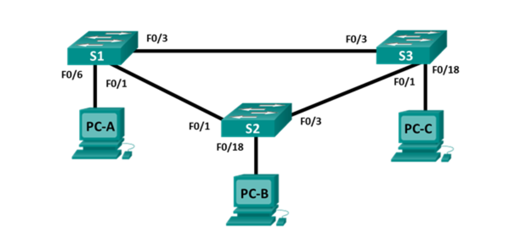

Лабораторная работа. Настройка расширенных сетей VLAN, VTP и DTP
---------

Топология
---------

Таблица адресации
-----------------

| Заголовок таблицы | Интерфейс | IP-адрес     | Маска подсети |
|-------------------|-----------|--------------|---------------|
| S1                | VLAN 99   | 192.168.99.1 | 255.255.255.0 |
| S2                | VLAN 99   | 192.168.99.2 | 255.255.255.0 |
| S3                | VLAN 99   | 192.168.99.3 | 255.255.255.0 |
| PC-A              | NIC       | 192.168.10.1 | 255.255.255.0 |
| PC-B              | NIC       | 192.168.20.1 | 255.255.255.0 |
| PC-C              | NIC       | 192.168.10.2 | 255.255.255.0 |

Задачи
------

Часть 1. Настройка VTP

Часть 2. Настройка DTP

Часть 3. Добавление сетей VLAN и назначение портов

Часть 4. Настройка расширенной сети VLAN

Общие сведения/сценарий
-----------------------

По мере увеличения количества коммутаторов в сети усложняется управление сетями
VLAN и магистралями. Протокол VTP позволяет сетевому администратору
автоматизировать управление сетями VLAN. Автоматическое согласование магистралей
между сетевыми устройствами управляется динамическим протоколом транкинга (DTP).
Протокол DTP включен по умолчанию на коммутаторах Catalyst 2960 и Catalyst 3560.

В этой лабораторной работе вы настроите магистральные каналы между этими
коммутаторами. Также необходимо будет настроить сервер и клиентов VTP в одном
домене VTP. Кроме того, вы настроите расширенную сеть VLAN на одном из
коммутаторов, назначите порты для сетей VLAN и проверите сквозное подключение
к этой же VLAN.

**Примечание.** Используются коммутаторы Cisco Catalyst 2960s с Cisco IOS версии
15.0(2) (образ lanbasek9). Допускается использование других моделей коммутаторов
и других версий Cisco IOS. В зависимости от модели устройства и версии Cisco IOS
доступные команды и результаты их выполнения могут отличаться от тех, которые
показаны в лабораторных работах.

**Примечание.** Убедитесь, что все настройки коммутатора удалены и загрузочная
конфигурация отсутствует. Если вы не уверены, обратитесь к инструктору.

Необходимые ресурсы
-------------------

-   3 коммутатора (Cisco 2960 с операционной системой Cisco IOS 15.0(2) (образ
    lanbasek9) или аналогичная модель)

-   3 ПК (Windows 7 или 8 с программой эмуляции терминала, например Tera Term)

-   Консольные кабели для настройки устройств Cisco IOS через консольные порты

-   Кабели Ethernet, расположенные в соответствии с топологией

Вопросы для повторения
----------------------

Каковы преимущества и недостатки использования VTP?

*Основное преимущество использования протокола VTP заключается в единой базе
VLAN на всех коммутаторах. Недостатком данного протока является его
небезопасность (устройство с меньшим номером конфигурации в сети может выступить
в роле VTP сервера и зачистить базы VLAN на всех коммутаторах).*