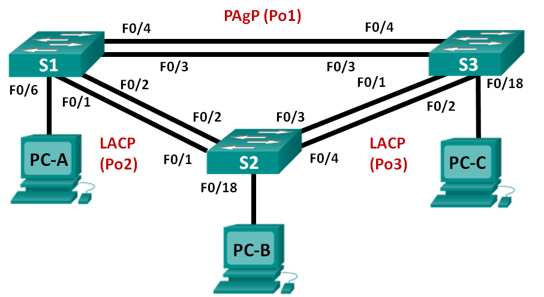

Лабораторная работа. Настройка EtherChannel
---------
Топология
---------

Таблица адресации
---------

| Устройство | Интерфейс | IP-адрес      | Маска подсети |
|------------|-----------|---------------|---------------|
| S1         | VLAN 99   | 192.168.99.11 | 255.255.255.0 |
| S2         | VLAN 99   | 192.168.99.12 | 255.255.255.0 |
| S3         | VLAN 99   | 192.168.99.13 | 255.255.255.0 |
| PC-A       | NIC       | 192.168.10.1  | 255.255.255.0 |
| PC-B       | NIC       | 192.168.10.2  | 255.255.255.0 |
| PC-C       | NIC       | 192.168.10.3  | 255.255.255.0 |

Цели
---------
Часть 1. Настройка базовых параметров коммутатора

Часть 2. Настройка PAgP

Часть 3. Настройка LACP

Общие сведения/сценарий
---------
Агрегирование каналов позволяет создавать логические каналы, состоящие из двух
или более физических каналов. Таким образом увеличивается пропускная
способность, а также используется только один физический канал. Агрегирование
каналов также обеспечивает избыточность в случае сбоя одного из каналов.

В этой лабораторной работе вам предстоит настроить EtherChannel — тип
агрегирования каналов, который используется в коммутируемых сетях. Вы настроите
EtherChannel с помощью протокола агрегирования портов (PAgP) и протокола
управления агрегированием каналов (LACP).

**Примечание**. PAgP является проприетарным протоколом Cisco, который можно
использовать только на коммутаторах Cisco и коммутаторах лицензированных
поставщиков, поддерживающих PAgP. Протокол LACP является протоколом
агрегирования каналов, который определен стандартом IEEE 802.3ad и не связан
с конкретным поставщиком.

Протокол LACP позволяет коммутаторам Cisco осуществлять управление каналами
Ethernet между коммутаторами в соответствии с протоколом 802.3ad. В создании
канала могут участвовать до 16 портов. Восемь из портов находятся в активном
режиме (active), а остальные восемь — в режиме ожидания (standby). В случае сбоя
любого из активных портов задействуется порт, пребывающий в режиме ожидания.
Режим ожидания (standby mode) доступен только для протокола LACP, но не для
протокола PAgP.

**Примечание**. В практических лабораторных работах CCNA используются
коммутаторы Cisco Catalyst 2960s с операционной системой Cisco IOS 15.0(2)
(образ lanbasek9). Допускается использование других моделей коммутаторов
и других версий Cisco IOS. В зависимости от модели устройства и версии Cisco IOS
доступные команды и результаты их выполнения могут отличаться от тех, которые
показаны в лабораторных работах.

**Примечание**. Убедитесь, что все настройки коммутатора удалены и загрузочная
конфигурация отсутствует. Если вы не уверены, обратитесь к инструктору.

Необходимые ресурсы
---------

-   3 коммутатора (Cisco 2960 с операционной системой Cisco IOS 15.0(2) (образ
    lanbasek9) или аналогичная модель)

-   3 ПК (Windows 7, Vista или XP с программой эмуляции терминалов, например
    Tera Term)

-   Консольные кабели для настройки устройств Cisco IOS через консольные порты

-   Кабели Ethernet, расположенные в соответствии с топологией

Часть 1. Настройка базовых параметров коммутатора
---------

####Настроем базовые параметры каждого коммутатора

S1-3(config)#no ip domain-lookup
S1-3(config)#enable secret class
S1-3(config)#line console 0
S1-3(config)#password cisco
S1-3(config)#login
S1-3(config)#logging synchronous
S1-3(config)#line vty 0 4
S1-3(config)#password cisco
S1-3(config)#login
S1-3(config)#logging synchronous
S1-3(config)#banner motd #Attention. Unauthorized users are not allowed.#
S1-3(config)# vlan 99
S1-3(config-vlan)# name Management
S1-3(config)# vlan 10
S1-3(config-vlan)# name Staff

S1(config)# interface f0/6
S1(config-if)# switchport mode access
S1(config-if)# switchport access vlan 10
S1(config)# interface vlan 99
S1(config-if)# ip address 192.168.99.11 255.255.255.0

S2(config)# interface f0/18
S2(config-if)# switchport mode access
S2(config-if)# switchport access vlan 10
S2(config)# interface vlan 99
S2(config-if)# ip address 192.168.99.12 255.255.255.0

S3(config)# interface f0/18
S3(config-if)# switchport mode access
S3(config-if)# switchport access vlan 10
S3(config)# interface vlan 99
S3(config-if)# ip address 192.168.99.13 255.255.255.0

Часть 2. Настройка PAgP
---------

#### Настраим PAgP на S1 и S3

S1(config)# interface range f0/3-4
S1(config-if-range)# channel-group 1 mode desirable
Creating a port-channel interface Port-channel 1

S1(config-if-range)# no shutdown

S3(config)# interface range f0/3-4
S3(config-if-range)# channel-group 1 mode auto
Creating a port-channel interface Port-channel 1

S3(config-if-range)# no shutdown

*Что означают флаги «SU» и «P» в сводных данных по Ethernet?*
*SU – Layer2 in user*
*P – bundled in port-channel*

#### Настроим транковые порты

S1(config)# interface port-channel 1
S1(config-if)# switchport mode trunk
S1(config-if)# switchport trunk native vlan 99

S3(config)# interface port-channel 1
S3(config-if)# switchport mode trunk
S3(config-if)# switchport trunk native vlan 99

##### Выполните команды show run interface идентификатор-интерфейса на S1 и S3. Какие команды включены в список для интерфейсов F0/3 и F0/4 на обоих коммутаторах? Сравните результаты с текущей конфигурацией для интерфейса Po1. Запишите наблюдения.
*Все команды симметрично скопировались с интерфейса Po1 на интерфейсы F0/3-4. Единственное отличие, что к интерфейсам F0/3-4 добавлена еще одна команда, “channel-group 1 mode auto”.*
##### Выполните команды show interfaces trunk и show spanning-tree на S1 и S3. Какой транковый порт включен в список? Какая используется сеть native VLAN? Какой вывод можно сделать на основе выходных данных?
*Транковым портом является Po1, Native vlan 99. Вывод: коммутатор работает с виртуальным интерфейсом Po1, а не с двумя физическими F0/3 и F0/4.*
##### Какие значения стоимости и приоритета порта для агрегированного канала отображены в выходных данных команды show spanning-tree?
*Стоимость равна *9. Приоритет равен 128.28.*

Часть 3. Настройка LACP
---------

#### Настроим LACP между S1 и S2

S1(config)# interface range f0/1-2
S1(config-if-range)# switchport mode trunk
S1(config-if-range)# switchport trunk native vlan 99
S1(config-if-range)# channel-group 2 mode active
Creating a port-channel interface Port-channel 2

S1(config-if-range)# no shutdown

S2(config)# interface range f0/1-2
S2(config-if-range)# switchport mode trunk
S2(config-if-range)# switchport trunk native vlan 99
S2(config-if-range)# channel-group 2 mode passive
Creating a port-channel interface Port-channel 2

S2(config-if-range)# no shutdown

##### Какой протокол использует Po2 для агрегирования каналов? Какие порты агрегируются для образования Po2? Запишите команду, используемую для проверки.
*Интерфейс Po2 использует протокол LACP. Fa0/1-2 агрегируются для образования Po2. Команда, используемая для проверки: show etherchannel summary.*

#### Настроим LACP между S2 и S3

S2(config)# interface range f0/3-4
S2(config-if-range)# switchport mode trunk
S2(config-if-range)# switchport trunk native vlan 99
S2(config-if-range)# channel-group 3 mode active
Creating a port-channel interface Port-channel 3
S2(config-if-range)# no shutdown

S3(config)# interface range f0/1-2
S3(config-if-range)# switchport mode trunk
S3(config-if-range)# switchport trunk native vlan 99
S3(config-if-range)# channel-group 3 mode passive
Creating a port-channel interface Port-channel 3

S3(config-if-range)# no shutdown

Вопросы для повторения
---------
Что может препятствовать образованию каналов EtherChannel?

1.  *Не симметричный скоростной режим.*

2.  *Не симметричный дуплексный режим.*

3.  *Отключение одно из интерфейсов.*
