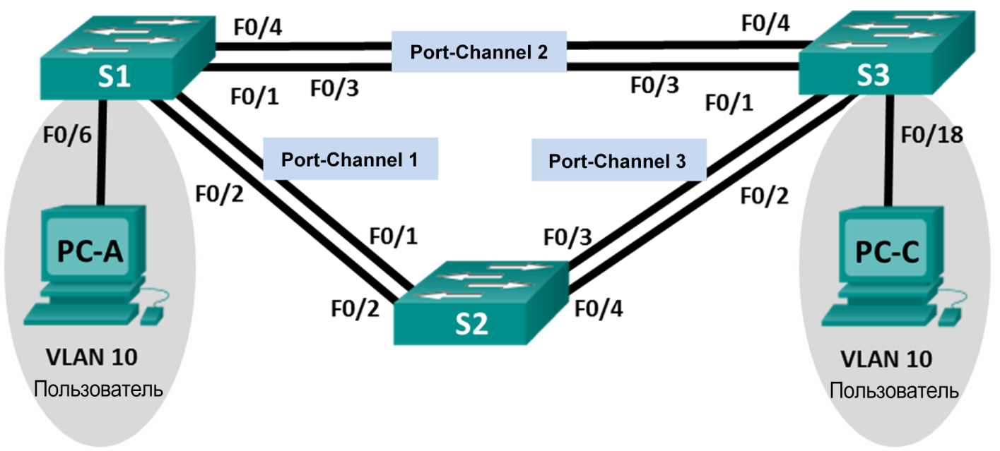

Лабораторная работа. Поиск и устранение неполадок в работе EtherChannel
---------

Топология
---------

Таблица адресации
---------

| **Устройство** | **Интерфейс** | **IP-адрес** | **Маска подсети** |
|----------------|---------------|--------------|-------------------|
| S1             | VLAN 99       | 192.168.1.11 | 255.255.255.0     |
| S2             | VLAN 99       | 192.168.1.12 | 255.255.255.0     |
| S3             | VLAN 99       | 192.168.1.13 | 255.255.255.0     |
| PC-A           | NIC           | 192.168.0.2  | 255.255.255.0     |
| PC-C           | NIC           | 192.168.0.3  | 255.255.255.0     |

Назначения сети VLAN
---------

| VLAN | Имя        |
|------|------------|
| 10   | User       |
| 99   | Управление |

Задачи
---------

Часть 1. Построение сети и загрузка настроек устройств

Часть 2. Отладка EtherChannel

Общие сведения/сценарий
---------

Маршрутизаторы в сети вашей компании были настроены неопытным сетевым
администратором. В результате ошибок в конфигурации возникли проблемы со
скоростью и подключением. Руководитель попросил вас найти и устранить неполадки
в настройке и задокументировать работу. Найдите и исправьте ошибки, используя
свои знания EtherChannel и стандартные методы тестирования. Убедитесь в том, что
все каналы EtherChannel используют протокол агрегирования портов (PAgP) и все
узлы доступны.

**Примечание**. Используются коммутаторы Cisco Catalyst 2960s с Cisco IOS версии
15.0(2) (образ lanbasek9). Допускается использование других моделей коммутаторов
и других версий Cisco IOS. В зависимости от модели устройства и версии Cisco IOS
доступные команды и результаты их выполнения могут отличаться от тех, которые
показаны в лабораторных работах.

**Примечание**. Убедитесь, что все настройки коммутатора удалены и загрузочная
конфигурация отсутствует. Если вы не уверены, обратитесь к инструктору.

Необходимые ресурсы
---------

-   3 коммутатора (Cisco 2960 с операционной системой Cisco IOS 15.0(2) (образ
    lanbasek9) или аналогичная модель)

-   2 ПК (Windows 7, Vista и XP с программой эмуляции терминала, например Tera
    Term)

-   Консольные кабели для настройки устройств Cisco IOS через консольные порты

-   Кабели Ethernet, расположенные в соответствии с топологией

Часть 1. Построение сети и загрузка настроек устройств
---------

#### Загрузим конфигурации коммутаторов

##### Конфигурация коммутатора S1:

	hostname S1
	interface range f0/1-24, g0/1-2
	shutdown
	exit
	enable secret class
	no ip domain lookup
	line vty 0 15
	password cisco
	login
	line con 0
	 password cisco
	 logging synchronous
	 login
	 exit
	vlan 10
	 name User
	vlan 99
	 Name Management
	interface range f0/1-2
	 switchport mode trunk
	 channel-group 1 mode active
	 switchport trunk native vlan 99
	 no shutdown
	interface range f0/3-4
	 channel-group 2 mode desirable
	 switchport trunk native vlan 99
	 no shutdown
	interface f0/6
	 switchport mode access
	 switchport access vlan 10
	 no shutdown
	interface vlan 99
	 ip address 192.168.1.11 255.255.255.0
	interface port-channel 1
	 switchport trunk native vlan 99
	 switchport mode trunk
	interface port-channel 2
	 switchport trunk native vlan 99
	 switchport mode access
	
##### Конфигурация коммутатора S2:

	hostname S2
	interface range f0/1-24, g0/1-2
	 shutdown
	 exit
	enable secret class
	no ip domain lookup
	line vty 0 15
	 password cisco
	 login
	line con 0
	 password cisco
	 logging synchronous
	 login
	 exit
	vlan 10
	 name User
	vlan 99
	 name Management
	spanning-tree vlan 1,10,99 root primary
	interface range f0/1-2
	 switchport mode trunk
	 channel-group 1 mode desirable
	 switchport trunk native vlan 99
	 no shutdown
	interface range f0/3-4
	 switchport mode trunk
	 channel-group 3 mode desirable
	 switchport trunk native vlan 99
	interface vlan 99
	 ip address 192.168.1.12 255.255.255.0
	interface port-channel 1
	 switchport trunk native vlan 99
	 switchport trunk allowed vlan 1,99
	interface port-channel 3
	 switchport trunk native vlan 99
	 switchport trunk allowed vlan 1,10,99
	 switchport mode trunk

##### Конфигурация коммутатора S3:

	hostname S3
	interface range f0/1-24, g0/1-2
	 shutdown
	 exit
	enable secret class
	no ip domain lookup
	line vty 0 15
	 password cisco
	 login
	line con 0
	 password cisco
	 logging synchronous
	 login
	 exit
	vlan 10
	 name User
	vlan 99
	 name Management
	interface range f0/1-2
	interface range f0/3-4
	 switchport mode trunk
	 channel-group 3 mode desirable
	 switchport trunk native vlan 99
	 no shutdown
	interface f0/18
	 switchport mode access
	 switchport access vlan 10
	 no shutdown
	interface vlan 99
	 ip address 192.168.1.13 255.255.255.0
	interface port-channel 3
	 switchport trunk native vlan 99
	 switchport mode trunk

Часть 2. Отладка EtherChannel
---------

#### Выполним поиск и устранение неполадок в работе маршрутизатора S1.

1.	Используем команду show interfaces trunk, чтобы убедиться в том, что агрегированные каналы работают, как транковые порты.
	Отображаются ли агрегированные каналы 1 и 2, как транковые порты? 
	*Нет.*
2.	Используем команду show etherchannel summary, чтобы убедиться в том, что интерфейсы входят в состав соответствующего агрегированного канала, применен правильный протокол и интерфейсы задействованы.
	Есть ли в выходных данных сведения о неполадках в работе EtherChannel? 
	*Согластно выводу команды, интерфейс Po1 находится в состоянии Down.*
3.	Используем команду show run | begin interface Port-channel для просмотра текущей конфигурации, начиная с первого интерфейса агрегированного канала.
4.	Устраняем все ошибки, найденные в выходных данных из предыдущих команд show. Запишем команды, используемые для исправления конфигураций.
	
	no interface Port-channel 1
	interface range fastEthernet 0/1-2
	channel-group 1 mode desirable
	switchport mode trunk
	switchport trunk native vlan 99

5.	Используем команду show interfaces trunk для проверки настроек транковой связи.
6.	Используем команду show etherchannel summary, чтобы убедиться в том, что агрегированные каналы работают и задействованы.

#### Выполним поиск и устранение неполадок в работе маршрутизатора S2.

1.	Выполним команду для того, чтобы убедиться, что агрегированные каналы работают в качестве транковых портов. Ниже запишим команду, которую мы использовали.

	show interface trunk

	Есть ли в выходных данных сведения о неполадках в конфигурациях?
	*Интерфейс Po3 не активен.*
2.	Выполним команду, чтобы убедиться в том, что интерфейсы настроены в правильном агрегированном канале и настроен соответствующий протокол.
	Есть ли в выходных данных сведения о неполадках в работе EtherChannel?
	*Интерфейсы Fa0/3-4 выключены.*
3.	Используем команду show run | begin interface Port-channel для просмотра текущей конфигурации, начиная с первого интерфейса канала порта.
4.	Устраним все ошибки, найденные в выходных данных из предыдущих команд show. Запишим команды, использованные для исправления настройки.

	interface range FastEthernet 0/3-4
	no sh

5.	Выполним команду для проверки параметров транковой связи.
6.	Выполним команду для проверки правильного функционирования агрегированных каналов. Помните, что проблемы с агрегированным каналом могут возникнуть на любом конце канала.

#### Выполним поиск и устранение неполадок в работе маршрутизатора S3.

1.	Выполним команду для того, чтобы убедиться, что агрегированные каналы работают в качестве транковых портов.
	Есть ли в выходных данных сведения о неполадках в конфигурациях?
	*Нет активного интерфейса Po для создания канала между S3 и S2.*
2.	Выполним команду, чтобы убедиться в том, что интерфейсы настроены в правильном агрегированном канале и применен соответствующий протокол.
	Есть ли в выходных данных сведения о неполадках в работе EtherChannel?
	*Не создан виртуального интерфейса Po для создания канала между S3 и S2.*
3.	Используем команду show run | begin interface Port-channel для просмотра текущей конфигурации, начиная с первого интерфейса агрегированного канала.
4.	Устраним все обнаруженные неполадки. Запишим команды, использованные для исправления конфигурации.

	interface range FastEthernet0/1-2
	switchport trunk native vlan 99
	switchport mode trunk
	channel-group 1 mode auto
	no sh

5.	Выполним команду для проверки параметров транковой связи. Ниже запишим команду, которую мы использовали.

	show interfaces trunk

6.	Выполним команду для проверки правильного функционирования агрегированных каналов. Ниже запишим команду, которую мы использовали.
	
	show etherchannel summary 

#### Проверка EtherChannel и подключения

1.	Используем команду show interfaces etherchannel для проверки работоспособности агрегированных каналов.
2.	Проверим подключение сети VLAN Management.
	Успешно ли выполняется эхо-запрос от коммутатора S1 на коммутатор S2? *Успешно*
	Успешно ли выполняется эхо-запрос от коммутатора S1 на коммутатор S3? *Успешно*
	Успешно ли выполняется эхо-запрос от коммутатора S2 на коммутатор S3? *Успешно*
3.	Проверим подключения компьютеров.
	Успешно ли выполняется эхо-запрос от узла ПК A на узел ПК C? *Успешно*