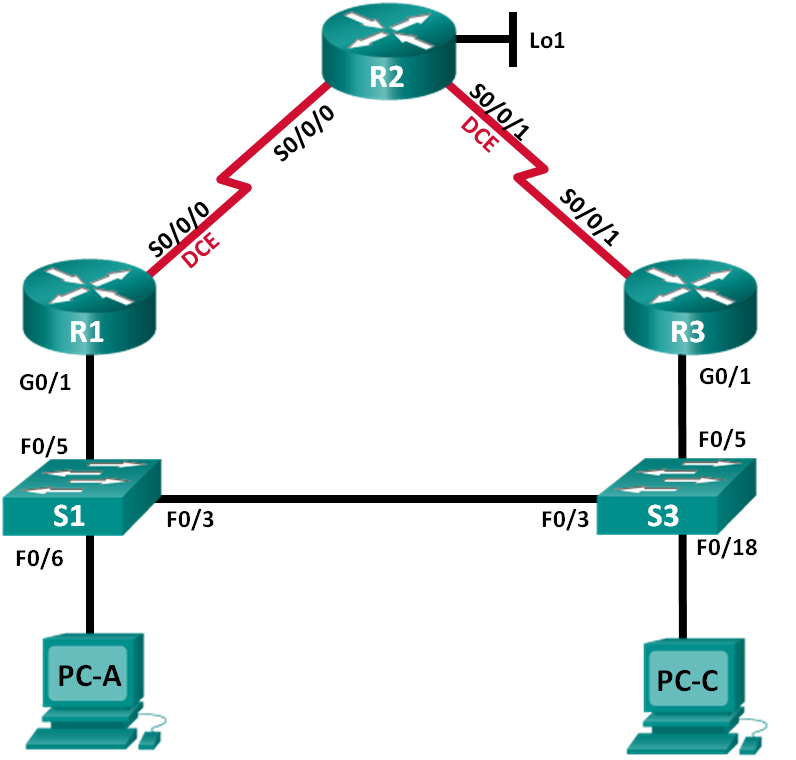

Лабораторная работа. Настройка HSRP
---------

Топология
---------

Таблица адресации
---------
| Устройство | Интерфейс    | IP-адрес        | Маска подсети   | Шлюз по умолчанию |
|------------|--------------|-----------------|-----------------|-------------------|
| R1         | G0/1         | 192.168.1.1     | 255.255.255.0   | —                 |
|            | S0/0/0 (DCE) | 10.1.1.1        | 255.255.255.252 | —                 |
| R2         | S0/0/0       | 10.1.1.2        | 255.255.255.252 | —                 |
|            | S0/0/1 (DCE) | 10.2.2.2        | 255.255.255.252 | —                 |
|            | Lo1          | 209.165.200.225 | 255.255.255.224 | —                 |
| R3         | G0/1         | 192.168.1.3     | 255.255.255.0   | —                 |
|            | S0/0/1       | 10.2.2.1        | 255.255.255.252 | —                 |
| S1         | VLAN 1       | 192.168.1.11    | 255.255.255.0   | 192.168.1.1       |
| S3         | VLAN 1       | 192.168.1.13    | 255.255.255.0   | 192.168.1.3       |
| PC-A       | NIC          | 192.168.1.31    | 255.255.255.0   | 192.168.1.1       |
| PC-C       | NIC          | 192.168.1.33    | 255.255.255.0   | 192.168.1.3       |

Задачи
---------

Часть 1. Построение сети и проверка соединения

Часть 2. Настройка обеспечения избыточности на первом хопе с помощью HSRP

Общие сведения/сценарий
---------

Связующее дерево обеспечивает резервирование коммутаторами в локальной сети, не
допуская возникновения петель. Но оно не позволяет организовать в сети
резервирование шлюзов по умолчанию для устройств конечных пользователей на
случай сбоя одного из маршрутизаторов. Протоколы обеспечения избыточности на
первом хопе (First Hop Redundancy Protocols, FHRP) предоставляют избыточные
шлюзы по умолчанию для конечных устройств. При этом конфигурация конечного
пользователя не требуется. В этой лабораторной работе вам предстоит настроить
протокол Cisco HSRP, являющийся протоколом FHRP.

**Примечание**. В практических лабораторных работах CCNA используются
маршрутизаторы с интегрированными сетевыми сервисами (ISR) Cisco 1941
с операционной системой Cisco IOS версии 15.2(4)M3 (образ universalk9). Также
используются коммутаторы Cisco Catalyst 2960 с операционной системой Cisco IOS
версии 15.0(2) (образ lanbasek9). Можно использовать другие маршрутизаторы,
коммутаторы и версии Cisco IOS. В зависимости от модели устройства и версии
Cisco IOS доступные команды и результаты их выполнения могут отличаться от тех,
которые показаны в лабораторных работах. Точные идентификаторы интерфейсов см.
в сводной таблице по интерфейсам маршрутизаторов в конце лабораторной работы.

**Примечание**. Убедитесь, что у маршрутизаторов и коммутаторов были удалены
начальные конфигурации. Если вы не уверены, обратитесь к инструктору.

Необходимые ресурсы
---------

-   3 маршрутизатора (Cisco 1941 с операционной системой Cisco IOS версии
    15.2(4)M3 (универсальный образ) или аналогичная модель)

-   2 коммутатора (Cisco 2960 с операционной системой Cisco IOS 15.0(2) (образ
    lanbasek9) или аналогичная модель)

-   2 компьютера (Windows 8, 7 или Vista с программой эмуляции терминала,
    например Tera Term)

-   Консольные кабели для настройки устройств Cisco IOS через консольные порты

-   Кабели Ethernet и последовательные кабели согласно топологии

Часть 1. Построение сети и проверка соединения
---------

#### Произведем базовую настройку маршрутизаторов

	R1-3(config)#no ip domain-lookup
	R1-3(config)#enable secret class
	R1-3(config)#line console 0
	R1-3(config)#password cisco
	R1-3(config)#login
	R1-3(config)#logging synchronous
	R1-3(config)#line vty 0 4
	R1-3(config)#password cisco
	R1-3(config)#login
	R1-3(config)#logging synchronous
	R1-3(config)#banner motd #Attention. Unauthorized users are not allowed.#

	R1(config)#interface GigabitEthernet0/1
	R1(config)#ip address 192.168.1.1 255.255.255.0
	R1(config)#interface Serial0/1/0
	R1(config)#ip address 10.1.1.1 255.255.255.252
	R1(config)#clock rate 128000

	R2(config)#interface Loopback0
	R2(config)#ip address 209.165.200.225 255.255.255.224
	R2(config)#interface Serial0/1/0
	R2(config)#ip address 10.1.1.2 255.255.255.252
	R2(config)#interface Serial0/1/1
	R2(config)#ip address 10.2.2.2 255.255.255.252
	R2(config)#clock rate 128000

	R3(config)#interface GigabitEthernet0/1
	R3(config)#ip address 192.168.1.3 255.255.255.0
	R3(config)#interface Serial0/1/1
	R3(config)#ip address 10.2.2.1 255.255.255.252
	
#### Настроим базовые параметры каждого коммутатора

	S1-3(config)#no ip domain-lookup
	S1-3(config)#enable secret class
	S1-3(config)#line console 0
	S1-3(config)#password cisco
	S1-3(config)#login
	S1-3(config)#logging synchronous
	S1-3(config)#line vty 0 4
	S1-3(config)#password cisco
	S1-3(config)#login
	S1-3(config)#logging synchronous
	S1-3(config)#banner motd #Attention. Unauthorized users are not allowed.#
	
	S1(config)#interface Vlan1
	S1(config)#ip address 192.168.1.11 255.255.255.0
	S1(config)#ip default-gateway 192.168.1.254

	S3(config)#interface Vlan1
	S3(config)#ip address 192.168.1.13 255.255.255.0
	S3(config)#ip default-gateway 192.168.1.254

#### Проверим подключение между PC-A и PC-C

##### Отправим ping-запрос с компьютера PC-A на компьютер PC-C. Удалось ли получить ответ? *Удалось.*

#### Настроим маршрутизацию

	R1(config)#router rip
	R1(config)#version 2
	R1(config)#network 10.0.0.0
	R1(config)#network 192.168.1.0

	R2(config)#router rip
	R2(config)#version 2
	R2(config)#network 10.0.0.0
	R2(config)#default-information originate
	R2(config)#ip route 209.165.200.0 255.255.255.0 209.165.200.224 

	R3(config)#router rip
	R3(config)#version 2
	R3(config)#network 10.0.0.0
	R3(config)#network 192.168.1.0	

#### Проверим подключение

1. Необходимо получить ответ на ping-запросы с компьютера PC-A от каждого интерфейса на маршрутизаторах R1, R2 и R3, а также от компьютера PC-C. Удалось ли получить все ответы? *Удалось.*
2. Необходимо получить ответ на ping-запросы с компьютера PC-C от каждого интерфейса на маршрутизаторах R1, R2 и R3, а также от компьютера PC-A. Удалось ли получить все ответы? *Удалось.*

Часть 2. Настройка обеспечения избыточности на первом хопе с помощью HSRP
---------

#### Определим путь интернет-трафика для PC-A и PC-C

В командной строке на PC-A введем команду tracert для loopback-адреса 209.165.200.225 на маршрутизаторе R2.

	C:\ tracert 209.165.200.225
	Tracing route to 209.165.200.225 over a maximum of 30 hops
	
	  1     1 ms     1 ms     1 ms  192.168.1.1
	  2    13 ms    13 ms    13 ms  209.165.200.225
	
	Trace complete.

Какой путь прошли пакеты от PC-A до 209.165.200.225? *PC-A > S1 > R1 > R2*

#### Запустим сеанс эхо-тестирования на PC-A и разорвем соединение между S1 и R1.

1. В командной строке на PC-A введем команду ping –t для адреса 209.165.200.225 на маршрутизаторе R2. Убедимся, что окно командной строки открыто.
*Примечание. Чтобы прервать отправку эхо-запросов, нажмите комбинацию клавиш Ctrl+C или закройте окно командной строки.*

	C:\ ping –t 209.165.200.225
	Pinging 209.165.200.225 with 32 bytes of data:
	Reply from 209.165.200.225: bytes=32 time=9ms TTL=254
	Reply from 209.165.200.225: bytes=32 time=9ms TTL=254
	Reply from 209.165.200.225: bytes=32 time=9ms TTL=254
	<выходные данные опущены>

2. В процессе эхо-тестирования отсоединим кабель Ethernet от интерфейса F0/5 на S1. Отключение интерфейса F0/5 на S1 приведет к тому же результату.
Что произошло с трафиком эхо-запросов? 
*Превышается время ответа (разрыв соединения).*

3. Какими были бы результате при повторении шагов 2a и 2b на компьютере PC-C и коммутаторе S3? 
*Аналогичным, так как отключается соединения с основным шлюзом R3 для PC-C.*

4. Повторно подсоединим кабели Ethernet к интерфейсу F0/5 или включим интерфейс F0/5 на S1 и S3, соответственно. Повторно отправим эхо-запросы на 209.165.200.225 с компьютеров PC-A и PC-C, чтобы убедиться в том, что подключение восстановлено.

#### Настроим HSRP на R1 и R3.

	R1(config)# interface g0/1
	R1(config-if)# standby version 2
	R1(config-if)# standby 1 ip 192.168.1.254
	R1(config-if)# standby 1 priority 150
	R1(config-if)# standby 1 preempt

	R3(config)# interface g0/1
	R3(config-if)# standby version 2
	R3(config-if)# standby 1 ip 192.168.1.254

	R1# show standby
	GigabitEthernet0/1 - Group 1 (version 2)
	  State is Active
	    4 state changes, last state change 0:00:30
	  Virtual IP address is 192.168.1.254
	  Active virtual MAC address is 0000.0c9f.f001
	    Local virtual MAC address is 0000.0c9f.f001 (v2 default)
	  Hello time 3 sec, hold time 10 sec
	    Next hello sent in 1.696 secs
	  Preemption enabled
	  Active router is local
	  Standby router is 192.168.1.3, priority 100 (expires in 11.120 sec)
	  Priority 150 (configured 150)
	  Group name is "hsrp-Gi0/1-1" (default)

	R3# show standby
	GigabitEthernet0/1 - Group 1 (version 2)
	  State is Standby
	    4 state changes, last state change 0:02:29
	  Virtual IP address is 192.168.1.254
	  Active virtual MAC address is 0000.0c9f.f001
	    Local virtual MAC address is 0000.0c9f.f001 (v2 default)
	  Hello time 3 sec, hold time 10 sec
	    Next hello sent in 0.720 secs
	  Preemption disabled
	  Active router is 192.168.1.1, priority 150 (expires in 10.128 sec)
	    MAC address is d48c.b5ce.a0c1
	  Standby router is local
	  Priority 100 (default 100)
	  Group name is "hsrp-Gi0/1-1" (default)

##### Используя указанные выше выходные данные, ответим на следующие вопросы:

Какой маршрутизатор является активным? *R1*
Какой MAC-адрес используется для виртуального IP-адреса? *0000.0C9F.F001*
Какой IP-адрес и приоритет используются для резервного маршрутизатора? *192.168.1.254 Priority 100*

	R1# show standby brief
	                     P indicates configured to preempt.
	                     |
	Interface   Grp  Pri P State   Active          Standby         Virtual IP
	Gi0/1       1    150 P Active  local           192.168.1.3     192.168.1.254
	
	R3# show standby brief
	                     P indicates configured to preempt.
	                     |
	Interface   Grp  Pri P State   Active          Standby         Virtual IP
	Gi0/1       1    100   Standby 192.168.1.1     local           192.168.1.254

Изменим адрес шлюза по умолчанию для PC-A, PC-C, S1 и S3. Какой адрес следует использовать? *192.168.1.254*
Отправим эхо-запрос с PC-A и с PC-C на loopback-адрес маршрутизатора R2. Успешно ли выполнены эхо-запросы? *Успешно.*

#### Запустим сеанс эхо-тестирования на PC-A и разорвем соединение с коммутатором, подключенным к активному маршрутизатору HSRP (R1).

1. В командной строке на PC-A введем команду ping –t для адреса 209.165.200.225 на маршрутизаторе R2. Убедимся, что окно командной строки открыто.
2. Во время отправки эхо-запроса отсоединим кабель Ethernet от интерфейса F0/5 на коммутаторе S1 или выключим интерфейс F0/5.

Что произошло с трафиком эхо-запросов? *Два эхо запроса были потеряны. После перехода R3 в статус Active, запросы начали проходить исправно.*

#### Проверим настройки HSRP на маршрутизаторах R1 и R3.

Выполним команду show standby brief на маршрутизаторах R1 и R3.
Какой маршрутизатор является активным? *R3*

Повторно подключим кабель, соединяющий коммутатор и маршрутизатор, или включим интерфейс F0/5. Какой маршрутизатор теперь является активным?
*Активным маршрутизатором вновь стал R1, так как в его настройках был выставлен более высокий приоритет (150).*

#### Измененим приоритетов HSRP.
1. Изменим приоритет HSRP на 200 на маршрутизаторе R3. Какой маршрутизатор является активным? *Активным маршрутизатором так же остается R1, так как на R3 нет вытеснения.*
2. Выполним команду, чтобы сделать активным маршрутизатор R3 без изменения приоритета. Какую команду вы использовали?

	standby 1 preempt 

3. Используем команду show, чтобы убедиться, что R3 является активным маршрутизатором.

Вопросы для повторения
---------

Для чего в локальной сети может потребоваться избыточность?

*Избыточность в локальной сети, позволяет создать, запасные пути для трафика, в
случаи недоступности (неисправности) одно из звеньев сети.*