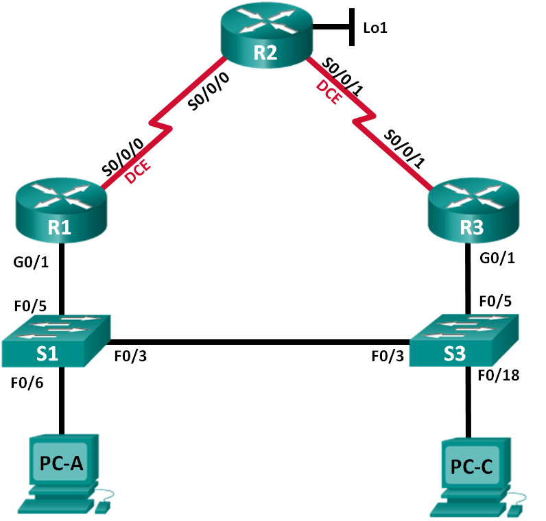

Лабораторная работа. Настройка HSRP
---------

Топология
---------

Таблица адресации
---------
| Устройство | Интерфейс    | IP-адрес        | Маска подсети   | Шлюз по умолчанию |
|------------|--------------|-----------------|-----------------|-------------------|
| R1         | G0/1         | 192.168.1.1     | 255.255.255.0   | —                 |
|            | S0/0/0 (DCE) | 10.1.1.1        | 255.255.255.252 | —                 |
| R2         | S0/0/0       | 10.1.1.2        | 255.255.255.252 | —                 |
|            | S0/0/1 (DCE) | 10.2.2.2        | 255.255.255.252 | —                 |
|            | Lo1          | 209.165.200.225 | 255.255.255.224 | —                 |
| R3         | G0/1         | 192.168.1.3     | 255.255.255.0   | —                 |
|            | S0/0/1       | 10.2.2.1        | 255.255.255.252 | —                 |
| S1         | VLAN 1       | 192.168.1.11    | 255.255.255.0   | 192.168.1.1       |
| S3         | VLAN 1       | 192.168.1.13    | 255.255.255.0   | 192.168.1.3       |
| PC-A       | NIC          | 192.168.1.31    | 255.255.255.0   | 192.168.1.1       |
| PC-C       | NIC          | 192.168.1.33    | 255.255.255.0   | 192.168.1.3       |

Задачи
---------

Часть 1. Построение сети и проверка соединения

Часть 2. Настройка обеспечения избыточности на первом хопе с помощью HSRP

Общие сведения/сценарий
---------

Связующее дерево обеспечивает резервирование коммутаторами в локальной сети, не
допуская возникновения петель. Но оно не позволяет организовать в сети
резервирование шлюзов по умолчанию для устройств конечных пользователей на
случай сбоя одного из маршрутизаторов. Протоколы обеспечения избыточности на
первом хопе (First Hop Redundancy Protocols, FHRP) предоставляют избыточные
шлюзы по умолчанию для конечных устройств. При этом конфигурация конечного
пользователя не требуется. В этой лабораторной работе вам предстоит настроить
протокол Cisco HSRP, являющийся протоколом FHRP.

**Примечание**. В практических лабораторных работах CCNA используются
маршрутизаторы с интегрированными сетевыми сервисами (ISR) Cisco 1941
с операционной системой Cisco IOS версии 15.2(4)M3 (образ universalk9). Также
используются коммутаторы Cisco Catalyst 2960 с операционной системой Cisco IOS
версии 15.0(2) (образ lanbasek9). Можно использовать другие маршрутизаторы,
коммутаторы и версии Cisco IOS. В зависимости от модели устройства и версии
Cisco IOS доступные команды и результаты их выполнения могут отличаться от тех,
которые показаны в лабораторных работах. Точные идентификаторы интерфейсов см.
в сводной таблице по интерфейсам маршрутизаторов в конце лабораторной работы.

**Примечание**. Убедитесь, что у маршрутизаторов и коммутаторов были удалены
начальные конфигурации. Если вы не уверены, обратитесь к инструктору.

Необходимые ресурсы
---------

-   3 маршрутизатора (Cisco 1941 с операционной системой Cisco IOS версии
    15.2(4)M3 (универсальный образ) или аналогичная модель)

-   2 коммутатора (Cisco 2960 с операционной системой Cisco IOS 15.0(2) (образ
    lanbasek9) или аналогичная модель)

-   2 компьютера (Windows 8, 7 или Vista с программой эмуляции терминала,
    например Tera Term)

-   Консольные кабели для настройки устройств Cisco IOS через консольные порты

-   Кабели Ethernet и последовательные кабели согласно топологии

Вопросы для повторения
---------

Для чего в локальной сети может потребоваться избыточность?

Избыточность в локальной сети, позволяет создать, запасные пути для трафика, в
случаи недоступности (неисправности) одно из звеньев сети.