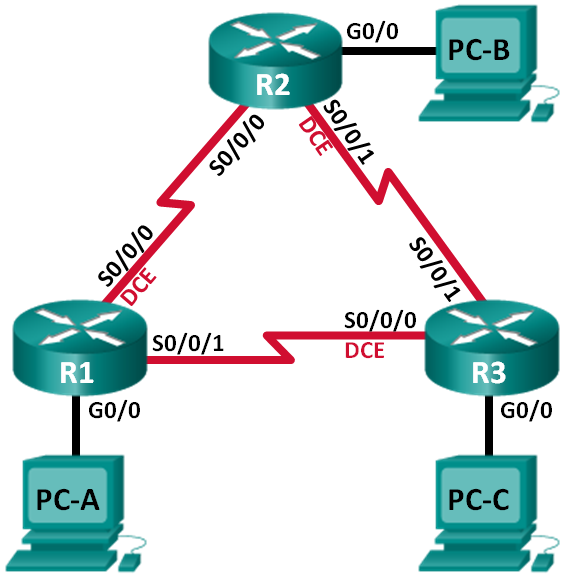

Лабораторная работа. Настройка базового протокола OSPFv2 для одной области
---------

Топология
---------

Таблица адресации
---------

| Устройство | Интерфейс    | IP-адрес     | Маска подсети   | Шлюз по умолчанию |
|------------|--------------|--------------|-----------------|-------------------|
| R1         | G0/0         | 192.168.1.1  | 255.255.255.0   | —                 |
|            | S0/0/0 (DCE) | 192.168.12.1 | 255.255.255.252 | —                 |
|            | S0/0/1       | 192.168.13.1 | 255.255.255.252 | —                 |
| R2         | G0/0         | 192.168.2.1  | 255.255.255.0   | —                 |
|            | S0/0/0       | 192.168.12.2 | 255.255.255.252 | —                 |
|            | S0/0/1 (DCE) | 192.168.23.1 | 255.255.255.252 | —                 |
| R3         | G0/0         | 192.168.3.1  | 255.255.255.0   | —                 |
|            | S0/0/0 (DCE) | 192.168.13.2 | 255.255.255.252 | —                 |
|            | S0/0/1       | 192.168.23.2 | 255.255.255.252 | —                 |
| PC-A       | NIC          | 192.168.1.3  | 255.255.255.0   | 192.168.1.1       |
| PC-B       | NIC          | 192.168.2.3  | 255.255.255.0   | 192.168.2.1       |
| PC-C       | NIC          | 192.168.3.3  | 255.255.255.0   | 192.168.3.1       |

Задачи
---------

Часть 1. Создание сети и настройка основных параметров устройства

Часть 2. Настройка и проверка маршрутизации OSPF

Часть 3. Изменение назначений идентификаторов маршрутизаторов

Часть 4. Настройка пассивных интерфейсов OSPF

Часть 5. Изменение метрик OSPF

Общие сведения/сценарий
---------

Алгоритм кратчайшего пути (OSPF) — это протокол маршрутизации для IP-сетей на
основе состояния канала. OSPFv2 определен для сетей протокола IPv4, а OSPFv3 —
для сетей IPv6. OSPF обнаруживает изменения в топологии, например сбой канала,
и быстро сходится в новой беспетлевой структуре маршрутизации. OSPF рассчитывает
каждый маршрут с помощью алгоритма Дейкстры, т. е. алгоритма кратчайшего пути.

В этой лабораторной работе необходимо настроить топологию сети с маршрутизацией
OSPFv2, изменить назначения идентификаторов маршрутизаторов, настроить пассивные
интерфейсы, настроить метрики OSPF и использовать ряд команд интерфейса
командной строки для вывода и проверки данных маршрутизации OSPF.

**Примечание**. В практических лабораторных работах CCNA используются
маршрутизаторы с интегрированными сетевыми сервисами (ISR) Cisco 1941
с операционной системой Cisco IOS версии 15.2(4)M3 (образ universalk9).
Допускается использование маршрутизаторов других моделей, а также других версий
операционной системы Cisco IOS. В зависимости от модели устройства и версии
Cisco IOS доступные команды и результаты их выполнения могут отличаться от тех,
которые показаны в лабораторных работах. Точные идентификаторы интерфейсов см.
в сводной таблице по интерфейсам маршрутизаторов в конце лабораторной работы.

**Примечание**. Убедитесь, что все настройки маршрутизаторов удалены
и загрузочная конфигурация отсутствует. Если вы не уверены, обратитесь
к инструктору.

Необходимые ресурсы
---------

-   3 маршрутизатора (Cisco 1941 с операционной системой Cisco IOS версии
    15.2(4)M3 (универсальный образ) или аналогичная модель)

-   3 ПК (Windows и программа эмуляции терминала, такая как Tera Term)

-   Консольные кабели для настройки устройств Cisco IOS через консольные порты

-   Кабели Ethernet и последовательные кабели согласно топологии

Часть 1. Создание сети и настройка основных параметров устройства
---------

#### Произведем базовую настройку маршрутизаторов.

	R1-3(config)#no ip domain-lookup
	R1-3(config)#enable secret class
	R1-3(config)#line console 0
	R1-3(config)#password cisco
	R1-3(config)#login
	R1-3(config)#logging synchronous
	R1-3(config)#line vty 0 4
	R1-3(config)#password cisco
	R1-3(config)#login
	R1-3(config)#logging synchronous
	R1-3(config)#banner motd #Attention. Unauthorized users are not allowed.#

	R1(config)#interface GigabitEthernet0/0
	R1(config)#ip address 192.168.1.1 255.255.255.0
	R1(config)#interface Serial0/0/0
	R1(config)#ip address 192.168.12.1 255.255.255.252
	R1(config)#clock rate 128000

	R2(config)#interface GigabitEthernet0/0
	R2(config)#ip address 192.168.2.1 255.255.255.0
	R2(config)#interface Serial0/0/0
	R2(config)#ip address 192.168.12.2 255.255.255.252
	R2(config)#interface Serial0/0/1
	R2(config)#ip address 192.168.23.1 255.255.255.252
	R2(config)#clock rate 128000

	R3(config)#interface GigabitEthernet0/0
	R3(config)#ip address 192.168.3.1 255.255.255.0
	R3(config)#interface Serial0/0/0
	R3(config)#ip address 192.168.13.2 255.255.255.252
	R3(config)#clock rate 128000
	R3(config)#interface Serial0/0/1
	R3(config)#ip address 192.168.23.2 255.255.255.252

Часть 2. Настройка и проверка маршрутизации OSPF
---------

#### Настроим протокол OSPF на маршрутизаторах R1,R2,R3.

	R1(config)#router ospf 1
	R1(config)#router-id 11.11.11.11
	R1(config)#log-adjacency-changes
	R1(config)#network 192.168.1.0 0.0.0.255 area 0
	R1(config)#network 192.168.12.0 0.0.0.3 area 0
	R1(config)#network 192.168.13.0 0.0.0.3 area 0

	R2(config)#router ospf 1
	R2(config)#router-id 22.22.22.22
	R2(config)#log-adjacency-changes
	R2(config)#network 192.168.2.0 0.0.0.255 area 0
	R2(config)#network 192.168.12.0 0.0.0.3 area 0
	R2(config)#network 192.168.23.0 0.0.0.3 area 0

	R3(config)#router ospf 1
	R3(config)#router-id 33.33.33.33
	R3(config)#log-adjacency-changes
	R3(config)#network 192.168.3.0 0.0.0.255 area 0
	R3(config)#network 192.168.13.0 0.0.0.3 area 0
	R3(config)#network 192.168.23.0 0.0.0.3 area 0

#### Проверим информацию о соседних устройствах и маршрутизации OSPF.

	R1# show ip ospf neighbor
	
	Neighbor ID     Pri   State           Dead Time   Address         Interface
	192.168.23.2      0   FULL/  -        00:00:33    192.168.13.2    Serial0/0/1
	192.168.23.1      0   FULL/  -        00:00:30    192.168.12.2    Serial0/0/0

	R1# show ip route
	Codes: L - local, C - connected, S - static, R - RIP, M - mobile, B - BGP
	       D - EIGRP, EX - EIGRP external, O - OSPF, IA - OSPF inter area
	       N1 - OSPF NSSA external type 1, N2 - OSPF NSSA external type 2
	       E1 - OSPF external type 1, E2 - OSPF external type 2, E - EGP
	       i - IS-IS, L1 - IS-IS level-1, L2 - IS-IS level-2, ia - IS-IS inter area
	       * - candidate default, U - per-user static route, o - ODR
	       P - periodic downloaded static route
	
	Gateway of last resort is not set
	
	     192.168.1.0/24 is variably subnetted, 2 subnets, 2 masks
	C       192.168.1.0/24 is directly connected, GigabitEthernet0/0
	L       192.168.1.1/32 is directly connected, GigabitEthernet0/0
	O    192.168.2.0/24 [110/65] via 192.168.12.2, 00:32:33, Serial0/0/0
	O    192.168.3.0/24 [110/65] via 192.168.13.2, 00:31:48, Serial0/0/1
	     192.168.12.0/24 is variably subnetted, 2 subnets, 2 masks
	C       192.168.12.0/30 is directly connected, Serial0/0/0
	L       192.168.12.1/32 is directly connected, Serial0/0/0
	     192.168.13.0/24 is variably subnetted, 2 subnets, 2 masks
	C       192.168.13.0/30 is directly connected, Serial0/0/1
	L       192.168.13.1/32 is directly connected, Serial0/0/1
	     192.168.23.0/30 is subnetted, 1 subnets
	O       192.168.23.0/30 [110/128] via 192.168.12.2, 00:31:38, Serial0/0/0
	                        [110/128] via 192.168.13.2, 00:31:38, Serial0/0/1

Какую команду вы бы применили, чтобы просмотреть в таблице маршрутизации только маршруты OSPF? 

	show ip route ospf

#### Проверим параметры протокола OSPF.

	R1# show ip protocols
	*** IP Routing is NSF aware ***
	
	Routing Protocol is "ospf 1"
	  Outgoing update filter list for all interfaces is not set
	  Incoming update filter list for all interfaces is not set
	  Router ID 192.168.13.1
	  Number of areas in this router is 1. 1 normal 0 stub 0 nssa
	  Maximum path: 4
	  Routing for Networks:
	    192.168.1.0 0.0.0.255 area 0
	    192.168.12.0 0.0.0.3 area 0
	    192.168.13.0 0.0.0.3 area 0
	  Routing Information Sources:
	    Gateway         Distance      Last Update
	    192.168.23.2         110      00:19:16
	    192.168.23.1         110      00:20:03
	  Distance: (default is 110)

#### Проверим данные процесса OSPF.

	R1# show ip ospf
	 Routing Process "ospf 1" with ID 192.168.13.1
	 Start time: 00:20:23.260, Time elapsed: 00:25:08.296
	 Supports only single TOS(TOS0) routes
	 Supports opaque LSA
	 Supports Link-local Signaling (LLS)
	 Supports area transit capability
	 Supports NSSA (compatible with RFC 3101)
	 Event-log enabled, Maximum number of events: 1000, Mode: cyclic
	 Router is not originating router-LSAs with maximum metric
	 Initial SPF schedule delay 5000 msecs
	 Minimum hold time between two consecutive SPFs 10000 msecs
	 Maximum wait time between two consecutive SPFs 10000 msecs
	 Incremental-SPF disabled
	 Minimum LSA interval 5 secs
	 Minimum LSA arrival 1000 msecs
	 LSA group pacing timer 240 secs
	 Interface flood pacing timer 33 msecs
	 Retransmission pacing timer 66 msecs
	 Number of external LSA 0. Checksum Sum 0x000000
	 Number of opaque AS LSA 0. Checksum Sum 0x000000
	 Number of DCbitless external and opaque AS LSA 0
	 Number of DoNotAge external and opaque AS LSA 0
	 Number of areas in this router is 1. 1 normal 0 stub 0 nssa
	 Number of areas transit capable is 0
	 External flood list length 0
	 IETF NSF helper support enabled
	 Cisco NSF helper support enabled
	 Reference bandwidth unit is 100 mbps
	    Area BACKBONE(0)
	        Number of interfaces in this area is 3
	        Area has no authentication
	        SPF algorithm last executed 00:22:53.756 ago
	        SPF algorithm executed 7 times
	        Area ranges are
	        Number of LSA 3. Checksum Sum 0x019A61
	        Number of opaque link LSA 0. Checksum Sum 0x000000
	        Number of DCbitless LSA 0
	        Number of indication LSA 0
	        Number of DoNotAge LSA 0
	        Flood list length 0

#### Проверим параметры интерфейса OSPF.

	R1# show ip ospf interface brief
	Interface    PID   Area            IP Address/Mask    Cost  State Nbrs F/C
	Se0/0/1      1     0               192.168.13.1/30    64    P2P   1/1
	Se0/0/0      1     0               192.168.12.1/30    64    P2P   1/1
	Gi0/0        1     0               192.168.1.1/24     1     DR    0/0

	R1# show ip ospf interface
	Serial0/0/1 is up, line protocol is up 
	  Internet Address 192.168.13.1/30, Area 0, Attached via Network Statement
	  Process ID 1, Router ID 192.168.13.1, Network Type POINT_TO_POINT, Cost: 64
	  Topology-MTID    Cost    Disabled    Shutdown      Topology Name
	        0           64        no          no            Base
	  Transmit Delay is 1 sec, State POINT_TO_POINT
	  Timer intervals configured, Hello 10, Dead 40, Wait 40, Retransmit 5
	    oob-resync timeout 40
	    Hello due in 00:00:01
	  Supports Link-local Signaling (LLS)
	  Cisco NSF helper support enabled
	  IETF NSF helper support enabled
	  Index 3/3, flood queue length 0
	  Next 0x0(0)/0x0(0)
	  Last flood scan length is 1, maximum is 1
	  Last flood scan time is 0 msec, maximum is 0 msec
	  Neighbor Count is 1, Adjacent neighbor count is 1 
	    Adjacent with neighbor 192.168.23.2
	  Suppress hello for 0 neighbor(s)
	Serial0/0/0 is up, line protocol is up 
	  Internet Address 192.168.12.1/30, Area 0, Attached via Network Statement
	  Process ID 1, Router ID 192.168.13.1, Network Type POINT_TO_POINT, Cost: 64
	  Topology-MTID    Cost    Disabled    Shutdown      Topology Name
	        0           64        no          no            Base
	  Transmit Delay is 1 sec, State POINT_TO_POINT
	  Timer intervals configured, Hello 10, Dead 40, Wait 40, Retransmit 5
	    oob-resync timeout 40
	    Hello due in 00:00:03
	  Supports Link-local Signaling (LLS)
	  Cisco NSF helper support enabled
	  IETF NSF helper support enabled
	  Index 2/2, flood queue length 0
	  Next 0x0(0)/0x0(0)
	  Last flood scan length is 1, maximum is 1
	  Last flood scan time is 0 msec, maximum is 0 msec
	  Neighbor Count is 1, Adjacent neighbor count is 1 
	    Adjacent with neighbor 192.168.23.1
	  Suppress hello for 0 neighbor(s)
	GigabitEthernet0/0 is up, line protocol is up 
	  Internet Address 192.168.1.1/24, Area 0, Attached via Network Statement
	  Process ID 1, Router ID 192.168.13.1, Network Type BROADCAST, Cost: 1
	  Topology-MTID    Cost    Disabled    Shutdown      Topology Name
	        0           1         no          no            Base
	  Transmit Delay is 1 sec, State DR, Priority 1
	  Designated Router (ID) 192.168.13.1, Interface address 192.168.1.1
	  No backup designated router on this network
	  Timer intervals configured, Hello 10, Dead 40, Wait 40, Retransmit 5
	    oob-resync timeout 40
	    Hello due in 00:00:01
	  Supports Link-local Signaling (LLS)
	  Cisco NSF helper support enabled
	  IETF NSF helper support enabled
	  Index 1/1, flood queue length 0
	  Next 0x0(0)/0x0(0)
	  Last flood scan length is 0, maximum is 0
	  Last flood scan time is 0 msec, maximum is 0 msec
	  Neighbor Count is 0, Adjacent neighbor count is 0 
	  Suppress hello for 0 neighbor(s)

Часть 3. Изменение назначений идентификаторов маршрутизаторов
---------

#### Изменим идентификаторы маршрутизатора с помощью loopback-адресов.

	R1(config)#interface Loopback0
	R1(config)#ip address 1.1.1.1 255.255.255.255

	R2(config)#interface Loopback0
	R2(config)#ip address 2.2.2.2 255.255.255.255

	R3(config)#interface Loopback0
	R3(config)#ip address 3.3.3.3 255.255.255.255

	R1# show ip protocols
	*** IP Routing is NSF aware ***
	
	Routing Protocol is "ospf 1"
	  Outgoing update filter list for all interfaces is not set
	  Incoming update filter list for all interfaces is not set
	  Router ID 1.1.1.1
	  Number of areas in this router is 1. 1 normal 0 stub 0 nssa
	  Maximum path: 4
	  Routing for Networks:
	    192.168.1.0 0.0.0.255 area 0
	    192.168.12.0 0.0.0.3 area 0
	    192.168.13.0 0.0.0.3 area 0
	  Routing Information Sources:
	    Gateway         Distance      Last Update
	    3.3.3.3              110      00:01:00
	    2.2.2.2              110      00:01:14
	  Distance: (default is 110)

	R1# show ip ospf neighbor
	
	Neighbor ID     Pri   State           Dead Time   Address         Interface
	3.3.3.3           0   FULL/  -        00:00:35    192.168.13.2    Serial0/0/1
	2.2.2.2           0   FULL/  -        00:00:32    192.168.12.2    Serial0/0/0

#### Изменим идентификатор маршрутизатора R1 с помощью команды router-id

	R1(config)# router ospf 1
	R1(config-router)# router-id 11.11.11.11
	Reload or use "clear ip ospf process" command, for this to take effect
	R1(config)# end

	R2(config)# router ospf 1
	R2(config-router)# router-id 22.22.22.22
	Reload or use "clear ip ospf process" command, for this to take effect
	R2(config)# end

	R3(config)# router ospf 1
	R3(config-router)# router-id 33.33.33.33
	Reload or use "clear ip ospf process" command, for this to take effect
	R3(config)# end

	R1-3(config)# clear ip ospf process *сброс процесса маршрутизации ospf*

	R1# show ip protocols
	*** IP Routing is NSF aware ***
	
	Routing Protocol is "ospf 1"
	  Outgoing update filter list for all interfaces is not set
	  Incoming update filter list for all interfaces is not set
	  Router ID 11.11.11.11
	  Number of areas in this router is 1. 1 normal 0 stub 0 nssa
	  Maximum path: 4
	  Routing for Networks:
	    192.168.1.0 0.0.0.255 area 0
	    192.168.12.0 0.0.0.3 area 0
	    192.168.13.0 0.0.0.3 area 0
	  Passive Interface(s):
	    GigabitEthernet0/1
	  Routing Information Sources:
	    Gateway         Distance      Last Update
	    33.33.33.33          110      00:00:19
	    22.22.22.22          110      00:00:31
	    3.3.3.3              110      00:00:41
	    2.2.2.2              110      00:00:41
	  Distance: (default is 110)

	R1# show ip ospf neighbor
	
	Neighbor ID     Pri   State           Dead Time   Address         Interface
	33.33.33.33       0   FULL/  -        00:00:36    192.168.13.2    Serial0/0/1
	22.22.22.22       0   FULL/  -        00:00:32    192.168.12.2    Serial0/0/0

Часть 4. Настройка пассивных интерфейсов OSPF
---------

#### Настроим пассивный интерфейс

	R1(config)# router ospf 1
	R1(config-router)# passive-interface g0/0

	R1# show ip ospf interface g0/0
	GigabitEthernet0/0 is up, line protocol is up 
	  Internet Address 192.168.1.1/24, Area 0, Attached via Network Statement
	  Process ID 1, Router ID 11.11.11.11, Network Type BROADCAST, Cost: 1
	  Topology-MTID    Cost    Disabled    Shutdown      Topology Name
	        0           1         no          no            Base
	  Transmit Delay is 1 sec, State DR, Priority 1
	  Designated Router (ID) 11.11.11.11, Interface address 192.168.1.1
	  No backup designated router on this network
	  Timer intervals configured, Hello 10, Dead 40, Wait 40, Retransmit 5
	    oob-resync timeout 40
	    ***No Hellos (Passive interface)***
	  Supports Link-local Signaling (LLS)
	  Cisco NSF helper support enabled
	  IETF NSF helper support enabled
	  Index 1/1, flood queue length 0
	  Next 0x0(0)/0x0(0)
	  Last flood scan length is 0, maximum is 0
	  Last flood scan time is 0 msec, maximum is 0 msec
	  Neighbor Count is 0, Adjacent neighbor count is 0 
	  Suppress hello for 0 neighbor(s)

	R2# show ip route
	Codes: L - local, C - connected, S - static, R - RIP, M - mobile, B - BGP
	       D - EIGRP, EX - EIGRP external, O - OSPF, IA - OSPF inter area 
	       N1 - OSPF NSSA external type 1, N2 - OSPF NSSA external type 2
	       E1 - OSPF external type 1, E2 - OSPF external type 2
	       i - IS-IS, su - IS-IS summary, L1 - IS-IS level-1, L2 - IS-IS level-2
	       ia - IS-IS inter area, * - candidate default, U - per-user static route
	       o - ODR, P - periodic downloaded static route, H - NHRP, l - LISP
	       + - replicated route, % - next hop override
	
	Gateway of last resort is not set
	
	      2.0.0.0/32 is subnetted, 1 subnets
	C        2.2.2.2 is directly connected, Loopback0
	***O     192.168.1.0/24 [110/65] via 192.168.12.1, 00:58:32, Serial0/0/0***
	      192.168.2.0/24 is variably subnetted, 2 subnets, 2 masks
	C        192.168.2.0/24 is directly connected, GigabitEthernet0/0
	L        192.168.2.1/32 is directly connected, GigabitEthernet0/0
	O     192.168.3.0/24 [110/65] via 192.168.23.2, 00:58:19, Serial0/0/1
	      192.168.12.0/24 is variably subnetted, 2 subnets, 2 masks
	C        192.168.12.0/30 is directly connected, Serial0/0/0
	L        192.168.12.2/32 is directly connected, Serial0/0/0
	      192.168.13.0/30 is subnetted, 1 subnets
	O        192.168.13.0 [110/128] via 192.168.23.2, 00:58:19, Serial0/0/1
	                      [110/128] via 192.168.12.1, 00:58:32, Serial0/0/0
	      192.168.23.0/24 is variably subnetted, 2 subnets, 2 masks
	C        192.168.23.0/30 is directly connected, Serial0/0/1
	L        192.168.23.1/32 is directly connected, Serial0/0/1

#### Настроим на маршрутизаторе пассивный интерфейс в качестве интерфейса по умолчанию.

	R2(config)# router ospf 1
	R2(config-router)# passive-interface default
	R2(config-router)#
	*Apr  3 00:03:00.979: %OSPF-5-ADJCHG: Process 1, Nbr 11.11.11.11 on Serial0/0/0 from FULL to DOWN, Neighbor Down: Interface down or detached
	*Apr  3 00:03:00.979: %OSPF-5-ADJCHG: Process 1, Nbr 33.33.33.33 on Serial0/0/1 from FULL to DOWN, Neighbor Down: Interface down or detached

##### До конфигурации

	R1# show ip ospf neighbor
	
	Neighbor ID     Pri   State           Dead Time   Address         Interface
	33.33.33.33       0   FULL/  -        00:00:31    192.168.13.2    Serial0/0/1
	22.22.22.22       0   FULL/  -        00:00:32    192.168.12.2    Serial0/0/0

##### После конфигурации

	R1# show ip ospf neighbor
	
	Neighbor ID     Pri   State           Dead Time   Address         Interface
	33.33.33.33       0   FULL/  -        00:00:34    192.168.13.2    Serial0/0/1

	R2(config)# router ospf 1
	R2(config-router)# no passive-interface s0/0/0
	R2(config-router)#
	*Apr  3 00:18:03.463: %OSPF-5-ADJCHG: Process 1, Nbr 11.11.11.11 on Serial0/0/0 from LOADING to FULL, Loading Done

    Какой интерфейс использует R3 для маршрута к сети 192.168.2.0/24? *S0/0/0*
    Чему равна суммарная метрика стоимости для сети 192.168.2.0/24 на R3? *[110/129]*
    Отображается ли маршрутизатор R2 как соседнее устройство OSPF на маршрутизаторе R1? *Да*
    Отображается ли маршрутизатор R2 как соседнее устройство OSPF на маршрутизаторе R3? *Нет*
    Что дает вам эта информация? *По причине активности passive-interface s0/0/1 на R2, маршрут до сети 192.168.2.0/24 от R3 строится через R2. Вследствие этого на R3 увеличивается метрика до этой сети.*

	R2(config)#router ospf 1
	R2(config-router)#no passive-interface s0/0/1

    Какой интерфейс использует R3 для маршрута к сети 192.168.2.0/24? *Serial0/0/1*
    Чему равна суммарная метрика стоимости для сети 192.168.2.0/24 на маршрутизаторе R3? Как она была рассчитана?
    *[110/65].110 (дефолтная метрика) / 64 (serial) + 1 (Gb) = 65*
    Отображается ли маршрутизатор R2 как сосед OSPF для маршрутизатора R3? *Да*

Часть 5. Изменение метрик OSPF
---------

#### Изменим заданную пропускную способность для маршрутизаторов.

	R1(config)# router ospf 1
	R1(config-router)# auto-cost reference-bandwidth 10000
	% OSPF: Reference bandwidth is changed.
	        Please ensure reference bandwidth is consistent across all routers.

	R2(config)# router ospf 1
	R2(config-router)# auto-cost reference-bandwidth 10000
	% OSPF: Reference bandwidth is changed.
	        Please ensure reference bandwidth is consistent across all routers.

	R3(config)# router ospf 1
	R3(config-router)# auto-cost reference-bandwidth 10000
	% OSPF: Reference bandwidth is changed.
	        Please ensure reference bandwidth is consistent across all routers.

    Почему может понадобиться изменить эталонную пропускную способность OSPF по умолчанию?
    *OSPF считает каналы с пропускной способностью 10Гб, 1Гб, 100Мб равнозначными (метрика 1). Поэтому процесс SPF может выбирать не самые оптимальные маршруты для трафика.*

#### Изменим пропускную способность для интерфейса.

	R1(config)# interface s0/0/0
	R1(config-if)# bandwidth 128
	R1(config)# interface s0/0/1
	R1(config-if)# bandwidth 128

	R1# show ip route ospf
	Codes: L - local, C - connected, S - static, R - RIP, M - mobile, B - BGP
	       D - EIGRP, EX - EIGRP external, O - OSPF, IA - OSPF inter area
	       N1 - OSPF NSSA external type 1, N2 - OSPF NSSA external type 2
	       E1 - OSPF external type 1, E2 - OSPF external type 2
	       i - IS-IS, su - IS-IS summary, L1 - IS-IS level-1, L2 - IS-IS level-2
	       ia - IS-IS inter area, * - candidate default, U - per-user static route
	       o - ODR, P - periodic downloaded static route, H - NHRP, l - LISP
	       + - replicated route, % - next hop override
	
	Gateway of last resort is not set
	
	O     192.168.2.0/24 [110/782] via 192.168.12.2, 00:00:09, Serial0/0/0
	O     192.168.3.0/24 [110/782] via 192.168.13.2, 00:00:09, Serial0/0/1
	      192.168.23.0/30 is subnetted, 1 subnets
	O        192.168.23.0 [110/845] via 192.168.13.2, 00:00:09, Serial0/0/1
	                      [110/845] via 192.168.12.2, 00:00:09, Serial0/0/0

    Объясните, как были рассчитаны стоимости маршрутов от маршрутизатора R1 для сетей 192.168.3.0/24 и 192.168.23.0/30.
    *192.168.3.0/24 – 781 (R1 S0/0/1) + 1 (R3 G0/0)*
    *192.168.23.0/30 – 781 (R1 S0/0/1) + 64 (R3 S0/0/1)*

	R3# show ip route ospf
	Codes: L - local, C - connected, S - static, R - RIP, M - mobile, B - BGP
	       D - EIGRP, EX - EIGRP external, O - OSPF, IA - OSPF inter area 
	       N1 - OSPF NSSA external type 1, N2 - OSPF NSSA external type 2
	       E1 - OSPF external type 1, E2 - OSPF external type 2
	       i - IS-IS, su - IS-IS summary, L1 - IS-IS level-1, L2 - IS-IS level-2
	       ia - IS-IS inter area, * - candidate default, U - per-user static route
	       o - ODR, P - periodic downloaded static route, H - NHRP, l - LISP
	       + - replicated route, % - next hop override
	
	Gateway of last resort is not set
	
	O     192.168.1.0/24 [110/65] via 192.168.13.1, 00:30:58, Serial0/0/0
	O     192.168.2.0/24 [110/65] via 192.168.23.1, 00:30:58, Serial0/0/1
	      192.168.12.0/30 is subnetted, 1 subnets
	O        192.168.12.0 [110/128] via 192.168.23.1, 00:30:58, Serial0/0/1
	                      [110/128] via 192.168.13.1, 00:30:58, Serial0/0/0

	R2(config)# interface s0/0/0
	R2(config-if)# bandwidth 128
	R2(config)# interface s0/0/1
	R2(config-if)# bandwidth 128

	R3(config)# interface s0/0/0
	R3(config-if)# bandwidth 128
	R3(config)# interface s0/0/1
	R3(config-if)# bandwidth 128

    Чему равна новая суммарная стоимость для сети 192.168.23.0/24 на R1? Почему?
    *Новая сумма ровная 1562. Она получается вследствие сложения стоимости двух интерфейсов (S0/0/1 R1 (751) + S0/0/1 R2 (751)).*

#### Изменим стоимость маршрута.

	R1(config)# interface s0/0/1
	R1(config-if)# ip ospf cost ***1565***

	R1# show ip route ospf
	Codes: L - local, C - connected, S - static, R - RIP, M - mobile, B - BGP
	       D - EIGRP, EX - EIGRP external, O - OSPF, IA - OSPF inter area 
	       N1 - OSPF NSSA external type 1, N2 - OSPF NSSA external type 2
	       E1 - OSPF external type 1, E2 - OSPF external type 2
	       i - IS-IS, su - IS-IS summary, L1 - IS-IS level-1, L2 - IS-IS level-2
	       ia - IS-IS inter area, * - candidate default, U - per-user static route
	       o - ODR, P - periodic downloaded static route, H - NHRP, l - LISP
	       + - replicated route, % - next hop override
	
	Gateway of last resort is not set
	
	O     192.168.2.0/24 [110/782] via 192.168.12.2, 00:02:06, Serial0/0/0
	O     192.168.3.0/24 [110/***1563***] via 192.168.12.2, 00:05:31, Serial0/0/0
	      192.168.23.0/30 is subnetted, 1 subnets
	O        192.168.23.0 [110/1562] via 192.168.12.2, 01:14:02, Serial0/0/0

    Почему маршрут к сети 192.168.3.0/24 от маршрутизатора R1 теперь проходит через R2?
    *Цена на канал между R1 и R3 поднялась до 1565. По этой причине, стало дешевле построить маршрут через R2.*

	
Вопросы для повторения
---------

1.  Почему так важно управлять назначением идентификатора маршрутизатора
    при использовании* протокола OSPF?

*Router id используется для выбора DR/BDR. Так же он используется для
идентификации маршрутизаторов в домене.*

2.  Почему в этой лабораторной работе не рассматривается процесс выбора DR/BDR?

*По данной топологии, маршрутизаторы объединены линками точка-точка.*

3.  Почему рекомендуется настраивать интерфейс OSPF как пассивный?

*Для уменьшения служебного трафика в доменной сети. Так же для обеспечения
безопасности правильного функционирования самого протокола.*