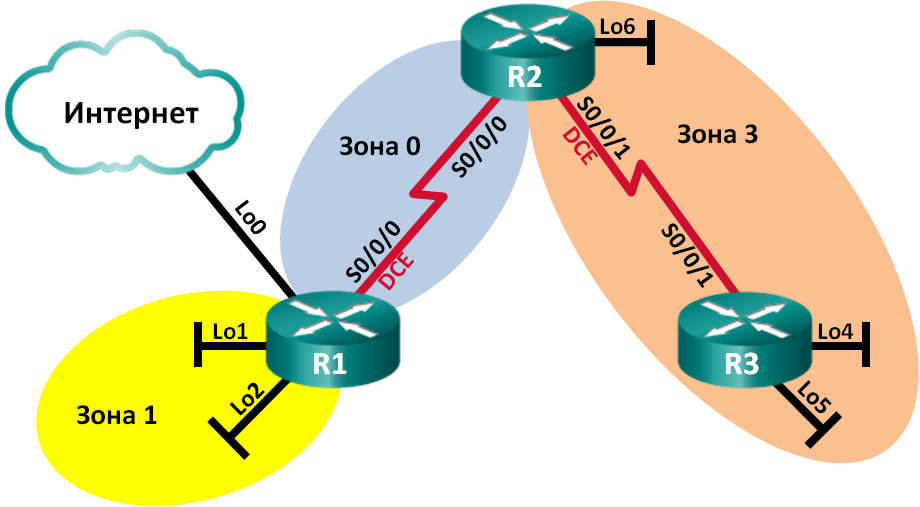

Лабораторная работа. Настройка OSPFv2 для нескольких областей
---------

Топология
---------

Таблица адресации
---------
| Устройство | Интерфейс    | IP-адрес        | Маска подсети   |
|------------|--------------|-----------------|-----------------|
| R1         | Lo0          | 209.165.200.225 | 255.255.255.252 |
|            | Lo1          | 192.168.1.1     | 255.255.255.0   |
|            | Lo2          | 192.168.2.1     | 255.255.255.0   |
|            | S0/0/0 (DCE) | 192.168.12.1    | 255.255.255.252 |
| R2         | Lo6          | 192.168.6.1     | 255.255.255.0   |
|            | S0/0/0       | 192.168.12.2    | 255.255.255.252 |
|            | S0/0/1 (DCE) | 192.168.23.1    | 255.255.255.252 |
| R3         | Lo4          | 192.168.4.1     | 255.255.255.0   |
|            | Lo5          | 192.168.5.1     | 255.255.255.0   |
|            | S0/0/1       | 192.168.23.2    | 255.255.255.252 |

Задачи
---------

Часть 1. Создание сети и настройка основных параметров устройства

Часть 2. Настройка сети OSPFv2 для нескольких областей

Часть 3. Настройка межобластных суммарных маршрутов

Общие сведения/сценарий
---------

Для улучшения эффективности и масштабируемости в OSPF поддерживается
иерархическая маршрутизация, использующая понятие областей. Область OSPF — это
группа маршрутизаторов, использующих в своих базах данных состояний каналов
(LSDB) общие и одинаковые данные о состоянии каналов. Если большая область OSPF
разделена на области меньшего размера, такая архитектура называется OSPF для
нескольких областей. Использование OSPF для нескольких областей является
целесообразным в сетях большего размера, поскольку это позволяет сократить
потребление ресурсов ЦП и памяти.

В этой лабораторной работе будет выполнена настройка сети OSPFv2 для нескольких
областей с межобластными суммарными маршрутами.

**Примечание**. В практических лабораторных работах CCNA используются
маршрутизаторы с интегрированными сетевыми сервисами (ISR) Cisco 1941
с операционной системой Cisco IOS версии 15.2(4)M3 (образ universalk9).
Допускается использование маршрутизаторов других моделей, а также других версий
операционной системы Cisco IOS. В зависимости от модели устройства и версии
Cisco IOS доступные команды и результаты их выполнения могут отличаться от тех,
которые показаны в лабораторных работах. Точные идентификаторы интерфейсов см.
в сводной таблице по интерфейсам маршрутизаторов в конце лабораторной работы.

**Примечание**. Убедитесь, что все настройки маршрутизаторов удалены
и загрузочная конфигурация отсутствует. Если вы не уверены, обратитесь
к инструктору.

Необходимые ресурсы
---------

-   3 маршрутизатора (Cisco 1941 с операционной системой Cisco IOS версии
    15.2(4)M3 (универсальный образ) или аналогичная модель)

-   Консольные кабели для настройки устройств Cisco IOS через консольные порты

-   Последовательные кабели в соответствии с топологией

Часть 1. Создание сети и настройка основных параметров устройства
---------

#### Произведим базовую настройку маршрутизаторов.

	R1-3(config)#no ip domain-lookup
	R1-3(config)#enable secret class
	R1-3(config)#line console 0
	R1-3(config)#password cisco
	R1-3(config)#login
	R1-3(config)#logging synchronous
	R1-3(config)#line vty 0 4
	R1-3(config)#password cisco
	R1-3(config)#login
	R1-3(config)#logging synchronous
	R1-3(config)#banner motd #Attention. Unauthorized users are not allowed.#

	R1(config)#interface Loopback0
	R1(config)#ip address 209.165.200.225 255.255.255.252
	R1(config)#interface Loopback1
	R1(config)#ip address 192.168.1.1 255.255.255.0
	R1(config)#interface Loopback2
	R1(config)#ip address 192.168.2.1 255.255.255.0
	R1(config)#interface Serial0/0/0
	R1(config)#bandwidth 128
	R1(config)#ip address 192.168.12.1 255.255.255.252
	R1(config)#clock rate 128000

	R2(config)#interface Loopback6
	R2(config)#ip address 192.168.6.1 255.255.255.0
	R2(config)#interface Serial0/0/0
	R2(config)#bandwidth 128
	R2(config)#ip address 192.168.12.2 255.255.255.252
	R2(config)#interface Serial0/0/1
	R2(config)#bandwidth 128
	R2(config)#ip address 192.168.23.1 255.255.255.252
	R2(config)#clock rate 128000

	R3(config)#interface Loopback4
	R3(config)#ip address 192.168.4.1 255.255.255.0
	R3(config)#interface Loopback5
	R3(config)#ip address 192.168.5.1 255.255.255.0
	R3(config)#interface Serial0/0/1
	R3(config)#bandwidth 128
	R3(config)#ip address 192.168.23.2 255.255.255.252

Часть 2. Настройка сети OSPFv2 для нескольких областей
---------

#### Определим типы маршрутизаторов OSPF в топологии.

Магистральные маршрутизаторы: **R1, R2.**
Граничные маршрутизаторы автономной системы (ASBR): **R1.**
Граничные маршрутизаторы области (ABR): **R1, R2.**
Внутренние маршрутизаторы: **R1, R2, R3.**

#### Настроим протокол OSPF на маршрутизаторе R1.

	R1(config)#router ospf 1
	R1(config)#router-id 1.1.1.1
	R1(config)#passive-interface Loopback1
	R1(config)#passive-interface Loopback2
	R1(config)#network 192.168.12.1 0.0.0.0 area 0
	R1(config)#network 192.168.1.1 0.0.0.0 area 1
	R1(config)#network 192.168.2.1 0.0.0.0 area 1
	R1(config)#default-information originate
	R1(config)#ip route 0.0.0.0 0.0.0.0 Loopback0

#### Настроим протокол OSPF на маршрутизаторе R2.

	R2(config)#router ospf 1
	R2(config)#router-id 2.2.2.2
	R2(config)#passive-interface Loopback6
	R2(config)#network 192.168.12.2 0.0.0.0 area 0
	R2(config)#network 192.168.6.1 0.0.0.0 area 3
	R2(config)#network 192.168.23.1 0.0.0.0 area 3

#### Настроим протокол OSPF на маршрутизаторе R3.

	R3(config)#router ospf 1
	R3(config)#router-id 3.3.3.3
	R3(config)#passive-interface Loopback4
	R3(config)#passive-interface Loopback5
	R3(config)#network 192.168.4.1 0.0.0.0 area 3
	R3(config)#network 192.168.5.1 0.0.0.0 area 3
	R3(config)#network 192.168.23.2 0.0.0.0 area 3
#### Проверим параментры OSPF
	R1# show ip protocols
	*** IP Routing is NSF aware ***
	
	Routing Protocol is "ospf 1"
	  Outgoing update filter list for all interfaces is not set
	  Incoming update filter list for all interfaces is not set
	  Router ID 1.1.1.1
	  It is an area border and autonomous system boundary router
	 Redistributing External Routes from,
	  Number of areas in this router is 2. 2 normal 0 stub 0 nssa
	  Maximum path: 4
	  Routing for Networks:
	    192.168.1.0 0.0.0.255 area 1
	    192.168.2.0 0.0.0.255 area 1
	    192.168.12.0 0.0.0.3 area 0
	  Passive Interface(s):
	    Loopback1
	    Loopback2
	  Routing Information Sources:
	    Gateway         Distance      Last Update
	    2.2.2.2              110      00:01:45
	  Distance: (default is 110)

	R2# show ip protocols
	*** IP Routing is NSF aware ***
	
	Routing Protocol is "ospf 1"
	  Outgoing update filter list for all interfaces is not set
	  Incoming update filter list for all interfaces is not set
	  Router ID 2.2.2.2
	  It is an area border router
	  Number of areas in this router is 2. 2 normal 0 stub 0 nssa
	  Maximum path: 4
	  Routing for Networks:
	    192.168.6.0 0.0.0.255 area 3
	    192.168.12.0 0.0.0.3 area 0
	    192.168.23.0 0.0.0.3 area 3
	  Passive Interface(s):
	    Loopback6
	  Routing Information Sources:
	    Gateway         Distance      Last Update
	    3.3.3.3              110      00:01:20
	    1.1.1.1              110      00:10:12
	  Distance: (default is 110)

	R3# show ip protocols
	*** IP Routing is NSF aware ***
	
	Routing Protocol is "ospf 1"
	  Outgoing update filter list for all interfaces is not set
	  Incoming update filter list for all interfaces is not set
	  Router ID 3.3.3.3
	  Number of areas in this router is 1. 1 normal 0 stub 0 nssa
	  Maximum path: 4
	  Routing for Networks:
	    192.168.4.0 0.0.0.255 area 3
	    192.168.5.0 0.0.0.255 area 3
	    192.168.23.0 0.0.0.3 area 3
	  Passive Interface(s):
	    Loopback4
	    Loopback5
	  Routing Information Sources:
	    Gateway         Distance      Last Update
	    1.1.1.1              110      00:07:46
	    2.2.2.2              110      00:07:46
	  Distance: (default is 110)

##### К какому типу маршрутизаторов OSPF относится каждый маршрутизатор?
**R1: ASBR, ABR.**
**R2: ABR.**
**R3: Внутренний маршрутизатор.**

#### Проверим отношения смежности

	R1# show ip ospf neighbor
	
	Neighbor ID     Pri   State           Dead Time   Address         Interface
	2.2.2.2           0   FULL/  -        00:00:34    192.168.12.2    Serial0/0/0
	
	R2# show ip ospf neighbor
	
	Neighbor ID     Pri   State           Dead Time   Address         Interface
	1.1.1.1           0   FULL/  -        00:00:36    192.168.12.1    Serial0/0/0
	3.3.3.3           0   FULL/  -        00:00:36    192.168.23.2    Serial0/0/1
	
	R3# show ip ospf neighbor
	
	Neighbor ID     Pri   State           Dead Time   Address         Interface
	2.2.2.2           0   FULL/  -        00:00:38    192.168.23.1    Serial0/0/1

#### Проверим стоимость маршрутов интерфейсов

	R1# show ip ospf interface brief
	Interface    PID   Area            IP Address/Mask    Cost  State Nbrs F/C
	Se0/0/0      1     0               192.168.12.1/30    781   P2P   1/1
	Lo1          1     1               192.168.1.1/24     1     LOOP  0/0
	Lo2          1     1               192.168.2.1/24     1     LOOP  0/0
	
	R2# show ip ospf interface brief
	Interface    PID   Area            IP Address/Mask    Cost  State Nbrs F/C
	Se0/0/0      1     0               192.168.12.2/30    781   P2P   1/1
	Lo6          1     3               192.168.6.1/24     1     LOOP  0/0
	Se0/0/1      1     3               192.168.23.1/30    781   P2P   1/1
	
	R3# show ip ospf interface brief
	Interface    PID   Area            IP Address/Mask    Cost  State Nbrs F/C
	Lo4          1     3               192.168.4.1/24     1     LOOP  0/0
	Lo5          1     3               192.168.5.1/24     1     LOOP  0/0
	Se0/0/1      1     3               192.168.23.2/30    781   P2P   1/1

#### Настроим аутентификацию MD5 для всех последовательных интерфейсов.

	R1(config)#interface Serial0/0/1
	R1(config)#ip ospf authentication message-digest
	R1(config)#ip ospf message-digest-key 2 md5 Cisco123

	R2(config)#interface Serial0/0/0
	R2(config)#ip ospf authentication message-digest
	R2(config)#ip ospf message-digest-key 2 md5 Cisco123
	R2(config)#interface Serial0/0/1
	R2(config)#ip ospf authentication message-digest
	R2(config)#ip ospf message-digest-key 2 md5 Cisco123

	R3(config)#interface Serial0/0/1
	R3(config)#ip ospf authentication message-digest
	R3(config)#ip ospf message-digest-key 2 md5 Cisco123

##### Почему перед настройкой аутентификации OSPF полезно проверить правильность работы OSPF?
**При ошибке в настройки аутентификации с любой из сторон, маршрутизаторы не смогут обменятся своими базами данных каналов. Так же, во время конфигурации на одном из маршрутизаторов, связь потеряется с его соседями, до момента пока на них так же не задастся пароль.**

Часть 3. Настройка межобластных суммарных маршрутов
---------

#### Просмотрим таблицы маршрутизации OSPF для всех маршрутизаторов.

R1:

	192.168.4.0/32 is subnetted, 1 subnets
	O IA 192.168.4.1 [110/1563] via 192.168.12.2, 00:23:49, Serial0/0/0
	192.168.5.0/32 is subnetted, 1 subnets
	O IA 192.168.5.1 [110/1563] via 192.168.12.2, 00:23:49, Serial0/0/0
	192.168.23.0/30 is subnetted, 1 subnets
	O IA 192.168.6.1 [110/782] via 192.168.12.2, 00:02:01, Serial0/0/0
	192.168.23.0/30 is subnetted, 1 subnets
	O IA 192.168.23.0 [110/1562] via 192.168.12.2, 00:23:49, Serial0/0/0

R2:

	192.168.1.0/32 is subnetted, 1 subnets
	O IA 192.168.1.1 [110/782] via 192.168.12.1, 00:18:06, Serial0/0/0
	192.168.2.0/32 is subnetted, 1 subnets
	O IA 192.168.2.1 [110/782] via 192.168.12.1, 00:18:06, Serial0/0/0

R3:

	192.168.1.0/32 is subnetted, 1 subnets
	O IA 192.168.1.1 [110/1563] via 192.168.23.1, 00:15:56, Serial0/0/1
	192.168.2.0/32 is subnetted, 1 subnets
	O IA 192.168.2.1 [110/1563] via 192.168.23.1, 00:15:56, Serial0/0/1
	192.168.6.0/32 is subnetted, 1 subnets
	O IA 192.168.12.0 [110/1562] via 192.168.23.1, 00:15:56, Serial0/0/1

#### Просмотрим базы данных LSDB на всех маршрутизаторах.

R1:
	
	         OSPF Router with ID (1.1.1.1) (Process ID 1)
	
	                Router Link States (Area 0)
	
	Link ID         ADV Router      Age         Seq#       Checksum Link count
	1.1.1.1         1.1.1.1         1295        0x80000003 0x0039CD 2
	2.2.2.2         2.2.2.2         1282        0x80000002 0x00D430 2
	
	                Summary Net Link States (Area 0)
	
	Link ID         ADV Router      Age         Seq#       Checksum
	192.168.1.1     1.1.1.1         1387        0x80000002 0x00AC1F
	192.168.2.1     1.1.1.1         1387        0x80000002 0x00A129
	192.168.4.1     2.2.2.2         761         0x80000001 0x000DA8
	192.168.5.1     2.2.2.2         751         0x80000001 0x0002B2
	192.168.6.1     2.2.2.2         1263        0x80000001 0x00596A
	192.168.23.0    2.2.2.2         1273        0x80000001 0x00297E
	
	                Router Link States (Area 1)
	
	Link ID         ADV Router      Age         Seq#       Checksum Link count
	1.1.1.1         1.1.1.1         1342        0x80000006 0x0094A4 2
	
	                Summary Net Link States (Area 1)
	
	Link ID         ADV Router      Age         Seq#       Checksum
	192.168.4.1     1.1.1.1         760         0x80000001 0x00C8E0
	192.168.5.1     1.1.1.1         750         0x80000001 0x00BDEA
	192.168.6.1     1.1.1.1         1262        0x80000001 0x0015A2
	192.168.12.0    1.1.1.1         1387        0x80000001 0x00C0F5
	192.168.23.0    1.1.1.1         1272        0x80000001 0x00E4B6
	
	                Type-5 AS External Link States
	
	Link ID         ADV Router      Age         Seq#       Checksum Tag
	0.0.0.0         1.1.1.1         1343        0x80000001 0x001D91 1

R2 (идентификаторы каналов):

	                Summary Net Link States (Area 0)
	
	Link ID 	ADV Router 	Age 	Seq# 		Checksum
	192.168.6.1 	2.2.2.2 	31 	0x8000000b 	0x004596
	192.168.23.0 	2.2.2.2 	31 	0x8000000c 	0x0013ab
	192.168.4.1 	2.2.2.2 	1154 	0x80000009 	0x00fcd2
	192.168.5.1 	2.2.2.2 	1154 	0x8000000a 	0x00efdd
	192.168.1.1 	1.1.1.1 	32 	0x80000005 	0x00a644
	192.168.2.1 	1.1.1.1 	32 	0x80000006 	0x00994f
	
	                Summary Net Link States (Area 3)
	
	Link ID	 ADV Router	 Age	 Seq#	 	Checksum
	192.168.12.0	2.2.2.2	 21	 0x8000000c	0x008c3d
	192.168.1.1 	2.2.2.2 	 1403	 0x8000000a 	0x001cb5
	192.168.2.1 	2.2.2.2 	 1403 	 0x8000000b 	0x000fc0

R3 (идентификаторы каналов):

	                Summary Net Link States (Area 3)
	
	Link ID	 ADV Router	 Age	 Seq#		 Checksum
	192.168.1.1	 2.2.2.2	 1686	 0x8000000a	 0x001cb5
	192.168.2.1	 2.2.2.2	 1686	 0x8000000b	 0x000fc0
	192.168.12.0	 2.2.2.2	 304	 0x8000000c	 0x008c3d

#### Настроим межобластные суммарные маршруты.

Общий суммарный маршрут для Area 0 - ***192.168.0.0/22***

	R1(config)# router ospf 1
	R1(config-router)# area 1 range 192.168.0.0 255.255.252.0

Общий суммарный маршрут для Area 3 - ***192.168.4.0/22***

	R2(config)#router ospf 1
	R2(config-router)#area 3 range 192.168.4.0 255.255.252.0

#### Повторно отобразим таблицы маршрутизации на всех маршрутизаторах.

R1:

	O IA 	192.168.4.0 [110/782] via 192.168.12.2, 00:01:23, Serial0/0/0
	        192.168.23.0/30 is subnetted, 1 subnets
	O IA 	192.168.23.0 [110/1562] via 192.168.12.2, 00:44:49, Serial0/0/0

R2:

	O IA 	192.168.0.0 [110/782] via 192.168.12.1, 00:15:08, Serial0/0/0
	        192.168.4.0/32 is subnetted, 1 subnets

R3:

	O IA 	192.168.0.0 [110/1563] via 192.168.23.1, 00:15:54, Serial0/0/1
	        192.168.6.0/32 is subnetted, 1 subnets
	O IA 	192.168.12.0 [110/1562] via 192.168.23.1, 00:43:27, Serial0/0/1

#### Повторно посмотрим базы данных LSDB на всех маршрутизаторах.

R1:

	Summary Net Link States (Area 0)
	Link ID	 ADV Router	 Age	 Seq#		 Checksum
	192.168.23.0	 2.2.2.2	 219	 0x80000002	 0x0027a1
	192.168.0.0	 1.1.1.1	 75	 0x80000003	 0x00b140
	192.168.4.0	 2.2.2.2	 31	 0x80000005	 0x006285
	
	Summary Net Link States (Area 1)
	Link ID	 ADV Router	 Age	 Seq#		 Checksum
	192.168.12.0	 1.1.1.1	 209	 0x80000001	 0x00c018
	192.168.23.0	 1.1.1.1	 204	 0x80000003	 0x00e0da
	192.168.4.0	 1.1.1.1	 26	 0x80000006	 0x001cbe

R2:

	Summary Net Link States (Area 0)
	Link ID	 ADV Router	 Age	 Seq#		 Checksum
	192.168.23.0	 2.2.2.2	 400	 0x80000002	 0x0027a1
	192.168.0.0	 1.1.1.1	 256	 0x80000003	 0x00b140
	192.168.4.0	 2.2.2.2	 212	 0x80000005	 0x006285
	
	Summary Net Link States (Area 3)
	Link ID	 ADV Router	 Age	 Seq#		 Checksum
	192.168.12.0	 2.2.2.2	 385	 0x80000002	 0x00a033
	192.168.0.0	 2.2.2.2 	2510	 0x80000005	 0x002caf

R3:

	Summary Net Link States (Area 3)
	Link ID	 ADV Router	 Age	 Seq#		 Checksum
	192.168.12.0	 2.2.2.2	 574	 0x80000002	 0x00a033
	192.168.0.0	 2.2.2.2	 440	 0x80000005	 0x002caf

##### Пакет LSA какого типа передается в магистраль маршрутизатором ABR, когда включено объединение межобластных маршрутов?
***LSA-3.***

Вопросы для повторения
---------

Какие три преимущества при проектировании сети предоставляет OSPF для нескольких
областей?

1.  Сокращение таблицы маршрутизации, при настройке объединения маршрутов на
    ABR.

2.  Реже происходит перерасчет SPF.

3.  Сокращение расходов на обновление состояния каналов.

4.  Сводная таблица по интерфейсам маршрутизаторов