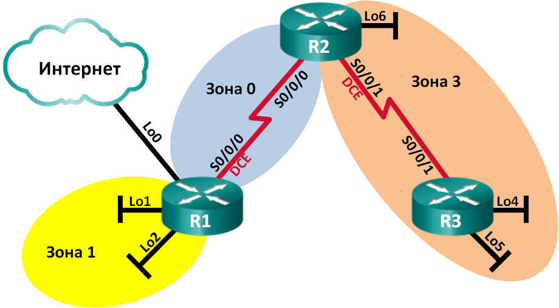

Лабораторная работа. Настройка OSPFv2 для нескольких областей
---------

Топология
---------

Таблица адресации
---------
| Устройство | Интерфейс    | IP-адрес        | Маска подсети   |
|------------|--------------|-----------------|-----------------|
| R1         | Lo0          | 209.165.200.225 | 255.255.255.252 |
|            | Lo1          | 192.168.1.1     | 255.255.255.0   |
|            | Lo2          | 192.168.2.1     | 255.255.255.0   |
|            | S0/0/0 (DCE) | 192.168.12.1    | 255.255.255.252 |
| R2         | Lo6          | 192.168.6.1     | 255.255.255.0   |
|            | S0/0/0       | 192.168.12.2    | 255.255.255.252 |
|            | S0/0/1 (DCE) | 192.168.23.1    | 255.255.255.252 |
| R3         | Lo4          | 192.168.4.1     | 255.255.255.0   |
|            | Lo5          | 192.168.5.1     | 255.255.255.0   |
|            | S0/0/1       | 192.168.23.2    | 255.255.255.252 |

Задачи
---------

Часть 1. Создание сети и настройка основных параметров устройства

Часть 2. Настройка сети OSPFv2 для нескольких областей

Часть 3. Настройка межобластных суммарных маршрутов

Общие сведения/сценарий
---------

Для улучшения эффективности и масштабируемости в OSPF поддерживается
иерархическая маршрутизация, использующая понятие областей. Область OSPF — это
группа маршрутизаторов, использующих в своих базах данных состояний каналов
(LSDB) общие и одинаковые данные о состоянии каналов. Если большая область OSPF
разделена на области меньшего размера, такая архитектура называется OSPF для
нескольких областей. Использование OSPF для нескольких областей является
целесообразным в сетях большего размера, поскольку это позволяет сократить
потребление ресурсов ЦП и памяти.

В этой лабораторной работе будет выполнена настройка сети OSPFv2 для нескольких
областей с межобластными суммарными маршрутами.

**Примечание**. В практических лабораторных работах CCNA используются
маршрутизаторы с интегрированными сетевыми сервисами (ISR) Cisco 1941
с операционной системой Cisco IOS версии 15.2(4)M3 (образ universalk9).
Допускается использование маршрутизаторов других моделей, а также других версий
операционной системы Cisco IOS. В зависимости от модели устройства и версии
Cisco IOS доступные команды и результаты их выполнения могут отличаться от тех,
которые показаны в лабораторных работах. Точные идентификаторы интерфейсов см.
в сводной таблице по интерфейсам маршрутизаторов в конце лабораторной работы.

**Примечание**. Убедитесь, что все настройки маршрутизаторов удалены
и загрузочная конфигурация отсутствует. Если вы не уверены, обратитесь
к инструктору.

Необходимые ресурсы
---------

-   3 маршрутизатора (Cisco 1941 с операционной системой Cisco IOS версии
    15.2(4)M3 (универсальный образ) или аналогичная модель)

-   Консольные кабели для настройки устройств Cisco IOS через консольные порты

-   Последовательные кабели в соответствии с топологией

Вопросы для повторения
---------

Какие три преимущества при проектировании сети предоставляет OSPF для нескольких
областей?

1.  Сокращение таблицы маршрутизации, при настройке объединения маршрутов на
    ABR.

2.  Реже происходит перерасчет SPF.

3.  Сокращение расходов на обновление состояния каналов.

4.  Сводная таблица по интерфейсам маршрутизаторов