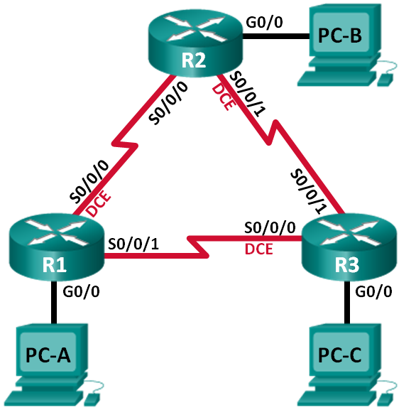

Лабораторная работа. Базовая настройка протокола EIGRP для IPv4
---------

Топология
---------

Таблица адресации
---------

| Устройство | Интерфейс    | IP-адрес    | Маска подсети   | Шлюз по умолчанию |
|------------|--------------|-------------|-----------------|-------------------|
| R1         | G0/0         | 192.168.1.1 | 255.255.255.0   | —                 |
|            | S0/0/0 (DCE) | 10.1.1.1    | 255.255.255.252 | —                 |
|            | S0/0/1       | 10.3.3.1    | 255.255.255.252 | —                 |
| R2         | G0/0         | 192.168.2.1 | 255.255.255.0   | —                 |
|            | S0/0/0       | 10.1.1.2    | 255.255.255.252 | —                 |
|            | S0/0/1 (DCE) | 10.2.2.2    | 255.255.255.252 | —                 |
| R3         | G0/0         | 192.168.3.1 | 255.255.255.0   | —                 |
|            | S0/0/0 (DCE) | 10.3.3.2    | 255.255.255.252 | —                 |
|            | S0/0/1       | 10.2.2.1    | 255.255.255.252 | —                 |
| PC-A       | NIC          | 192.168.1.3 | 255.255.255.0   | 192.168.1.1       |
| PC-B       | NIC          | 192.168.2.3 | 255.255.255.0   | 192.168.2.1       |
| PC-C       | NIC          | 192.168.3.3 | 255.255.255.0   | 192.168.3.1       |

Задачи
---------

Часть 1. Построение сети и проверка соединения

Часть 2. Настройка маршрутизации EIGRP

Часть 3. Проверка маршрутизации EIGRP

Часть 4. Настройка пропускной способности и пассивных интерфейсов

Общие сведения/сценарий
---------

Протокол EIGRP — это высокопроизводительный протокол маршрутизации на основе
векторов расстояния, относительно несложный при настройке для базовых сетей.

В этой лабораторной работе необходимо настроить EIGRP для приведённых выше сетей
и их топологии. Вам предстоит изменить пропускную способность и настроить
пассивный интерфейс, чтобы повысить эффективность работы EIGRP.

**Примечание**. В практических лабораторных работах CCNA используются
маршрутизаторы с интегрированными сетевыми сервисами (ISR) Cisco 1941
с операционной системой Cisco IOS версии 15.2(4)M3 (образ universalk9).
Допускается использование маршрутизаторов других моделей, а также других версий
операционной системы Cisco IOS. В зависимости от модели устройства и версии
Cisco IOS доступные команды и результаты их выполнения могут отличаться от тех,
которые показаны в лабораторных работах. Точные идентификаторы интерфейсов см.
в сводной таблице по интерфейсам маршрутизаторов в конце лабораторной работы.

**Примечание**. Убедитесь, что все настройки маршрутизаторов удалены
и загрузочная конфигурация отсутствует. Если вы не уверены, обратитесь
к инструктору.

Необходимые ресурсы
---------

-   3 маршрутизатора (Cisco 1941 с операционной системой Cisco IOS версии
    15.2(4)M3 (универсальный образ) или аналогичная модель)

-   3 ПК (Windows 7, Vista или XP с программой эмуляции терминала, например Tera
    Term)

-   Консольные кабели для настройки устройств Cisco IOS через консольные порты

-   Кабели Ethernet и последовательные кабели согласно топологии

Часть 1. Построение сети и проверка соединения
---------

#### Произведите базовую настройку маршрутизаторов.

	R1-3(config)#no ip domain-lookup
	R1-3(config)#enable secret class
	R1-3(config)#line console 0
	R1-3(config)#password cisco
	R1-3(config)#login
	R1-3(config)#logging synchronous
	R1-3(config)#line vty 0 4
	R1-3(config)#password cisco
	R1-3(config)#login
	R1-3(config)#logging synchronous
	R1-3(config)#banner motd #Attention. Unauthorized users are not allowed.#

	R1(config)#interface G0/0
	R1(config)#ip address 192.168.1.1 255.255.255.0
	R1(config)#interface Serial0/0/0
	R1(config)#ip address 10.1.1.1 255.255.255.252
	R1(config)#interface Serial0/0/1
	R1(config)#ip address 10.3.3.1 255.255.255.252

	R2(config)#interface G0/0
	R2(config)#ip address 192.168.2.1 255.255.255.0
	R2(config)#interface Serial0/0/0
	R2(config)#ip address 10.1.1.2 255.255.255.252
	R2(config)#interface Serial0/0/1
	R2(config)#ip address 10.2.2.2 255.255.255.252

	R3(config)#interface G0/0
	R3(config)#ip address 192.168.3.1 255.255.255.0
	R3(config)#interface Serial0/0/0
	R3(config)#ip address 10.3.3.2 255.255.255.252
	R3(config)#interface Serial0/0/1
	R3(config)#ip address 10.2.2.1 255.255.255.252

#### Настройка маршрутизации EIGRP

##### Включим маршрутизацию EIGRP на маршрутизаторе R1. Используем номер автономной системы 10.

	R1(config)# router eigrp 10

##### Объявим напрямую подключенные сети на маршрутизаторе R1, используя шаблонную маску.

	R1(config-router)# network 10.1.1.0 0.0.0.3
	R1(config-router)# network 192.168.1.0 0.0.0.255
	R1(config-router)# network 10.3.3.0 0.0.0.3

***Почему рекомендуется использовать шаблонные маски при объявлении сетей? Можно ли исключить маску в какой-нибудь из вышеприведённых инструкций network? Если да, то в какой (в каких)?***

> Шаблонные маски позволяют указать на отдельные IP адреса сети, которые нужно обработать (объявить). Можно исключить обратную маску сети из "network 192.168.1.0 0.0.0.255", по причине того, что данная сеть попадает под С класс сетей.

##### Включим маршрутизацию EIGRP и объявим напрямую подключенные сети на маршрутизаторах R2 и R3.

	R2(config)# router eigrp 10
	R2(config-router)# network 10.1.1.0 0.0.0.3
	R2(config-router)# network 192.168.2.0 0.0.0.255
	R2(config-router)# network 10.2.2.0 0.0.0.3

	R3(config)# router eigrp 10
	R3(config-router)# network 10.2.2.0 0.0.0.3
	R3(config-router)# network 192.168.1.0 0.0.0.255
	R3(config-router)# network 10.3.3.0 0.0.0.3

#### Проверка маршрутизации EIGRP

##### Анализ таблицы соседних устройств EIGRP.

	R1#show ip eigrp neighbors 
	IP-EIGRP neighbors for process 10
	H   Address         Interface      Hold Uptime    SRTT   RTO   Q   Seq
	                                   (sec)          (ms)        Cnt  Num
	0   10.1.1.2        Se0/1/0        13   00:02:28  40     1000  0   15
	1   10.3.3.2        Se0/1/1        11   00:02:26  40     1000  0   9

	R2#show ip eigrp neighbors 
	IP-EIGRP neighbors for process 10
	H   Address         Interface      Hold Uptime    SRTT   RTO   Q   Seq
	                                   (sec)          (ms)        Cnt  Num
	0   10.1.1.1        Se0/1/0        11   00:00:49  40     1000  0   12
	1   10.2.2.1        Se0/1/1        14   00:00:47  40     1000  0   10

	R3#show ip eigrp neighbors 
	IP-EIGRP neighbors for process 10
	H   Address         Interface      Hold Uptime    SRTT   RTO   Q   Seq
	                                   (sec)          (ms)        Cnt  Num
	0   10.3.3.1        Se0/1/0        11   00:01:55  40     1000  0   11
	1   10.2.2.2        Se0/1/1        10   00:01:54  40     1000  0   16

##### Проанализируем таблицу IP-маршрутизации EIGRP.

	R1# show ip route eigrp
	Codes: L - local, C - connected, S - static, R - RIP, M - mobile, B - BGP
	       D - EIGRP, EX - EIGRP external, O - OSPF, IA - OSPF inter area
	       N1 - OSPF NSSA external type 1, N2 - OSPF NSSA external type 2
	       E1 - OSPF external type 1, E2 - OSPF external type 2
	       i - IS-IS, su - IS-IS summary, L1 - IS-IS level-1, L2 - IS-IS level-2
	       ia - IS-IS inter area, * - candidate default, U - per-user static route
	       o - ODR, P - periodic downloaded static route, H - NHRP, l - LISP
	       + - replicated route, % - next hop override
	
	Gateway of last resort is not set
	
	      10.0.0.0/8 is variably subnetted, 5 subnets, 2 masks
	D        10.2.2.0/30 [90/2681856] via 10.3.3.2, 00:29:01, Serial0/0/1
	                     [90/2681856] via 10.1.1.2, 00:29:01, Serial0/0/0
	D     192.168.2.0/24 [90/2172416] via 10.1.1.2, 00:29:01, Serial0/0/0
	D     192.168.3.0/24 [90/2172416] via 10.3.3.2, 00:27:56, Serial0/0/1

***Почему у маршрутизатора R1 два пути к сети 10.2.2.0/30?***
> Стоимость пути до данной сети идентичная.

##### Проанализируем таблицу соседних устройств EIGRP.

	R1# show ip eigrp topology
	EIGRP-IPv4 Topology Table for AS(10)/ID(192.168.1.1)
	Codes: P - Passive, A - Active, U - Update, Q - Query, R - Reply,
	       r - reply Status, s - sia Status
	
	P 192.168.3.0/24, 1 successors, FD is 2172416
	        via 10.3.3.2 (2172416/28160), Serial0/0/1
	P 192.168.2.0/24, 1 successors, FD is 2172416
	        via 10.1.1.2 (2172416/28160), Serial0/0/0
	P 10.2.2.0/30, 2 successors, FD is 2681856
	        via 10.1.1.2 (2681856/2169856), Serial0/0/0
	        via 10.3.3.2 (2681856/2169856), Serial0/0/1
	P 10.3.3.0/30, 1 successors, FD is 2169856
	        via Connected, Serial0/0/1
	P 192.168.1.0/24, 1 successors, FD is 2816
	        via Connected, GigabitEthernet0/0
	P 10.1.1.0/30, 1 successors, FD is 2169856
	        via Connected, Serial0/0/0

##### Проверим параметры маршрутизации EIGRP и объявленные сети.

	R1# show ip protocols
	*** IP Routing is NSF aware ***
	
	Routing Protocol is "eigrp 10"
	  Outgoing update filter list for all interfaces is not set
	  Incoming update filter list for all interfaces is not set
	  Default networks flagged in outgoing updates
	  Default networks accepted from incoming updates
	  EIGRP-IPv4 Protocol for AS(10)
	    Metric weight K1=1, K2=0, K3=1, K4=0, K5=0
	    NSF-aware route hold timer is 240
	    Router-ID: 192.168.1.1
	    Topology : 0 (base)
	      Active Timer: 3 min
	      Distance: internal 90 external 170
	      Maximum path: 4
	      Maximum hopcount 100
	      Maximum metric variance 1
	
	  Automatic Summarization: disabled
	  Maximum path: 4
	  Routing for Networks:
	    10.1.1.0/30
	    10.3.3.0/30
	    192.168.1.0
	  Routing Information Sources:
	    Gateway         Distance      Last Update
	    10.3.3.2              90      02:38:34
	    10.1.1.2              90      02:38:34
	  Distance: internal 90 external 170

***Ответьте на следующие вопросы, используя результаты команды show ip protocols.***

*Какой номер автономной системы используется?*
> 10.

*Какие сети объявляются?*
> 10.1.1.0/30, 10.3.3.0/30, 192.168.1.0.

*Каково значение административной дистанции для маршрутов EIGRP?*
> 90.

*Сколько маршрутов с равной стоимостью по умолчанию использует EIGRP?*
> 2.

#### Настройка пропускной способности и пассивных интерфейсов

##### Изучим текущие настройки маршрутизации.

	R1# show interface s0/0/0
	Serial0/0/0 is up, line protocol is up
	  Hardware is WIC MBRD Serial
	  Internet address is 10.1.1.1/30
	  MTU 1500 bytes, BW 1544 Kbit/sec, DLY 20000 usec,
	     reliability 255/255, txload 1/255, rxload 1/255
	  Encapsulation HDLC, loopback not set
	  Keepalive set (10 sec)
	  Last input 00:00:01, output 00:00:02, output hang never
	  Last clearing of "show interface" counters 03:43:45
	  Input queue: 0/75/0/0 (size/max/drops/flushes); Total output drops: 0
	  Queueing strategy: fifo
	  Output queue: 0/40 (size/max)
	  5 minute input rate 0 bits/sec, 0 packets/sec
	  5 minute output rate 0 bits/sec, 0 packets/sec
	     4050 packets input, 270294 bytes, 0 no buffer
	     Received 1554 broadcasts (0 IP multicasts)
	     0 runts, 0 giants, 0 throttles
	     1 input errors, 0 CRC, 0 frame, 0 overrun, 0 ignored, 1 abort
	     4044 packets output, 271278 bytes, 0 underruns
	     0 output errors, 0 collisions, 5 interface resets
	     4 unknown protocol drops
	     0 output buffer failures, 0 output buffers swapped out
	     12 carrier transitions
	     DCD=up  DSR=up  DTR=up  RTS=up  CTS=up

*Какова пропускная способность по умолчанию для этого последовательного интерфейса?*
> 1544 Kbit/sec.

*Сколько маршрутов к сети 10.2.2.0/30 содержит таблица маршрутизации?* 
> 2.

##### Изменим пропускную способность на маршрутизаторе R1.

	R1(config)# interface s0/0/0
	R1(config-if)# bandwidth 2000
	R1(config-if)# interface s0/0/1
	R1(config-if)# bandwidth 64

	R1# show ip route
	Codes: L - local, C - connected, S - static, R - RIP, M - mobile, B - BGP
	       D - EIGRP, EX - EIGRP external, O - OSPF, IA - OSPF inter area
	       N1 - OSPF NSSA external type 1, N2 - OSPF NSSA external type 2
	       E1 - OSPF external type 1, E2 - OSPF external type 2
	       i - IS-IS, su - IS-IS summary, L1 - IS-IS level-1, L2 - IS-IS level-2
	       ia - IS-IS inter area, * - candidate default, U - per-user static route
	       o - ODR, P - periodic downloaded static route, H - NHRP, l - LISP
	       + - replicated route, % - next hop override
	
	Gateway of last resort is not set
	
	      10.0.0.0/8 is variably subnetted, 5 subnets, 2 masks
	C        10.1.1.0/30 is directly connected, Serial0/0/0
	L        10.1.1.1/32 is directly connected, Serial0/0/0
	D        10.2.2.0/30 [90/2681856] via 10.1.1.2, 00:03:09, Serial0/0/0
	C        10.3.3.0/30 is directly connected, Serial0/0/1
	L        10.3.3.1/32 is directly connected, Serial0/0/1
	      192.168.1.0/24 is variably subnetted, 2 subnets, 2 masks
	C        192.168.1.0/24 is directly connected, GigabitEthernet0/0
	L        192.168.1.1/32 is directly connected, GigabitEthernet0/0
	D     192.168.2.0/24 [90/1794560] via 10.1.1.2, 00:03:09, Serial0/0/0
	D     192.168.3.0/24 [90/2684416] via 10.1.1.2, 00:03:08, Serial0/0/0

> До сети 10.2.2.0/30 остался всего один маршрут. Причиной является удорожание маршрута через R3.

##### Изменим пропускную способность на маршрутизаторах R2 и R3.

	R2(config)# interface s0/0/0
	R2(config-if)# bandwidth 2000
	R2(config-if)# interface s0/0/1
	R2(config-if)# bandwidth 2000

	R3(config)# interface s0/0/0
	R3(config-if)# bandwidth 64
	R3(config-if)# interface s0/0/1
	R3(config-if)# bandwidth 2000

##### Проверим изменения пропускной способности.

	R1# show interface s0/0/0
	Serial0/0/0 is up, line protocol is up
	  Hardware is WIC MBRD Serial
	  Internet address is 10.1.1.1/30
	  MTU 1500 bytes, BW 2000 Kbit/sec, DLY 20000 usec,
	     reliability 255/255, txload 1/255, rxload 1/255
	  Encapsulation HDLC, loopback not set
	  Keepalive set (10 sec)
	  Last input 00:00:01, output 00:00:02, output hang never
	  Last clearing of "show interface" counters 04:06:06
	  Input queue: 0/75/0/0 (size/max/drops/flushes); Total output drops: 0
	  Queueing strategy: fifo
	  Output queue: 0/40 (size/max)
	  5 minute input rate 0 bits/sec, 0 packets/sec
	  5 minute output rate 0 bits/sec, 0 packets/sec
	     4767 packets input, 317155 bytes, 0 no buffer
	     Received 1713 broadcasts (0 IP multicasts)
	     0 runts, 0 giants, 0 throttles
	     1 input errors, 0 CRC, 0 frame, 0 overrun, 0 ignored, 1 abort
	     4825 packets output, 316451 bytes, 0 underruns
	     0 output errors, 0 collisions, 5 interface resets
	     4 unknown protocol drops
	     0 output buffer failures, 0 output buffers swapped out
	     12 carrier transitions
	     DCD=up  DSR=up  DTR=up  RTS=up  CTS=up

*Исходя из заданной пропускной способности, попробуйте определить, как будут выглядеть таблицы маршрутизации маршрутизаторов R2 и R3 до выполнения команды show ip route. Останутся ли их таблицы маршрутизации прежними или изменятся?*
> На маршрутизатор R3 останится один маршрут до сети 192.168.1.0/24.

##### Настроим на маршрутизаторах R1, R2 и R3 интерфейс G0/0 как пассивный.

	R1(config)# router eigrp 10
	R1(config-router)# passive-interface g0/0

	R2(config)# router eigrp 10
	R2(config-router)# passive-interface g0/0

	R3(config)# router eigrp 10
	R3(config-router)# passive-interface g0/0

##### Проверим конфигурацию пассивных интерфейсов.

	R1# show ip protocols
	*** IP Routing is NSF aware ***
	
	Routing Protocol is "eigrp 10"
	  Outgoing update filter list for all interfaces is not set
	  Incoming update filter list for all interfaces is not set
	  Default networks flagged in outgoing updates
	  Default networks accepted from incoming updates
	  EIGRP-IPv4 Protocol for AS(10)
	    Metric weight K1=1, K2=0, K3=1, K4=0, K5=0
	    NSF-aware route hold timer is 240
	    Router-ID: 192.168.1.1
	    Topology : 0 (base)
	      Active Timer: 3 min
	      Distance: internal 90 external 170
	      Maximum path: 4
	      Maximum hopcount 100
	      Maximum metric variance 1
	
	  Automatic Summarization: disabled
	  Maximum path: 4
	  Routing for Networks:
	    10.1.1.0/30
	    10.3.3.0/30
	    192.168.1.0
	  Passive Interface(s):
	    GigabitEthernet0/0
	  Routing Information Sources:
	    Gateway         Distance      Last Update
	    10.3.3.2              90      00:48:09
	    10.1.1.2              90      00:48:26
	  Distance: internal 90 external 170

Вопросы для повторения
---------

При выполнении лабораторной работы можно было ограничиться только статической
маршрутизацией. Каковы преимущества использования EIGRP?

1. Протоком автоматически реагирует на изменения в сети;

2. При конфигурации меньший шанс ошибки;

3. У администратора сети меньше работы по обслуживанию конфигурации сетевого
   оборудования.