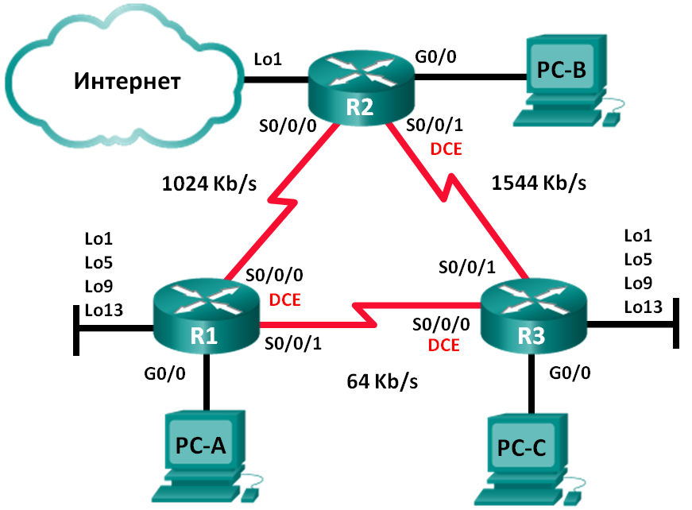

Лабораторная работа. Настройка расширенных функций EIGRP для IPv4
---------

Топология
---------

Таблица адресации
---------

| Устройство | Интерфейс    | IP-адрес      | Маска подсети   | Шлюз по умолчанию |
|------------|--------------|---------------|-----------------|-------------------|
| R1         | G0/0         | 192.168.1.1   | 255.255.255.0   | —                 |
|            | S0/0/0 (DCE) | 192.168.12.1  | 255.255.255.252 | —                 |
|            | S0/0/1       | 192.168.13.1  | 255.255.255.252 | —                 |
|            | Lo1          | 192.168.11.1  | 255.255.255.252 | Н/Д (недоступно)  |
|            | Lo5          | 192.168.11.5  | 255.255.255.252 | —                 |
|            | Lo9          | 192.168.11.9  | 255.255.255.252 | —                 |
|            | Lo13         | 192.168.11.13 | 255.255.255.252 | —                 |
| R2         | G0/0         | 192.168.2.1   | 255.255.255.0   | —                 |
|            | S0/0/0       | 192.168.12.2  | 255.255.255.252 | —                 |
|            | S0/0/1 (DCE) | 192.168.23.1  | 255.255.255.252 | —                 |
|            | Lo1          | 192.168.22.1  | 255.255.255.252 | —                 |
| R3         | G0/0         | 192.168.3.1   | 255.255.255.0   | —                 |
|            | S0/0/0 (DCE) | 192.168.13.2  | 255.255.255.252 | —                 |
|            | S0/0/1       | 192.168.23.2  | 255.255.255.252 | —                 |
|            | Lo1          | 192.168.33.1  | 255.255.255.252 | Н/Д (недоступно)  |
|            | Lo5          | 192.168.33.5  | 255.255.255.252 | —                 |
|            | Lo9          | 192.168.33.9  | 255.255.255.252 | —                 |
|            | Lo13         | 192.168.33.13 | 255.255.255.252 | —                 |
| PC-A       | NIC          | 192.168.1.3   | 255.255.255.0   | 192.168.1.1       |
| PC-B       | NIC          | 192.168.2.3   | 255.255.255.0   | 192.168.2.1       |
| PC-C       | NIC          | 192.168.3.3   | 255.255.255.0   | 192.168.3.1       |

Задачи
---------

Часть 1. Создание сети и настройка основных параметров устройства

Часть 2. Настройка EIGRP и проверка подключения

Часть 3. Настройка EIGRP для автоматического объединения

Часть 4. Настройка и распространение статического маршрута по умолчанию

Часть 5. Выполнение точной настройки EIGRP

-   Настройте параметры использования пропускной способности для EIGRP.

-   Настройте интервал отправки пакетов приветствия (hello) и таймер удержания
    для EIGRP.

Общие сведения/сценарий
---------

EIGRP поддерживает расширенный набор функций, которые позволяют вносить
изменения, связанные с объединением, распространением маршрута по умолчанию,
использованием пропускной способности и показателями.

В этой лабораторной работе вам предстоит настроить автоматическое объединение
для EIGRP, настроить распространение маршрута EIGRP и выполнить точную настройку
показателей EIGRP.

**Примечание**. В практических лабораторных работах CCNA используются
маршрутизаторы с интегрированными сетевыми сервисами (ISR) Cisco 1941
с операционной системой Cisco IOS версии 15.2(4)M3 (образ universalk9).
Допускается использование маршрутизаторов других моделей, а также других версий
операционной системы Cisco IOS. В зависимости от модели устройства и версии
Cisco IOS доступные команды и результаты их выполнения могут отличаться от тех,
которые показаны в лабораторных работах. Правильные идентификаторы интерфейса
см. в сводной таблице по интерфейсам маршрутизаторов в конце лабораторной
работы.

**Примечание**. Убедитесь, что предыдущие настройки маршрутизаторов удалены,
и на них отсутствуют файлы загрузочной конфигурации. Если вы не уверены,
обратитесь к инструктору.

Необходимые ресурсы
---------

-   3 маршрутизатора (Cisco 1941 с операционной системой Cisco IOS версии
    15.2(4)M3 (универсальный образ) или аналогичная модель)

-   3 ПК (Windows и программа эмуляции терминалов, например Tera Term)

-   Консольные кабели для настройки устройств Cisco IOS через консольные порты

-   Кабели Ethernet и последовательные кабели согласно топологии

Часть 1. Создание сети и настройка основных параметров устройства
---------

#### Произведите базовую настройку маршрутизаторов.

	R1-3(config)#no ip domain-lookup
	R1-3(config)#enable secret class
	R1-3(config)#line console 0
	R1-3(config)#password cisco
	R1-3(config)#login
	R1-3(config)#logging synchronous
	R1-3(config)#line vty 0 4
	R1-3(config)#password cisco
	R1-3(config)#login
	R1-3(config)#logging synchronous
	R1-3(config)#banner motd #Attention. Unauthorized users are not allowed.#

	R1(config)#interface G0/0
	R1(config)#ip address 192.168.1.1 255.255.255.0
	R1(config)#interface Serial0/0/0
	R1(config)#ip address 192.168.12.1 255.255.255.252
	R1(config)#interface Serial0/0/1
	R1(config)#ip address 192.168.13.1 255.255.255.252

	R2(config)#interface G0/0
	R2(config)#ip address 192.168.2.1 255.255.255.0
	R2(config)#interface Serial0/0/0
	R2(config)#ip address 192.168.12.2 255.255.255.252
	R2(config)#interface Serial0/0/1
	R2(config)#ip address 192.168.23.1 255.255.255.252

	R3(config)#interface G0/0
	R3(config)#ip address 192.168.3.1 255.255.255.0
	R3(config)#interface Serial0/0/0
	R3(config)#ip address 192.168.13.2 255.255.255.252
	R3(config)#interface Serial0/0/1
	R3(config)#ip address 192.168.23.2 255.255.255.252

Часть 2. Настройка EIGRP и проверка подключения
---------

#### Настроим EIGRP.

	R1(config)#router eigrp 1
	R1(config-router)# network 192.168.1.0
	R1(config-router)# network 192.168.12.0 0.0.0.3
	R1(config-router)# network 192.168.13.0 0.0.0.3
	R1(config-router)# passive-interface GigabitEthernet0/0
	R1(config)#interface Serial0/0/0
	R1(config-if)# bandwidth 1024
	R1(config)#interface Serial0/0/1
	R1(config-if)# bandwidth 64

	R2(config)#router eigrp 1
	R2(config-router)# network 192.168.2.0
	R2(config-router)# network 192.168.12.0 0.0.0.3
	R2(config-router)# network 192.168.23.0 0.0.0.3
	R2(config-router)# passive-interface GigabitEthernet0/0
	R2(config)#interface Serial0/0/0
	R2(config-if)# bandwidth 1024

	R3(config)#router eigrp 1
	R3(config-router)# network 192.168.3.0
	R3(config-router)# network 192.168.13.0 0.0.0.3
	R3(config-router)# network 192.168.23.0 0.0.0.3
	R3(config-router)# passive-interface GigabitEthernet0/0
	R3(config)#interface Serial0/0/0
	R3(config-if)# bandwidth 64

Часть 3. Настройка EIGRP для автоматического объединения
---------

#### Настроим EIGRP для автоматического объединения.

*Введем команду show ip protocols на R1. Как по умолчанию настроено автоматическое объединение в EIGRP?*

>disabled

##### Добавим loopback-адреса на R1.

	R1(config)#interface Loopback1
	R1(config-if)#ip address 192.168.11.1 255.255.255.252
	R1(config-if)#interface Loopback5
	R1(config-if)#ip address 192.168.11.5 255.255.255.252
	R1(config-if)#interface Loopback9
	R1(config-if)#ip address 192.168.11.9 255.255.255.252
	R1(config-if)#interface Loopback13
	R1(config-if)#ip address 192.168.11.13 255.255.255.252

##### Добавим соответствующие инструкции network для процесса EIGRP на маршрутизаторе R1. 
	
	R1(config-router)# network 192.168.11.0

##### На маршрутизаторе R2 выполним команду show ip route eigrp. Следующие сети loopback представлены в результатах этой команды:

	192.168.11.0/30 is subnetted, 4 subnets
	 D 192.168.11.0 [90/3139840] via 192.168.12.1, 00:00:02, Serial0/0/0
	 D 192.168.11.4 [90/3139840] via 192.168.12.1, 00:00:02, Serial0/0/0
	 D 192.168.11.8 [90/3139840] via 192.168.12.1, 00:00:02, Serial0/0/0
	 D 192.168.11.12 [90/3139840] via 192.168.12.1, 00:00:02, Serial0/0/0

##### На маршрутизаторе R1 выполним команду auto-summary в рамках процесса EIGRP.

	R1(config)# router eigrp 1
	R1(config-router)# auto-summary

##### Таблица маршрутизации R2 изменилась следующим образом:

	D    192.168.11.0/24 [90/3139840] via 192.168.12.1, 00:00:01, Serial0/0/0

##### Повторим шаги на маршрутизаторе R3:

	R3(config)#interface Loopback1
	R3(config-if)#ip address 192.168.33.1 255.255.255.252
	R3(config)#interface Loopback5
	R3(config-if)#ip address 192.168.33.5 255.255.255.252
	R3(config)#interface Loopback9
	R3(config-if)#ip address 192.168.33.9 255.255.255.252
	R3(config)#interface Loopback13
	R3(config-if)#ip address 192.168.33.13 255.255.255.252
	R3(config)# router eigrp 1
	R3(config-router)# network 192.168.33.0
	R3(config-router)# auto-summary

##### В таблицу маршрутизации R2 добавился следующий маршрут:

	D    192.168.33.0/24 [90/2297856] via 192.168.23.2, 00:00:02, Serial0/0/1

Часть 4. Настройка и распространение статического маршрута по умолчанию
---------

#### Настроим loopback-адреса на R2.

	R2(config)#interface Loopback1
	R2(config-if)#ip address 192.168.22.1 255.255.255.252

#### Настроим статический маршрут по умолчанию с выходным интерфейсом Lo1.

	R2(config)# ip route 0.0.0.0 0.0.0.0 Lo1

#### Выполним команду redistribute static в рамках процесса EIGRP, чтобы распространить статический маршрут по умолчанию на другие участвующие маршрутизаторы.

	R2(config)# router eigrp 1
	R2(config-router)# redistribute static

#### Используем команду show ip protocols на маршрутизаторе R2, чтобы проверить, распространился ли этот статический маршрут.

	R2# show ip protocols
	*** IP Routing is NSF aware ***
	<выходные данные опущены>
	Routing Protocol is "eigrp 1"
	  Outgoing update filter list for all interfaces is not set
	  Incoming update filter list for all interfaces is not set
	  Default networks flagged in outgoing updates
	  Default networks accepted from incoming updates
	  Redistributing: static
	  EIGRP-IPv4 Protocol for AS(1)
	    Metric weight K1=1, K2=0, K3=1, K4=0, K5=0
	    NSF-aware route hold timer is 240
	    Router-ID: 192.168.23.1
	    Topology : 0 (base)
	      Active Timer: 3 min
	      Distance: internal 90 external 170
	      Maximum path: 4
	      Maximum hopcount 100
	      Maximum metric variance 1
	
	  Automatic Summarization: disabled
	  Maximum path: 4
	  Routing for Networks:
	    192.168.2.0
	    192.168.12.0/30
	    192.168.23.0/30
	  Passive Interface(s):
	    GigabitEthernet0/0
	  Routing Information Sources:
	    Gateway         Distance      Last Update
	    192.168.12.1          90      00:13:20
	    192.168.23.2          90      00:13:20
	  Distance: internal 90 external 170

*На маршрутизаторе R1 выполним команду show ip route eigrp | include 0.0.0.0, чтобы просмотреть инструкции, относящиеся к маршруту по умолчанию.*
*Как статический маршрут по умолчанию представлен в результатах этой команды?* 
*Укажите административную дистанцию (AD) распространяемого маршрута.*

>D*EX 0.0.0.0/0 [170/4291840] via 192.168.12.2, 00:00:53, Serial0/0/0

Часть 5. Выполнение точной настройки EIGRP
---------

#### Настроим параметры использования пропускной способности для EIGRP.

	R1(config)# interface s0/0/0
	R1(config-if)# ip bandwidth-percent eigrp 1 75
	R1(config)# interface s0/0/0
	R1(config-if)# ip bandwidth-percent eigrp 1 40
	R2(config)# interface s0/0/0
	R2(config-if)# ip bandwidth-percent eigrp 1 75
	R3(config)# interface s0/0/0
	R3(config-if)#ip bandwidth-percent eigrp 1 40

#### Настроим интервал отправки пакетов приветствия (hello) и таймер удержания для EIGRP.

##### На R1 проверим интервал приветствия:

	R2# show ip eigrp interfaces detail
	EIGRP-IPv4 Interfaces for AS(1)
	                              Xmit Queue   PeerQ        Mean   Pacing Time   Multicast    Pending
	Interface              Peers  Un/Reliable  Un/Reliable  SRTT   Un/Reliable   Flow Timer   Routes
	Se0/0/0                  1        0/0       0/0           1       0/15          50           0
	  Hello-interval is 5, Hold-time is 15
	  Split-horizon is enabled
	  Next xmit serial <none>
	  Packetized sent/expedited: 29/1
	  Hello's sent/expedited: 390/2
	  Un/reliable mcasts: 0/0  Un/reliable ucasts: 35/39
	  Mcast exceptions: 0  CR packets: 0  ACKs suppressed: 0
	  Retransmissions sent: 0  Out-of-sequence rcvd: 0
	  Topology-ids on interface - 0
	  Interface BW percentage is 75
	  Authentication mode is not set
	Se0/0/1                  1        0/0       0/0           1       0/16          50           0
	  Hello-interval is 5, Hold-time is 15
	  Split-horizon is enabled
	  Next xmit serial <none>
	  Packetized sent/expedited: 34/5
	  Hello's sent/expedited: 382/2
	  Un/reliable mcasts: 0/0  Un/reliable ucasts: 31/42
	  Mcast exceptions: 0  CR packets: 0  ACKs suppressed: 2
	  Retransmissions sent: 0  Out-of-sequence rcvd: 0
	  Topology-ids on interface - 0
	  Authentication mode is not set

*Значение таймера приветствия по умолчанию.*

>5

*Значение таймера удержания по умолчанию.*

>15

##### Для интерфейсов S0/0/0 и S0/0/1 маршрутизаторов R1-3 настроим интервал приветствия равным 60 секунд, а таймер удержания равным 180 секунд, именно в этом порядке.

	R1(config)# interface s0/0/0
	R1(config-if)# ip hello-interval eigrp 1 60
	R1(config-if)# ip hold-time eigrp 1 180
	R1(config)# interface s0/0/1
	R1(config-if)# ip hello-interval eigrp 1 60
	R1(config-if)# ip hold-time eigrp 1 180

	R2(config)# interface s0/0/0
	R2(config-if)# ip hello-interval eigrp 1 60
	R2(config-if)# ip hold-time eigrp 1 180
	R2(config)# interface s0/0/1
	R2(config-if)# ip hello-interval eigrp 1 60
	R2(config-if)# ip hold-time eigrp 1 180

	R3(config)# interface s0/0/0
	R3(config-if)# ip hello-interval eigrp 1 60
	R3(config-if)# ip hold-time eigrp 1 180
	R3(config)# interface s0/0/1
	R3(config-if)# ip hello-interval eigrp 1 60
	R3(config-if)# ip hold-time eigrp 1 180

Вопросы для повторения
---------

1. В чем заключаются преимущества объединения маршрутов?

 *Упрощения визуального восприятия таблицы маршрутизации.*

2. Почему при настройке таймеров EIGRP необходимо настраивать значение времени удержания равным или больше интервала приветствия?

 *Возможна потеря пакета Hello. Данная настройка позволяет дождаться следующего возможного пакета, не перестраивая таблицу маршрутизации.*
