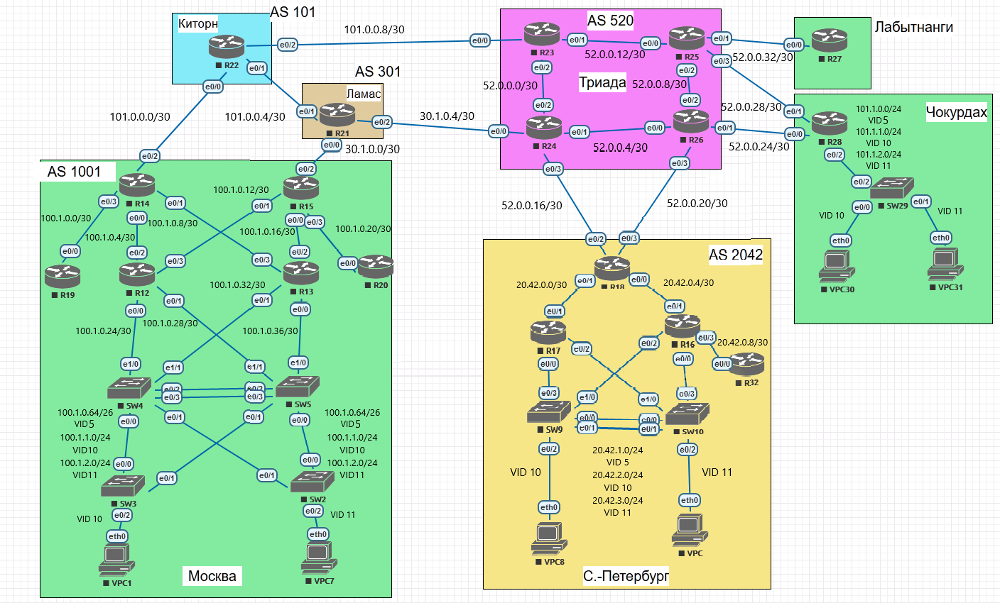

Лабораторная работа. Планировка и настройка адресного пространства. 
---------

Топология
---------

Задачи
---------

1. Разработаете и задокументируете адресное пространство для лабораторного стенда;
2. Настроите ip адреса на каждом активном порту;
4. Настроите каждый VPC в любом офисе в своем VLAN;
5. Настроите VLAN управления для сетевых устройств;
6. Настроите сети офисов так, чтобы не возникало broadcast штормов, а использование линков было максимально оптимизировано;
7. Используете ipv4 и ipv6.

Решение
---------

>Vlan 5 выделен под управления оборудованием.
>Vlan 10-11 используются для пользователей сети.

### Общая таблица сетей

|Network IPv4|Summary net|Network IPv6|Summary net             |Description            |VID                  |Eq&port                                                                |
|------------|-----------|------------|------------------------|-----------------------|---------------------|-----------------------------------------------------------------------|
|101.0.0.0/30|101.0.0.0/28|2001:AAAA:101:1::/64|2001:AAAA:101::/48      |ISP Network (Киторн)   |-                    |R22e0/0 - R14e0/2                                                      |
|101.0.0.4/30|101.0.0.0/28|2001:AAAA:101:2::/64|2001:AAAA:101::/48      |ISP Network (Киторн)   |-                    |R22e0/1 - R21e0/1                                                      |
|101.0.0.8/30|101.0.0.0/28|2001:AAAA:101:3::/64|2001:AAAA:101::/48      |ISP Network (Киторн)   |-                    |R22e0/2 - R23e0/0                                                      |
|            |           |            |                        |                       |                     |                                                                       |
|30.1.0.0/30 |30.1.0.0/28|2001:AAAA:301:1::/64|2001:AAAA:301::/48      |ISP Network (Ламас)    |-                    |R21e0/0 - R15e0/2                                                      |
|30.1.0.4/30 |30.1.0.0/28|2001:AAAA:301:2::/64|2001:AAAA:301::/48      |ISP Network (Ламас)    |-                    |R21e0/2 - R24e0/0                                                      |
|            |           |            |                        |                       |                     |                                                                       |
|52.0.0.0/30 |52.0.0.0/26|2001:AAAA:502:1::/64|2001:AAAA:502::/48      |ISP Network (Триада)   |-                    |R23e0/2 - R24e0/2                                                      |
|52.0.0.4/30 |52.0.0.0/26|2001:AAAA:502:2::/64|2001:AAAA:502::/48      |ISP Network (Триада)   |-                    |R24e0/1 - R26e0/0                                                      |
|52.0.0.8/30 |52.0.0.0/26|2001:AAAA:502:3::/64|2001:AAAA:502::/48      |ISP Network (Триада)   |-                    |R26e0/2 - R25e0/2                                                      |
|52.0.0.12/30|52.0.0.0/26|2001:AAAA:502:4::/64|2001:AAAA:502::/48      |ISP Network (Триада)   |-                    |R25e0/0 - R23e0/1                                                      |
|52.0.0.16/30|52.0.0.0/26|2001:AAAA:502:5::/64|2001:AAAA:502::/48      |ISP Network (Триада)   |-                    |R24e0/3 - R18e0/2                                                      |
|52.0.0.20/30|52.0.0.0/26|2001:AAAA:502:6::/64|2001:AAAA:502::/48      |ISP Network (Триада)   |-                    |R26e0/3 - R18e0/3                                                      |
|52.0.0.24/30|52.0.0.0/26|2001:AAAA:502:7::/64|2001:AAAA:502::/48      |ISP Network (Триада)   |-                    |R26e0/1 - R28e0/0                                                      |
|52.0.0.28/30|52.0.0.0/26|2001:AAAA:502:8::/64|2001:AAAA:502::/48      |ISP Network (Триада)   |-                    |R25e0/3 - R28e0/1                                                      |
|52.0.0.32/30|52.0.0.0/26|2001:AAAA:502:9::/64|2001:AAAA:502::/48      |ISP Network (Триада)   |-                    |R25e0/1 - R27e0/0                                                      |
|            |           |            |                        |                       |                     |                                                                       |
|100.1.0.0/30|100.1.0.0/22|2001:AAAA:1001:1::/64|2001:AAAA:1001::/48     |AS 1001 (Москва)       |-                    |R14e0/3 - R19e0/0                                                      |
|100.1.0.4/30|100.1.0.0/22|2001:AAAA:1001:2::/64|2001:AAAA:1001::/48     |AS 1001 (Москва)       |-                    |R14e0/0 - R12e0/2                                                      |
|100.1.0.8/30|100.1.0.0/22|2001:AAAA:1001:3::/64|2001:AAAA:1001::/48     |AS 1001 (Москва)       |-                    |R14e0/1 - R13e0/3                                                      |
|100.1.0.12/30|100.1.0.0/22|2001:AAAA:1001:4::/64|2001:AAAA:1001::/48     |AS 1001 (Москва)       |-                    |R15e0/1 - R12e0/3                                                      |
|100.1.0.16/30|100.1.0.0/22|2001:AAAA:1001:5::/64|2001:AAAA:1001::/48     |AS 1001 (Москва)       |-                    |R15e0/0 - R13e0/2                                                      |
|100.1.0.20/30|100.1.0.0/22|2001:AAAA:1001:6::/64|2001:AAAA:1001::/48     |AS 1001 (Москва)       |-                    |R15e0/3 - R20e0/0                                                      |
|100.1.0.24/30|100.1.0.0/22|2001:AAAA:1001:7::/64|2001:AAAA:1001::/48     |AS 1001 (Москва)       |-                    |R12e0/0 - SW4e1/0                                                      |
|100.1.0.28/30|100.1.0.0/22|2001:AAAA:1001:8::/64|2001:AAAA:1001::/48     |AS 1001 (Москва)       |-                    |R12e0/1 - SW5e1/1                                                      |
|100.1.0.32/30|100.1.0.0/22|2001:AAAA:1001:9::/64|2001:AAAA:1001::/48     |AS 1001 (Москва)       |-                    |R13e0/1 - SW4e1/1                                                      |
|100.1.0.36/30|100.1.0.0/22|2001:AAAA:1001:10::/64|2001:AAAA:1001::/48     |AS 1001 (Москва)       |-                    |R13e0/0 - SW5e1/0                                                      |
|100.1.0.64/26|100.1.0.0/22|2001:AAAA:1001:11::/64|2001:AAAA:1001::/48     |AS 1001 (Москва) Management VLAN|5                    |SW4e0/0 - SW3e0/0 SW4e0/1 - SW2e0/1 SW5e0/0 - SW2e0/0 SW5e0/1 - SW3e0/1|
|100.1.1.0/24|100.1.0.0/22|2001:AAAA:1001:12::/64|2001:AAAA:1001::/48     |AS 1001 (Москва) Access VLAN|10                   |SW4e0/0 - SW3e0/0 SW4e0/1 - SW2e0/1 SW5e0/1 - SW3e0/1 SW5e0/0 - SW2e0/0|
|100.1.2.0/24|100.1.0.0/22|2001:AAAA:1001:13::/64|2001:AAAA:1001::/48     |AS 1001 (Москва) Access VLAN|11                   |SW4e0/0 - SW3e0/0 SW4e0/1 - SW2e0/1 SW5e0/1 - SW3e0/1 SW5e0/0 - SW2e0/0|
|-           |-          |-           |-                       |AS 1001 (Москва) Access VLAN|10                   |SW3e0/2 - VPC1(eth0)                                                   |
|-           |-          |-           |-                       |AS 1001 (Москва) Access VLAN|11                   |SW2e0/2 - VPC7(eth0)                                                   |
|            |           |            |                        |                       |                     |                                                                       |
|20.42.0.0/30|20.42.0.0/22|2001:AAAA:2042:1::/64|2001:AAAA:2042::/48     |AS 2042 (С.-Петербург) |-                    |R18e0/1 - R17e0/1                                                      |
|20.42.0.4/30|20.42.0.0/22|2001:AAAA:2042:2::/64|2001:AAAA:2042::/48     |AS 2042 (С.-Петербург) |-                    |R18e0/0 - R16e0/1                                                      |
|20.42.0.8/30|20.42.0.0/22|2001:AAAA:2042:3::/64|2001:AAAA:2042::/48     |AS 2042 (С.-Петербург) |-                    |R16e0/3 - R32e0/0                                                      |
|20.42.0.12/30|20.42.0.0/22|2001:AAAA:2042:4::/64|2001:AAAA:2042::/48     |AS 2042 (С.-Петербург) |-                    |R17e0/0 - SW9e0/3                                                      |
|20.42.0.16/30|20.42.0.0/22|2001:AAAA:2042:5::/64|2001:AAAA:2042::/48     |AS 2042 (С.-Петербург) |-                    |R17e0/2 - SW10e1/0                                                     |
|20.42.0.20/30|20.42.0.0/22|2001:AAAA:2042:6::/64|2001:AAAA:2042::/48     |AS 2042 (С.-Петербург) |-                    |R16e0/2 - SW9e1/0                                                      |
|20.42.0.24/30|20.42.0.0/22|2001:AAAA:2042:7::/64|2001:AAAA:2042::/48     |AS 2042 (С.-Петербург) |-                    |R16e0/0 - SW10e0/3                                                     |
|20.42.1.0/24|20.42.0.0/22|2001:AAAA:2042:9::/64|2001:AAAA:2042::/48     |AS 2042 (С.-Петербург) |-                    |SW9e0/2 - VPC8(eth0)                                                   |
|20.42.2.0/24|20.42.0.0/22|2001:AAAA:2042:10::/64|2001:AAAA:2042::/48     |AS 2042 (С.-Петербург) |-                    |SW10e0/2 -  VPC(eth0)                                                  |
|            |           |            |                        |                       |                     |                                                                       |
|101.1.0.0/24|101.1.0.0/22|2001:AAAA:1011:1::/64|2001:AAAA:1011::/48     |Чокурдах Management VLAN|5                    |R28e0/2 - SW29e0/2                                                     |
|101.1.1.0/24|101.1.0.0/22|2001:AAAA:1011:2::/64|2001:AAAA:1011::/48     |Чокурдах Access VLAN   |10                   |R28e0/2 - SW29e0/2                                                     |
|101.1.2.0/24|101.1.0.0/22|2001:AAAA:1011:3::/64|2001:AAAA:1011::/48     |Чокурдах Access VLAN   |11                   |R28e0/2 - SW29e0/2                                                     |
|-           |-          |-           |-                       |Чокурдах Access VLAN   |10                   |SW29e0/0 - VPC30(eth0)                                                 |
|-           |-          |-           |-                       |Чокурдах Access VLAN   |11                   |SW29e0/1 - VPC31(eth0)                                                 |

### Общая таблица сетевых адресов на интерфейсах

|Equip|Port  |AddrTyp|Address                 |Network                |Description          |
|-----|------|-------|------------------------|-----------------------|---------------------|
|R22  |e0/0  |IPv4   |101.0.0.1/30            |101.0.0.0/30           |to 1001 (R14)        |
|R22  |e0/0  |IPv6   |2001:AAAA:101:1::1/64   |2001:AAAA:101:1::/64   |to 1001 (R14)        |
|R22  |e0/0  |IPv6 LL|FE80::22                |FE80::/10              |link-local e0/0      |
|R22  |e0/1  |IPv4   |101.0.0.5/30            |101.0.0.4/30           |to 301 (R21)         |
|R22  |e0/1  |IPv6   |2001:AAAA:101:2::1/64   |2001:AAAA:101:2::/64   |to 301 (R21)         |
|R22  |e0/1  |IPv6 LL|FE80::22                |FE80::/10              |link-local e0/1      |
|R22  |e0/2  |IPv4   |101.0.0.9/30            |101.0.0.8/30           |to 520 (R23)         |
|R22  |e0/2  |IPv6   |2001:AAAA:101:3::1/64   |2001:AAAA:101:3::/64   |to 520 (R23)         |
|R22  |e0/2  |IPv6 LL|FE80::22                |FE80::/10              |link-local e0/2      |
|     |      |       |                        |                       |                     |
|R21  |e0/1  |IPv4   |101.0.0.6/30            |101.0.0.4/30           |to 101 (R22)         |
|R21  |e0/1  |IPv6   |2001:AAAA:101:2::2/64   |2001:AAAA:101:2::/64   |to 101 (R22)         |
|R21  |e0/1  |IPv6 LL|FE80::21                |FE80::/10              |link-local e0/1      |
|R21  |e0/0  |IPv4   |30.1.0.1/30             |30.1.0.0/30            |to 1001 (R15)        |
|R21  |e0/0  |IPv6   |2001:AAAA:301:1::1/64   |2001:AAAA:301:1::/64   |to 1001 (R15)        |
|R21  |e0/0  |IPv6 LL|FE80::21                |FE80::/10              |link-local e0/0      |
|R21  |e0/2  |IPv4   |30.1.0.5/30             |30.1.0.4/30            |to 520 (R24)         |
|R21  |e0/2  |IPv6   |2001:AAAA:301:2::1/64   |2001:AAAA:301:2::/64   |to 520 (R24)         |
|R21  |e0/2  |IPv6 LL|FE80::21                |FE80::/10              |link-local e0/2      |
|     |      |       |                        |                       |                     |
|R23  |e0/0  |IPv4   |101.0.0.10/30           |101.0.0.8/30           |to 101 (R22)         |
|R23  |e0/0  |IPv6   |2001:AAAA:101:3::2/64   |2001:AAAA:101:3::/64   |to 101 (R22)         |
|R23  |e0/0  |IPv6 LL|FE80::23                |FE80::/10              |link-local e0/0      |
|R23  |e0/2  |IPv4   |52.0.0.1/30             |52.0.0.0/30            |inside 520 (R24)     |
|R23  |e0/2  |IPv6   |2001:AAAA:502:1::1/64   |2001:AAAA:502:1::/64   |inside 520 (R24)     |
|R23  |e0/2  |IPv6 LL|FE80::23                |FE80::/10              |link-local e0/2      |
|R23  |e0/1  |IPv4   |52.0.0.14/30            |52.0.0.12/30           |inside 520 (R25)     |
|R23  |e0/1  |IPv6   |2001:AAAA:502:4::2/64   |2001:AAAA:502:4::/64   |inside 520 (R25)     |
|R23  |e0/1  |IPv6 LL|FE80::23                |FE80::/10              |link-local e0/1      |
|     |      |       |                        |                       |                     |
|R24  |e0/0  |IPv4   |30.1.0.6/30             |30.1.0.4/30            |to 301 (R21)         |
|R24  |e0/0  |IPv6   |2001:AAAA:301:2::2/64   |2001:AAAA:301:2::/64   |to 301 (R21)         |
|R24  |e0/0  |IPv6 LL|FE80::24                |FE80::/10              |link-local e0/0      |
|R24  |e0/2  |IPv4   |52.0.0.2/30             |52.0.0.0/30            |inside 520 (R23)     |
|R24  |e0/2  |IPv6   |2001:AAAA:502:1::2/64   |2001:AAAA:502:1::/64   |inside 520 (R23)     |
|R24  |e0/2  |IPv6 LL|FE80::24                |FE80::/10              |link-local e0/2      |
|R24  |e0/1  |IPv4   |52.0.0.5/30             |52.0.0.4/30            |inside 520 (R26)     |
|R24  |e0/1  |IPv6   |2001:AAAA:502:2::1/64   |2001:AAAA:502:2::/64   |inside 520 (R26)     |
|R24  |e0/1  |IPv6 LL|FE80::24                |FE80::/10              |link-local e0/1      |
|R24  |e0/3  |IPv4   |52.0.0.17/30            |52.0.0.16/30           |to 2042 (R18)        |
|R24  |e0/3  |IPv6   |2001:AAAA:502:5::1/64   |2001:AAAA:502:5::/64   |to 2042 (R18)        |
|R24  |e0/3  |IPv6 LL|FE80::24                |FE80::/10              |link-local e0/3      |
|     |      |       |                        |                       |                     |
|R25  |e0/2  |IPv4   |52.0.0.10/30            |52.0.0.8/30            |inside 520 (R26)     |
|R25  |e0/2  |IPv6   |2001:AAAA:502:3::2/64   |2001:AAAA:502:3::/64   |inside 520 (R26)     |
|R25  |e0/2  |IPv6 LL|FE80::25                |FE80::/10              |link-local e0/2      |
|R25  |e0/0  |IPv4   |52.0.0.13/30            |52.0.0.12/30           |inside 520 (R23)     |
|R25  |e0/0  |IPv6   |2001:AAAA:502:4::1/64   |2001:AAAA:502:4::/64   |inside 520 (R23)     |
|R25  |e0/0  |IPv6 LL|FE80::25                |FE80::/10              |link-local e0/0      |
|R25  |e0/3  |IPv4   |52.0.0.29/30            |52.0.0.28/30           |to Сhokurdah (R28)   |
|R25  |e0/3  |IPv6   |2001:AAAA:502:8::1/64   |2001:AAAA:502:8::/64   |to Сhokurdah (R28)   |
|R25  |e0/3  |IPv6 LL|FE80::25                |FE80::/10              |link-local e0/3      |
|R25  |e0/1  |IPv4   |52.0.0.33/30            |52.0.0.32/30           |to Labytnangi (R27)  |
|R25  |e0/1  |IPv6   |2001:AAAA:502:9::1/64   |2001:AAAA:502:9::/64   |to Labytnangi (R27)  |
|R25  |e0/1  |IPv6 LL|FE80::25                |FE80::/10              |link-local e0/1      |
|     |      |       |                        |                       |                     |
|R26  |e0/0  |IPv4   |52.0.0.6/30             |52.0.0.4/30            |inside 520 (R24)     |
|R26  |e0/0  |IPv6   |2001:AAAA:502:2::2/64   |2001:AAAA:502:2::/64   |inside 520 (R24)     |
|R26  |e0/0  |IPv6 LL|FE80::26                |FE80::/10              |link-local e0/0      |
|R26  |e0/2  |IPv4   |52.0.0.9/30             |52.0.0.8/30            |inside 520 (R25)     |
|R26  |e0/2  |IPv6   |2001:AAAA:502:3::1/64   |2001:AAAA:502:3::/64   |inside 520 (R25)     |
|R26  |e0/2  |IPv6 LL|FE80::26                |FE80::/10              |link-local e0/2      |
|R26  |e0/3  |IPv4   |52.0.0.21/30            |52.0.0.20/30           |to 2042 (R18)        |
|R26  |e0/3  |IPv6   |2001:AAAA:502:6::1/64   |2001:AAAA:502:6::/64   |to 2042 (R18)        |
|R26  |e0/3  |IPv6 LL|FF80::26                |FE80::/10              |link-local e0/3      |
|R26  |e0/1  |IPv4   |52.0.0.25/30            |52.0.0.24/30           |to Сhokurdah (R28)   |
|R26  |e0/1  |IPv6   |2001:AAAA:502:7::1/64   |2001:AAAA:502:7::/64   |to Сhokurdah (R28)   |
|R26  |e0/1  |IPv6   |FF80::26                |FE80::/10              |link-local e0/1      |
|     |      |       |                        |                       |                     |
|R14  |e0/2  |IPv4   |101.0.0.2/30            |101.0.0.0/30           |to 101 (Kitorn)      |
|R14  |e0/2  |IPv6   |2001:AAAA:101:1::2/64   |2001:AAAA:101:1::/64   |to 101 (Kitorn)      |
|R14  |e0/2  |IPv6 LL|FE80::14                |FE80::/10              |link-local e0/2      |
|R14  |e0/3  |IPv4   |100.1.0.1/30            |100.1.0.0/30           |inside 1001 (R19)    |
|R14  |e0/3  |IPv6   |2001:AAAA:1001:1::1/64  |2001:AAAA:1001:1::/64  |inside 1001 (R19)    |
|R14  |e0/3  |IPv6 LL|FE80::14                |FE80::/10              |link-local e0/3      |
|R14  |e0/0  |IPv4   |100.1.0.5/30            |100.1.0.4/30           |inside 1001 (R12)    |
|R14  |e0/0  |IPv6   |2001:AAAA:1001:2::1/64  |2001:AAAA:1001:2::/64  |inside 1001 (R12)    |
|R14  |e0/0  |IPv6 LL|FE80::14                |FE80::/10              |link-local e0/0      |
|R14  |e0/1  |IPv4   |100.1.0.9/30            |100.1.0.8/30           |inside 1001 (R13)    |
|R14  |e0/1  |IPv6   |2001:AAAA:1001:3::1/64  |2001:AAAA:1001:3::/64  |inside 1001 (R13)    |
|R14  |e0/1  |IPv6 LL|FE80::14                |FE80::/10              |link-local e0/1      |
|     |      |       |                        |                       |                     |
|R15  |e0/2  |IPv4   |30.1.0.2/30             |30.1.0.0/30            |to 301 (Lamas)       |
|R15  |e0/2  |IPv6   |2001:AAAA:301:1::2/64   |2001:AAAA:301:1::/64   |to 301 (Lamas)       |
|R15  |e0/2  |IPv6 LL|FE80::15                |FE80::/10              |link-local e0/2      |
|R15  |e0/1  |IPv4   |100.1.0.13/30           |100.1.0.12/30          |inside 1001 (R12)    |
|R15  |e0/1  |IPv6   |2001:AAAA:1001:4::1/64  |2001:AAAA:1001:4::/64  |inside 1001 (R12)    |
|R15  |e0/1  |IPv6 LL|FE80::15                |FE80::/10              |link-local e0/1      |
|R15  |e0/0  |IPv4   |100.1.0.17/30           |100.1.0.16/30          |inside 1001 (R13)    |
|R15  |e0/0  |IPv6   |2001:AAAA:1001:5::1/64  |2001:AAAA:1001:5::/64  |inside 1001 (R13)    |
|R15  |e0/0  |IPv6 LL|FE80::15                |FE80::/10              |link-local e0/0      |
|R15  |e0/3  |IPv4   |100.1.0.21/30           |100.1.0.20/30          |inside 1001 (R20)    |
|R15  |e0/3  |IPv6   |2001:AAAA:1001:6::1/64  |2001:AAAA:1001:6::/64  |inside 1001 (R20)    |
|R15  |e0/3  |IPv6 LL|FE80::15                |FE80::/10              |link-local e0/3      |
|     |      |       |                        |                       |                     |
|R19  |e0/0  |IPv4   |100.1.0.2/30            |100.1.0.0/30           |inside 1001 (R14)    |
|R19  |e0/0  |IPv6   |2001:AAAA:1001:1::2/64  |2001:AAAA:1001:1::/64  |inside 1001 (R14)    |
|R19  |e0/0  |IPv6 LL|FE80::19                |FE80::/10              |link-local e0/0      |
|     |      |       |                        |                       |                     |
|R20  |e0/0  |IPv4   |100.1.0.22/30           |100.1.0.20/30          |inside 1001 (R15)    |
|R20  |e0/0  |IPv6   |2001:AAAA:1001:6::2/64  |2001:AAAA:1001:6::/64  |inside 1001 (R15)    |
|R20  |e0/0  |IPv6 LL|FE80::20                |FE80::/10              |link-local e0/0      |
|     |      |       |                        |                       |                     |
|R12  |e0/2  |IPv4   |100.1.0.6/30            |100.1.0.4/30           |inside 1001 (R14)    |
|R12  |e0/2  |IPv6   |2001:AAAA:1001:2::2/64  |2001:AAAA:1001:2::/64  |inside 1001 (R14)    |
|R12  |e0/2  |IPv6 LL|FE80::12                |FE80::/10              |link-local e0/2      |
|R12  |e0/3  |IPv4   |100.1.0.14/30           |100.1.0.12/30          |inside 1001 (R15)    |
|R12  |e0/3  |IPv6   |2001:AAAA:1001:4::2/64  |2001:AAAA:1001:4::/64  |inside 1001 (R15)    |
|R12  |e0/3  |IPv6 LL|FE80::12                |FE80::/10              |link-local e0/3      |
|R12  |e0/0  |IPv4   |100.1.0.25/30           |100.1.0.24/30          |inside 1001 (SW4)    |
|R12  |e0/0  |IPv6   |2001:AAAA:1001:7::1/64  |2001:AAAA:1001:7::/64  |inside 1001 (SW4)    |
|R12  |e0/0  |IPv6 LL|FE80::12                |FE80::/10              |link-local e0/0      |
|R12  |e0/1  |IPv4   |100.1.0.29/30           |100.1.0.28/30          |inside 1001 (SW5)    |
|R12  |e0/1  |IPv6   |2001:AAAA:1001:8::1/64  |2001:AAAA:1001:8::/64  |inside 1001 (SW5)    |
|R12  |e0/1  |IPv6 LL|FE80::12                |FE80::/10              |link-local e0/1      |
|     |      |       |                        |                       |                     |
|R13  |e0/3  |IPv4   |100.1.0.10/30           |100.1.0.8/30           |inside 1001 (R14)    |
|R13  |e0/3  |IPv6   |2001:AAAA:1001:3::2/64  |2001:AAAA:1001:3::/64  |inside 1001 (R14)    |
|R13  |e0/3  |IPv6 LL|FE80::13                |FE80::/10              |link-local e0/3      |
|R13  |e0/2  |IPv4   |100.1.0.18/30           |100.1.0.16/30          |inside 1001 (R15)    |
|R13  |e0/2  |IPv6   |2001:AAAA:1001:5::2/64  |2001:AAAA:1001:5::/64  |inside 1001 (R15)    |
|R13  |e0/2  |IPv6 LL|FE80::13                |FE80::/10              |link-local e0/2      |
|R13  |e0/1  |IPv4   |100.1.0.33/30           |100.1.0.32/30          |inside 1001 (SW4)    |
|R13  |e0/1  |IPv6   |2001:AAAA:1001:9::1/64  |2001:AAAA:1001:9::/64  |inside 1001 (SW4)    |
|R13  |e0/1  |IPv6 LL|FE80::13                |FE80::/10              |link-local e0/1      |
|R13  |e0/0  |IPv4   |100.1.0.37/30           |100.1.0.36/30          |inside 1001 (SW5)    |
|R13  |e0/0  |IPv6   |2001:AAAA:1001:10::1/64 |2001:AAAA:1001:10::/64 |inside 1001 (SW5)    |
|R13  |e0/0  |IPv6 LL|FE80::13                |FE80::/10              |link-local e0/0      |
|     |      |       |                        |                       |                     |
|SW4  |e1/0  |IPv4   |100.1.0.26/30           |100.1.0.24/30          |inside 1001 (R12)    |
|SW4  |e1/0  |IPv6   |2001:AAAA:1001:7::2/64  |2001:AAAA:1001:7::/64  |inside 1001 (R12)    |
|SW4  |e1/0  |IPv6 LL|FE80::4                 |FE80::/10              |link-local e1/0      |
|SW4  |e1/1  |IPv4   |100.1.0.34/30           |100.1.0.32/30          |inside 1001 (R13)    |
|SW4  |e1/1  |IPv6   |2001:AAAA:1001:9::2/64  |2001:AAAA:1001:9::/64  |inside 1001 (R13)    |
|SW4  |e1/1  |IPv6 LL|FE80::4                 |FE80::/10              |link-local e1/1      |
|SW4  |e0/0-1|IPv4   |100.1.0.65/26           |100.1.0.64/26          |VID 5 Management VLAN|
|SW4  |e0/0-1|IPv6   |2001:AAAA:1001:11::1/64 |2001:AAAA:1001:11::/64 |VID 5 Management VLAN|
|SW4  |e0/0-1|IPv6 LL|FE80::4                 |FE80::/10              |link-local VID 5     |
|SW4  |e0/0-1|IPv4   |100.1.1.1/24            |100.1.1.0/24           |VID 10               |
|SW4  |e0/0-1|IPv6   |2001:AAAA:1001:12::1/64 |2001:AAAA:1001:12::/64 |VID 10               |
|SW4  |e0/0-1|IPv6 LL|FE80::4                 |FE80::/10              |link-local VID 10    |
|SW4  |e0/0-1|IPv4   |100.1.2.2/24            |100.1.2.0/24           |VID 11               |
|SW4  |e0/0-1|IPv6   |2001:AAAA:1001:13::2/64 |2001:AAAA:1001:13::/64 |VID 11               |
|SW4  |e0/0-1|IPv6 LL|FE80::4                 |FE80::/10              |link-local VID 11    |
|     |      |       |                        |                       |                     |
|SW5  |e1/0  |IPv4   |100.1.0.38/30           |100.1.0.36/30          |inside 1001 (R12)    |
|SW5  |e1/0  |IPv6   |2001:AAAA:1001:10::2/64 |2001:AAAA:1001:10::/64 |inside 1001 (R12)    |
|SW5  |e1/0  |IPv6 LL|FE80::5                 |FE80::/10              |link-local e1/0      |
|SW5  |e1/1  |IPv4   |100.1.0.30/30           |100.1.0.28/30          |inside 1001 (R12)    |
|SW5  |e1/1  |IPv6   |2001:AAAA:1001:8::2/64  |2001:AAAA:1001:8::/64  |inside 1001 (R12)    |
|SW5  |e1/1  |IPv6 LL|FE80::5                 |FE80::/10              |link-local e1/1      |
|SW5  |e0/0-1|IPv4   |100.1.0.66/26           |100.1.0.64/26          |VID 5 Management VLAN|
|SW5  |e0/0-1|IPv6   |2001:AAAA:1001:11::2/64 |2001:AAAA:1001:11::/64 |VID 5 Management VLAN|
|SW5  |e0/0-1|IPv6 LL|FE80::5                 |FE80::/10              |link-local VID 5     |
|SW5  |e0/0-1|IPv4   |100.1.2.1/24            |100.1.2.0/24           |VID 11               |
|SW5  |e0/0-1|IPv6   |2001:AAAA:1001:13::1/64 |2001:AAAA:1001:13::/64 |VID 11               |
|SW5  |e0/0-1|IPv6 LL|FE80::5                 |FE80::/10              |link-local VID 11    |
|SW5  |e0/0-1|IPv4   |100.1.1.2/24            |100.1.1.0/24           |VID 10               |
|SW5  |e0/0-1|IPv6   |2001:AAAA:1001:12::2/64 |2001:AAAA:1001:12::/64 |VID 10               |
|SW5  |e0/0-1|IPv6 LL|FE80::5                 |FE80::/10              |link-local VID 10    |
|     |      |       |                        |                       |                     |
|SW3  |e0/0-1|IPv4   |100.1.0.67/26           |100.1.0.64/26          |VID 5 Management VLAN|
|SW3  |e0/0-1|IPv6   |2001:AAAA:1001:11::3/64 |2001:AAAA:1001:11::/64 |VID 5 Management VLAN|
|SW3  |e0/0-1|IPv6 LL|FE80::3                 |FE80::/10              |link-local VID 5     |
|SW3  |e0/0  |-      |-                       |-                      |Trunk                |
|SW3  |e0/1  |-      |-                       |-                      |Trunk                |
|SW3  |e0/2  |-      |-                       |-                      |Access VID 10        |
|     |      |       |                        |                       |                     |
|SW2  |e0/0-1|IPv4   |100.1.0.68/26           |100.1.0.64/26          |VID 5 Management VLAN|
|SW2  |e0/0-1|IPv6   |2001:AAAA:1001:11::4/64 |2001:AAAA:1001:11::/64 |VID 5 Management VLAN|
|SW2  |e0/0-1|IPv6 LL|FE80::2                 |FE80::/10              |link-local VID 5     |
|SW2  |e0/1  |-      |-                       |-                      |Trunk                |
|SW2  |e0/0  |-      |-                       |-                      |Trunk                |
|SW2  |e0/2  |-      |-                       |-                      |Access VID 11        |
|     |      |       |                        |                       |                     |
|VPC1 |eth0  |IPv4   |100.1.1.10/24           |100.1.1.0/24           |VID 10               |
|VPC1 |eth0  |IPv6   |2001:AAAA:1001:12::10/64|2001:AAAA:1001:12::/64 |VID 10               |
|VPC1 |eth0  |IPv6 LL|-                       |-                      |VID 10               |
|     |      |       |                        |                       |                     |
|VPC7 |eth0  |IPv4   |100.1.2.10/24           |100.1.2.0/24           |VID 11               |
|VPC7 |eth0  |IPv6   |2001:AAAA:1001:13::10/64|2001:AAAA:1001:13::/64 |VID 11               |
|VPC7 |eth0  |IPv6 LL|-                       |-                      |VID 11               |
|     |      |       |                        |                       |                     |
|R18  |e0/2  |IPv4   |52.0.0.18/30            |52.0.0.16/30           |to 520 (R24)         |
|R18  |e0/2  |IPv6   |2001:AAAA:502:5::2/64   |2001:AAAA:502:5::/64   |to 520 (R24)         |
|R18  |e0/2  |IPv6 LL|FE80::18                |FE80::/10              |link-local e0/2      |
|R18  |e0/3  |IPv4   |52.0.0.22/30            |52.0.0.20/30           |to 520 (R26)         |
|R18  |e0/3  |IPv6   |2001:AAAA:502:6::2/64   |2001:AAAA:502:6::/64   |to 520 (R26)         |
|R18  |e0/3  |IPv6 LL|FE80::18                |FE80::/10              |link-local e0/3      |
|R18  |e0/1  |IPv4   |20.42.0.1/30            |20.42.0.0/30           |inside 2042 (R17)    |
|R18  |e0/1  |IPv6   |2001:AAAA:2042:1::1/64  |2001:AAAA:2042:1::/64  |inside 2042 (R17)    |
|R18  |e0/1  |IPv6 LL|FE80::18                |FE80::/10              |link-local e0/1      |
|R18  |e0/0  |IPv4   |20.42.0.5/30            |20.42.0.4/30           |inside 2042 (R16)    |
|R18  |e0/0  |IPv6   |2001:AAAA:2042:2::1/64  |2001:AAAA:2042:2::/64  |inside 2042 (R16)    |
|R18  |e0/0  |IPv6 LL|FE80::18                |FE80::/10              |link-local e0/0      |
|     |      |       |                        |                       |                     |
|R17  |e0/1  |IPv4   |20.42.0.2/30            |20.42.0.0/30           |inside 2042 (R18)    |
|R17  |e0/1  |IPv6   |2001:AAAA:2042:1::2/64  |2001:AAAA:2042:1::/64  |inside 2042 (R18)    |
|R17  |e0/1  |IPv6 LL|FE80::17                |FE80::/10              |link-local e0/1      |
|R17  |e0/0  |IPv4   |20.42.0.13/30           |20.42.0.12/30          |inside 2042 (SW9)    |
|R17  |e0/0  |IPv6   |2001:AAAA:2042:4::1/64  |2001:AAAA:2042:4::/64  |inside 2042 (SW9)    |
|R17  |e0/0  |IPv6 LL|FE80::17                |FE80::/10              |link-local e0/0      |
|R17  |e0/2  |IPv4   |20.42.0.17/30           |20.42.0.16/30          |inside 2042 (SW10)   |
|R17  |e0/2  |IPv6   |2001:AAAA:2042:5::1/64  |2001:AAAA:2042:5::/64  |inside 2042 (SW10)   |
|R17  |e0/2  |IPv6 LL|FE80::17                |FE80::/10              |link-local e0/2      |
|     |      |       |                        |                       |                     |
|R16  |e0/1  |IPv4   |20.42.0.6/30            |20.42.0.4/30           |inside 2042 (R18)    |
|R16  |e0/1  |IPv6   |2001:AAAA:2042:2::2/64  |2001:AAAA:2042:2::/64  |inside 2042 (R18)    |
|R16  |e0/1  |IPv6 LL|FE80::16                |FE80::/10              |link-local e0/1      |
|R16  |e0/3  |IPv4   |20.42.0.9/30            |20.42.0.8/30           |inside 2042 (R32)    |
|R16  |e0/3  |IPv6   |2001:AAAA:2042:3::1/64  |2001:AAAA:2042:3::/64  |inside 2042 (R32)    |
|R16  |e0/3  |IPv6 LL|FE80::16                |FE80::/10              |link-local e0/3      |
|R16  |e0/2  |IPv4   |20.42.0.21/30           |20.42.0.20/30          |inside 2042 (SW9)    |
|R16  |e0/2  |IPv6   |2001:AAAA:2042:6::1/64  |2001:AAAA:2042:6::/64  |inside 2042 (SW9)    |
|R16  |e0/2  |IPv6 LL|FE80::16                |FE80::/10              |link-local e0/2      |
|R16  |e0/0  |IPv4   |20.42.0.25/30           |20.42.0.24/30          |inside 2042 (SW10)   |
|R16  |e0/0  |IPv6   |2001:AAAA:2042:7::1/64  |2001:AAAA:2042:7::/64  |inside 2042 (SW10)   |
|R16  |e0/0  |IPv6 LL|FE80::16                |FE80::/10              |link-local e0/0      |
|     |      |       |                        |                       |                     |
|R32  |e0/0  |IPv4   |20.42.0.10/30           |20.42.0.8/30           |inside 2042 (R16)    |
|R32  |e0/0  |IPv6   |2001:AAAA:2042:3::2/64  |2001:AAAA:2042:3::/64  |inside 2042 (R16)    |
|R32  |e0/0  |IPv6 LL|FE80::32                |FE80::/10              |link-local e0/0      |
|     |      |       |                        |                       |                     |
|SW9  |e0/3  |IPv4   |20.42.0.14/30           |20.42.0.12/30          |inside 2042 (R17)    |
|SW9  |e0/3  |IPv6   |2001:AAAA:2042:4::2/64  |2001:AAAA:2042:4::/64  |inside 2042 (R17)    |
|SW9  |e0/3  |IPv6 LL|FE80::9                 |FE80::/10              |link-local e0/3      |
|SW9  |e1/0  |IPv4   |20.42.0.22/30           |20.42.0.20/30          |inside 2042 (R16)    |
|SW9  |e1/0  |IPv6   |2001:AAAA:2042:6::2/64  |2001:AAAA:2042:6::/64  |inside 2042 (R16)    |
|SW9  |e1/0  |IPv6 LL|FE80::9                 |FE80::/10              |link-local e1/0      |
|SW9  |e0/2  |IPv4   |20.42.1.1/24            |20.42.1.0/24           |inside 2042 (VPC8)   |
|SW9  |e0/2  |IPv6   |2001:AAAA:2042:9::1/64  |2001:AAAA:2042:9::/64  |inside 2042 (VPC8)   |
|SW9  |e0/2  |IPv6 LL|FE80::9                 |FE80::/10              |link-local e0/2      |
|     |      |       |                        |                       |                     |
|SW10 |e1/0  |IPv4   |20.42.0.18/30           |20.42.0.16/30          |inside 2042 (R17)    |
|SW10 |e1/0  |IPv6   |2001:AAAA:2042:5::2/64  |2001:AAAA:2042:5::/64  |inside 2042 (R17)    |
|SW10 |e1/0  |IPv6 LL|FE80::10                |FE80::/10              |link-local e1/0      |
|SW10 |e0/3  |IPv4   |20.42.0.26/30           |20.42.0.24/30          |inside 2042 (R16)    |
|SW10 |e0/3  |IPv6   |2001:AAAA:2042:7::2/64  |2001:AAAA:2042:7::/64  |inside 2042 (R16)    |
|SW10 |e0/3  |IPv6 LL|FE80::10                |FE80::/10              |link-local e0/3      |
|SW10 |e0/2  |IPv4   |20.42.2.1/24            |20.42.2.0/24           |inside 2042 (VPC)    |
|SW10 |e0/2  |IPv6   |2001:AAAA:2042:10::1/64 |2001:AAAA:2042:10::/64 |inside 2042 (VPC)    |
|SW10 |e0/2  |IPv6 LL|FE80::10                |FE80::/10              |link-local e0/2      |
|     |      |       |                        |                       |                     |
|VPC8 |eth0  |IPv4   |20.42.1.10/24           |20.42.1.1/24           |inside 2042 (SW9)    |
|VPC8 |eth0  |IPv6   |2001:AAAA:2042:9::1/64  |2001:AAAA:2042:9::1/64 |inside 2042 (SW9)    |
|VPC8 |eth0  |IPv6 LL|-                       |-                      |inside 2042 (SW9)    |
|     |      |       |                        |                       |                     |
|VPC  |eth0  |IPv4   |20.42.2.10/24           |20.42.2.1/24           |inside 2042 (SW10)   |
|VPC  |eth0  |IPv6   |2001:AAAA:2042:10::1/64 |2001:AAAA:2042:10::1/64|inside 2042 (SW10)   |
|VPC  |eth0  |IPv6 LL|-                       |-                      |inside 2042 (SW10)   |
|     |      |       |                        |                       |                     |
|R28  |e0/0  |IPv4   |52.0.0.26/30            |52.0.0.24/30           |to 520 (R26)         |
|R28  |e0/0  |IPv6   |2001:AAAA:502:7::2/64   |2001:AAAA:502:7::/64   |to 520 (R26)         |
|R28  |e0/0  |IPv6 LL|FE80::28                |FE80::/10              |link-local e0/0      |
|R28  |e0/1  |IPv4   |52.0.0.30/30            |52.0.0.28/30           |to 520 (R25)         |
|R28  |e0/1  |IPv6   |2001:AAAA:502:8::2/64   |2001:AAAA:502:8::/64   |to 520 (R25)         |
|R28  |e0/1  |IPv6 LL|FE80::28                |FE80::/10              |link-local e0/1      |
|R28  |e0/2  |IPv4   |101.1.0.1/24            |101.1.0.0/24           |VID 5 Management VLAN|
|R28  |e0/2  |IPv6   |2001:AAAA:1011:1::1/64  |2001:AAAA:1011:1::/64  |VID 5 Management VLAN|
|R28  |e0/2  |IPv6 LL|FE80::28                |FE80::/10              |link-local VID 5     |
|R28  |e0/2  |IPv4   |101.1.1.1/24            |101.1.1.0/24           |VID 10               |
|R28  |e0/2  |IPv6   |2001:AAAA:1011:2::1/64  |2001:AAAA:1011:2::/64  |VID 10               |
|R28  |e0/2  |IPv6 LL|FE80::28                |FE80::/10              |link-local VID 10    |
|R28  |e0/2  |IPv4   |101.1.2.1/24            |101.1.2.0/24           |VID 11               |
|R28  |e0/2  |IPv6   |2001:AAAA:1011:3::1/64  |2001:AAAA:1011:3::/64  |VID 11               |
|R28  |e0/2  |IPv6 LL|FE80::28                |FE80::/10              |link-local VID 11    |
|     |      |       |                        |                       |                     |
|SW29 |e0/2  |IPv4   |101.1.0.2/24            |101.1.0.0/24           |VID 5 Management VLAN|
|SW29 |e0/2  |IPv6   |2001:AAAA:1011:1::2/64  |2001:AAAA:1011:1::/64  |VID 5 Management VLAN|
|SW29 |e0/2  |IPv6 LL|FE80::29                |FE80::/10              |link-local VID 5     |
|SW29 |e0/2  |-      |-                       |-                      |Trunk                |
|SW29 |e0/0  |-      |-                       |-                      |Access VID 10        |
|SW29 |e0/1  |-      |-                       |-                      |Access VID 11        |
|     |      |       |                        |                       |                     |
|VPC30|eth0  |IPv4   |101.1.1.10/24           |101.1.0.0/24           |VID 10               |
|VPC30|eth0  |IPv6   |2001:AAAA:1011:2::10/64 |2001:AAAA:1011:2::/64  |VID 10               |
|VPC30|eth0  |IPv6 LL|-                       |-                      |VID 10               |
|     |      |       |                        |                       |                     |
|VPC31|eth0  |IPv4   |101.1.2.10/24           |101.1.1.0/24           |VID 11               |
|VPC31|eth0  |IPv6   |2001:AAAA:1011:3::10/64 |2001:AAAA:1011:3::/64  |VID 11               |
|VPC31|eth0  |IPv6 LL|-                       |-                      |VID 11               |
|     |      |       |                        |                       |                     |
|R27  |e0/0  |IPv4   |52.0.0.34/30            |52.0.0.32/30           |to 520 (R25)         |
|R27  |e0/0  |IPv6   |2001:AAAA:502:9::2/64   |2001:AAAA:502:9::/64   |to 520 (R25)         |
|R27  |e0/0  |IPv6 LL|FE80::27                |FE80::/10              |to 520 (R25)         |