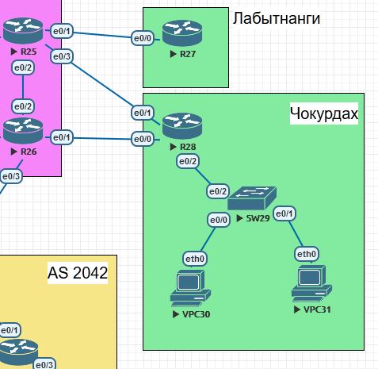

Лабораторная работа. Маршрутизация на основе политики (PBR). 
---------

Топология
---------



Задачи
---------

1. Настроите политику маршрутизации для сетей офиса Чокурдах;
2. Распределите трафик между двумя линками с провайдером в Чокурдах;
3. Настроите отслеживание линка через технологию IP SLA в Чокурдах;
4. Настройте для офиса Лабытнанги маршрут по-умолчанию;
5. План работы и изменения зафиксированы в документации.


Решение
---------

В офисе "Чокурдах" есть две пользовательских сети, такие как 101.1.1.0/24 и 101.1.2.0/24.
Так же к маршрутизатору R28 подключено два Up-Link от провайдера (e0/0-1) с сетями 52.0.0.24/30 и 52.0.0.28/30.
Распределение трафика между двумя линками будет реализована по принципу - одна внутренняя сеть через один Up-Link.
Сеть 101.1.1.0/24 будет направляться через Up-Link e0/0 сеть 52.0.0.24/30.
Сеть 101.1.2.0/24 будет направляться через Up-Link e0/1 сеть 52.0.0.28/30.
Для отслеживания состояния линка будет использована технология IP SLA. Она будет сконфигурирована на маршрутизаторе R28.

#### Конфигурация PBR на R28:

```
R28(config)# ip access-list standard VLAN_10
R28(config)# permit 101.1.1.0 0.0.0.255
R28(config)# ip access-list standard VLAN_11
R28(config)# permit 101.1.2.0 0.0.0.255

R28(config)# ip sla auto discovery
R28(config)# ip sla 1
R28(config)# icmp-echo 52.0.0.25 source-interface Ethernet0/0
R28(config)# frequency 15
R28(config)# ip sla schedule 1 life forever start-time now
R28(config)# ip sla 2
R28(config)# icmp-echo 52.0.0.29 source-interface Ethernet0/1
R28(config)# frequency 15
R28(config)# ip sla schedule 2 life forever start-time now

R28(config)# route-map PBR1 permit 10
R28(config)# match ip address VLAN_10
R28(config)# set ip next-hop verify-availability 52.0.0.25 1 track 1
R28(config)# set ip next-hop verify-availability 52.0.0.29 2 track 2
R28(config)# route-map PBR1 permit 20
R28(config)# match ip address VLAN_11
R28(config)# set ip next-hop verify-availability 52.0.0.29 2 track 2
R28(config)# set ip next-hop verify-availability 52.0.0.25 2 track 1

R28(config)# interface Ethernet0/2.10
R28(config)# ip policy route-map PBR1

R28(config)# interface Ethernet0/2.11
R28(config)# ip policy route-map PBR1
```

#### Тестирование PBR на R28:

*Чтобы провести проверку конфигурации, нужно добавить маршрут до сетей 101.1.1.0/24, 101.1.2.0/24 на маршрутизаторы R25 и R26.*

```
R25(config)#ip route 101.1.0.0 255.255.0.0 52.0.0.30
R26(config)#ip route 101.1.0.0 255.255.0.0 52.0.0.26
```

##### Оба UP-Link (e0/0, e0/1) в состоянии UP:

VPC30:
```
VPCS> trace 8.8.8.8
trace to 8.8.8.8, 8 hops max, press Ctrl+C to stop
 1   101.1.1.1   0.489 ms  0.413 ms  0.355 ms
 2   52.0.0.25   0.941 ms  0.537 ms  0.424 ms
 3   *52.0.0.25   0.624 ms (ICMP type:3, code:1, Destination host unreachable)  
*
```

VPC31:
```
VPCS> trace 8.8.8.8
trace to 8.8.8.8, 8 hops max, press Ctrl+C to stop
 1   101.1.2.1   0.894 ms  0.630 ms  0.585 ms
 2   52.0.0.29   1.441 ms  0.707 ms  0.650 ms
 3   *52.0.0.29   0.694 ms (ICMP type:3, code:1, Destination host unreachable)  
*
```


##### UP-Link e0/0 в состоянии DOWN:

VPC30:
```
VPCS> trace 8.8.8.8
trace to 8.8.8.8, 8 hops max, press Ctrl+C to stop
 1   101.1.1.1   0.924 ms  0.399 ms  0.374 ms
 2   52.0.0.29   1.049 ms  0.611 ms  0.675 ms
 3   *52.0.0.29   0.595 ms (ICMP type:3, code:1, Destination host unreachable) 
*
```

VPC31:
```
VPCS> trace 8.8.8.8
trace to 8.8.8.8, 8 hops max, press Ctrl+C to stop
 1   101.1.2.1   0.591 ms  0.447 ms  0.474 ms
 2   52.0.0.29   0.676 ms  0.634 ms  1.003 ms
 3   *52.0.0.29   0.539 ms (ICMP type:3, code:1, Destination host unreachable)  
*
```

##### UP-Link e0/1 в состоянии DOWN:

VPC30:
```
VPCS> trace 8.8.8.8
trace to 8.8.8.8, 8 hops max, press Ctrl+C to stop
 1   101.1.1.1   0.805 ms  0.488 ms  0.435 ms
 2   52.0.0.25   1.158 ms  0.644 ms  0.558 ms
 3   *52.0.0.25   0.625 ms (ICMP type:3, code:1, Destination host unreachable)  
*
```

VPC31:
```
VPCS> trace 8.8.8.8
trace to 8.8.8.8, 8 hops max, press Ctrl+C to stop
 1   101.1.2.1   0.485 ms  0.426 ms  0.443 ms
 2   52.0.0.25   0.741 ms  0.494 ms  0.563 ms
 3   *52.0.0.25   0.535 ms (ICMP type:3, code:1, Destination host unreachable)  
*
```


Для сетей в офисе Лабытнанги будет задан маршрут по умолчанию через маршрутизатор R25 (e0/0).

#### Конфигурация маршрута по умолчанию на R27:

```
R27(config)# ip route 0.0.0.0 0.0.0.0 52.0.0.33
```
