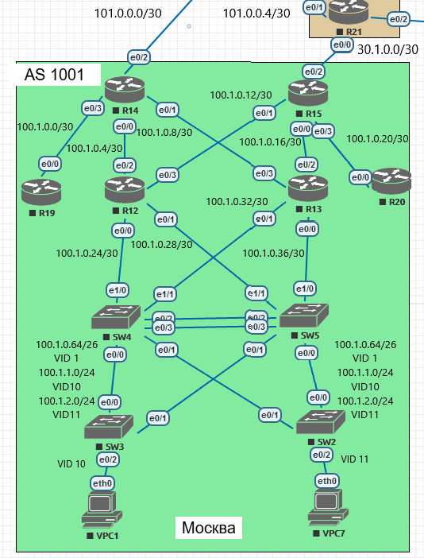

Лабораторная работа. Маршрутизация на основе политики (PBR). 
---------

Топология
---------



Задачи
---------
Настроить OSPF офисе Москва. Разделить сеть на зоны. Настроить фильтрацию между зонами.
1. Маршрутизаторы R14-R15 находятся в зоне 0 - backbone;
2. Маршрутизаторы R12-R13 находятся в зоне 10. Дополнительно к маршрутам должны получать маршрут по-умолчанию;
3. Маршрутизатор R19 находится в зоне 101 и получает только маршрут по умолчанию;
4. Маршрутизатор R20 находится в зоне 102 и получает все маршруты, кроме маршрутов до сетей зоны 101;
5. План работы и изменения зафиксированы в документации.

```
Примечание: так как согластно выбранной архитектуре сети, коммутаторы SW4 и SW5 будут участвовать в маршрутизации,
на них будет запущен процесс OSPF. Коммутаторы будут находится в Area 10.
```

Решение
---------

#### Настроим OSPF на маршрутизаторах R14 и R15

##### Конфигурация R15:
 
```
router ospf 1
 router-id 15.15.15.15
 area 10 stub
 area 102 filter-list prefix DEAD_area101 in
 passive-interface Ethernet0/2
 network 30.1.0.0 0.0.0.3 area 0
 network 100.1.0.12 0.0.0.3 area 10
 network 100.1.0.16 0.0.0.3 area 10
 network 100.1.0.20 0.0.0.3 area 102
```

##### Таблица маршрутизации R15:

```
R15#show ip route ospf
Codes: L - local, C - connected, S - static, R - RIP, M - mobile, B - BGP
       D - EIGRP, EX - EIGRP external, O - OSPF, IA - OSPF inter area
       N1 - OSPF NSSA external type 1, N2 - OSPF NSSA external type 2
       E1 - OSPF external type 1, E2 - OSPF external type 2
       i - IS-IS, su - IS-IS summary, L1 - IS-IS level-1, L2 - IS-IS level-2
       ia - IS-IS inter area, * - candidate default, U - per-user static route
       o - ODR, P - periodic downloaded static route, H - NHRP, l - LISP
       + - replicated route, % - next hop override

Gateway of last resort is 100.1.0.18 to network 0.0.0.0

O*IA  0.0.0.0/0 [110/21] via 100.1.0.18, 00:11:38, Ethernet0/0
                [110/21] via 100.1.0.14, 00:11:43, Ethernet0/1
      100.0.0.0/8 is variably subnetted, 17 subnets, 5 masks
O IA     100.1.0.0/30 [110/30] via 100.1.0.18, 00:11:38, Ethernet0/0
                      [110/30] via 100.1.0.14, 00:11:43, Ethernet0/1
O        100.1.0.4/30 [110/20] via 100.1.0.14, 00:11:43, Ethernet0/1
O        100.1.0.8/30 [110/20] via 100.1.0.18, 00:11:38, Ethernet0/0
O        100.1.0.24/30 [110/20] via 100.1.0.14, 00:11:43, Ethernet0/1
O        100.1.0.28/30 [110/20] via 100.1.0.14, 00:11:43, Ethernet0/1
O        100.1.0.32/30 [110/20] via 100.1.0.18, 00:11:38, Ethernet0/0
O        100.1.0.36/30 [110/20] via 100.1.0.18, 00:11:38, Ethernet0/0
O        100.1.0.64/26 [110/21] via 100.1.0.18, 00:09:08, Ethernet0/0
                       [110/21] via 100.1.0.14, 00:09:08, Ethernet0/1
O        100.1.1.0/24 [110/21] via 100.1.0.18, 00:09:08, Ethernet0/0
                      [110/21] via 100.1.0.14, 00:09:08, Ethernet0/1
O        100.1.2.0/24 [110/21] via 100.1.0.18, 00:09:08, Ethernet0/0
                      [110/21] via 100.1.0.14, 00:09:08, Ethernet0/1
      101.0.0.0/8 is variably subnetted, 2 subnets, 2 masks
O IA     101.0.0.0/30 [110/30] via 100.1.0.18, 00:11:38, Ethernet0/0
                      [110/30] via 100.1.0.14, 00:11:43, Ethernet0/1
```

##### Конфигурация R14:

```
router ospf 1
 router-id 14.14.14.14
 area 10 stub
 area 101 stub no-summary
 passive-interface Ethernet0/2
 network 100.1.0.0 0.0.0.3 area 101
 network 100.1.0.4 0.0.0.3 area 10
 network 100.1.0.8 0.0.0.3 area 10
 network 101.0.0.0 0.0.0.3 area 0
```


##### Таблица маршрутизации R14:

```
R14#show ip route ospf
Codes: L - local, C - connected, S - static, R - RIP, M - mobile, B - BGP
       D - EIGRP, EX - EIGRP external, O - OSPF, IA - OSPF inter area
       N1 - OSPF NSSA external type 1, N2 - OSPF NSSA external type 2
       E1 - OSPF external type 1, E2 - OSPF external type 2
       i - IS-IS, su - IS-IS summary, L1 - IS-IS level-1, L2 - IS-IS level-2
       ia - IS-IS inter area, * - candidate default, U - per-user static route
       o - ODR, P - periodic downloaded static route, H - NHRP, l - LISP
       + - replicated route, % - next hop override

Gateway of last resort is 100.1.0.10 to network 0.0.0.0

O*IA  0.0.0.0/0 [110/21] via 100.1.0.10, 00:12:12, Ethernet0/1
                [110/21] via 100.1.0.6, 00:12:17, Ethernet0/0
      30.0.0.0/8 is variably subnetted, 2 subnets, 2 masks
O IA     30.1.0.0/30 [110/30] via 100.1.0.10, 00:12:12, Ethernet0/1
                     [110/30] via 100.1.0.6, 00:12:17, Ethernet0/0
      100.0.0.0/8 is variably subnetted, 17 subnets, 5 masks
O        100.1.0.12/30 [110/20] via 100.1.0.6, 00:12:17, Ethernet0/0
O        100.1.0.16/30 [110/20] via 100.1.0.10, 00:12:17, Ethernet0/1
O IA     100.1.0.20/30 [110/30] via 100.1.0.10, 00:12:12, Ethernet0/1
                       [110/30] via 100.1.0.6, 00:12:17, Ethernet0/0
O        100.1.0.24/30 [110/20] via 100.1.0.6, 00:16:57, Ethernet0/0
O        100.1.0.28/30 [110/20] via 100.1.0.6, 00:16:57, Ethernet0/0
O        100.1.0.32/30 [110/20] via 100.1.0.10, 00:21:52, Ethernet0/1
O        100.1.0.36/30 [110/20] via 100.1.0.10, 00:21:52, Ethernet0/1
O        100.1.0.64/26 [110/21] via 100.1.0.10, 00:09:42, Ethernet0/1
                       [110/21] via 100.1.0.6, 00:09:42, Ethernet0/0
O        100.1.1.0/24 [110/21] via 100.1.0.10, 00:09:42, Ethernet0/1
                      [110/21] via 100.1.0.6, 00:09:42, Ethernet0/0
O        100.1.2.0/24 [110/21] via 100.1.0.10, 00:09:42, Ethernet0/1
                      [110/21] via 100.1.0.6, 00:09:42, Ethernet0/0
```

#### Настроим OSPF на маршрутизаторах R12 и R13

##### Конфигурация R12:

```
router ospf 1
 router-id 12.12.12.12
 area 10 stub
 network 100.1.0.4 0.0.0.3 area 10
 network 100.1.0.12 0.0.0.3 area 10
 network 100.1.0.24 0.0.0.3 area 10
 network 100.1.0.28 0.0.0.3 area 10
```

##### Таблица маршрутизации R12:

```
R12#show ip route ospf
Codes: L - local, C - connected, S - static, R - RIP, M - mobile, B - BGP
       D - EIGRP, EX - EIGRP external, O - OSPF, IA - OSPF inter area
       N1 - OSPF NSSA external type 1, N2 - OSPF NSSA external type 2
       E1 - OSPF external type 1, E2 - OSPF external type 2
       i - IS-IS, su - IS-IS summary, L1 - IS-IS level-1, L2 - IS-IS level-2
       ia - IS-IS inter area, * - candidate default, U - per-user static route
       o - ODR, P - periodic downloaded static route, H - NHRP, l - LISP
       + - replicated route, % - next hop override

Gateway of last resort is 100.1.0.13 to network 0.0.0.0

O*IA  0.0.0.0/0 [110/11] via 100.1.0.13, 00:13:26, Ethernet0/3
                [110/11] via 100.1.0.5, 00:18:07, Ethernet0/2
      30.0.0.0/30 is subnetted, 1 subnets
O IA     30.1.0.0 [110/20] via 100.1.0.13, 00:13:26, Ethernet0/3
      100.0.0.0/8 is variably subnetted, 17 subnets, 4 masks
O IA     100.1.0.0/30 [110/20] via 100.1.0.5, 00:18:07, Ethernet0/2
O        100.1.0.8/30 [110/20] via 100.1.0.5, 00:18:07, Ethernet0/2
O        100.1.0.16/30 [110/20] via 100.1.0.13, 00:13:26, Ethernet0/3
O IA     100.1.0.20/30 [110/20] via 100.1.0.13, 00:13:26, Ethernet0/3
O        100.1.0.32/30 [110/20] via 100.1.0.26, 00:11:12, Ethernet0/0
O        100.1.0.36/30 [110/20] via 100.1.0.30, 00:11:12, Ethernet0/1
O        100.1.0.64/26 [110/11] via 100.1.0.30, 00:10:51, Ethernet0/1
                       [110/11] via 100.1.0.26, 00:10:51, Ethernet0/0
O        100.1.1.0/24 [110/11] via 100.1.0.30, 00:10:51, Ethernet0/1
                      [110/11] via 100.1.0.26, 00:10:51, Ethernet0/0
O        100.1.2.0/24 [110/11] via 100.1.0.30, 00:10:51, Ethernet0/1
                      [110/11] via 100.1.0.26, 00:10:51, Ethernet0/0
      101.0.0.0/30 is subnetted, 1 subnets
O IA     101.0.0.0 [110/20] via 100.1.0.5, 00:18:07, Ethernet0/2
```

##### Конфигурация R13:

```
router ospf 1
 router-id 13.13.13.13
 area 10 stub
 network 100.1.0.8 0.0.0.3 area 10
 network 100.1.0.16 0.0.0.3 area 10
 network 100.1.0.32 0.0.0.3 area 10
 network 100.1.0.36 0.0.0.3 area 10
```

##### Таблица маршрутизации R13:

```
R13#show ip route ospf
Codes: L - local, C - connected, S - static, R - RIP, M - mobile, B - BGP
       D - EIGRP, EX - EIGRP external, O - OSPF, IA - OSPF inter area
       N1 - OSPF NSSA external type 1, N2 - OSPF NSSA external type 2
       E1 - OSPF external type 1, E2 - OSPF external type 2
       i - IS-IS, su - IS-IS summary, L1 - IS-IS level-1, L2 - IS-IS level-2
       ia - IS-IS inter area, * - candidate default, U - per-user static route
       o - ODR, P - periodic downloaded static route, H - NHRP, l - LISP
       + - replicated route, % - next hop override

Gateway of last resort is 100.1.0.17 to network 0.0.0.0

O*IA  0.0.0.0/0 [110/11] via 100.1.0.17, 00:14:24, Ethernet0/2
                [110/11] via 100.1.0.9, 00:24:08, Ethernet0/3
      30.0.0.0/30 is subnetted, 1 subnets
O IA     30.1.0.0 [110/20] via 100.1.0.17, 00:14:24, Ethernet0/2
      100.0.0.0/8 is variably subnetted, 17 subnets, 4 masks
O IA     100.1.0.0/30 [110/20] via 100.1.0.9, 00:24:08, Ethernet0/3
O        100.1.0.4/30 [110/20] via 100.1.0.9, 00:24:08, Ethernet0/3
O        100.1.0.12/30 [110/20] via 100.1.0.17, 00:14:24, Ethernet0/2
O IA     100.1.0.20/30 [110/20] via 100.1.0.17, 00:14:24, Ethernet0/2
O        100.1.0.24/30 [110/20] via 100.1.0.34, 00:12:14, Ethernet0/1
O        100.1.0.28/30 [110/20] via 100.1.0.38, 00:12:14, Ethernet0/0
O        100.1.0.64/26 [110/11] via 100.1.0.38, 00:11:53, Ethernet0/0
                       [110/11] via 100.1.0.34, 00:11:53, Ethernet0/1
O        100.1.1.0/24 [110/11] via 100.1.0.38, 00:11:53, Ethernet0/0
                      [110/11] via 100.1.0.34, 00:11:53, Ethernet0/1
O        100.1.2.0/24 [110/11] via 100.1.0.38, 00:11:53, Ethernet0/0
                      [110/11] via 100.1.0.34, 00:11:53, Ethernet0/1
      101.0.0.0/30 is subnetted, 1 subnets
O IA     101.0.0.0 [110/20] via 100.1.0.9, 00:24:08, Ethernet0/3
```

#### Настроим OSPF на L3 коммутаторах SW4 и SW5

##### Конфигурация SW4:

```
router ospf 1
 router-id 4.4.4.4
 area 10 stub
 passive-interface default
 no passive-interface Ethernet1/0
 no passive-interface Ethernet1/1
 network 100.1.0.24 0.0.0.3 area 10
 network 100.1.0.32 0.0.0.3 area 10
 network 100.1.0.64 0.0.0.63 area 10
 network 100.1.1.0 0.0.0.255 area 10
 network 100.1.2.0 0.0.0.255 area 10
```

##### Таблица маршрутизации SW4:

```
SW4#show ip route ospf
Codes: L - local, C - connected, S - static, R - RIP, M - mobile, B - BGP
       D - EIGRP, EX - EIGRP external, O - OSPF, IA - OSPF inter area
       N1 - OSPF NSSA external type 1, N2 - OSPF NSSA external type 2
       E1 - OSPF external type 1, E2 - OSPF external type 2
       i - IS-IS, su - IS-IS summary, L1 - IS-IS level-1, L2 - IS-IS level-2
       ia - IS-IS inter area, * - candidate default, U - per-user static route
       o - ODR, P - periodic downloaded static route, H - NHRP, l - LISP
       a - application route
       + - replicated route, % - next hop override

Gateway of last resort is 100.1.0.33 to network 0.0.0.0

O*IA  0.0.0.0/0 [110/21] via 100.1.0.33, 00:13:16, Ethernet1/1
                [110/21] via 100.1.0.25, 00:13:16, Ethernet1/0
      30.0.0.0/30 is subnetted, 1 subnets
O IA     30.1.0.0 [110/30] via 100.1.0.33, 00:13:16, Ethernet1/1
                  [110/30] via 100.1.0.25, 00:13:16, Ethernet1/0
      100.0.0.0/8 is variably subnetted, 18 subnets, 4 masks
O IA     100.1.0.0/30 [110/30] via 100.1.0.33, 00:13:16, Ethernet1/1
                      [110/30] via 100.1.0.25, 00:13:16, Ethernet1/0
O        100.1.0.4/30 [110/20] via 100.1.0.25, 00:13:16, Ethernet1/0
O        100.1.0.8/30 [110/20] via 100.1.0.33, 00:13:16, Ethernet1/1
O        100.1.0.12/30 [110/20] via 100.1.0.25, 00:13:16, Ethernet1/0
O        100.1.0.16/30 [110/20] via 100.1.0.33, 00:13:16, Ethernet1/1
O IA     100.1.0.20/30 [110/30] via 100.1.0.33, 00:13:16, Ethernet1/1
                       [110/30] via 100.1.0.25, 00:13:16, Ethernet1/0
O        100.1.0.28/30 [110/20] via 100.1.0.25, 00:13:16, Ethernet1/0
O        100.1.0.36/30 [110/20] via 100.1.0.33, 00:13:16, Ethernet1/1
      101.0.0.0/30 is subnetted, 1 subnets
O IA     101.0.0.0 [110/30] via 100.1.0.33, 00:13:16, Ethernet1/1
                   [110/30] via 100.1.0.25, 00:13:16, Ethernet1/0
```

##### Конфигурация SW5:

```
router ospf 1
 router-id 5.5.5.5
 area 10 stub
 passive-interface default
 no passive-interface Ethernet1/0
 no passive-interface Ethernet1/1
 network 100.1.0.28 0.0.0.3 area 10
 network 100.1.0.36 0.0.0.3 area 10
 network 100.1.0.64 0.0.0.63 area 10
 network 100.1.1.0 0.0.0.255 area 10
 network 100.1.2.0 0.0.0.255 area 10
```

##### Таблица маршрутизации SW5:

```
SW5#show ip route ospf
Codes: L - local, C - connected, S - static, R - RIP, M - mobile, B - BGP
       D - EIGRP, EX - EIGRP external, O - OSPF, IA - OSPF inter area
       N1 - OSPF NSSA external type 1, N2 - OSPF NSSA external type 2
       E1 - OSPF external type 1, E2 - OSPF external type 2
       i - IS-IS, su - IS-IS summary, L1 - IS-IS level-1, L2 - IS-IS level-2
       ia - IS-IS inter area, * - candidate default, U - per-user static route
       o - ODR, P - periodic downloaded static route, H - NHRP, l - LISP
       a - application route
       + - replicated route, % - next hop override

Gateway of last resort is 100.1.0.37 to network 0.0.0.0

O*IA  0.0.0.0/0 [110/21] via 100.1.0.37, 00:15:27, Ethernet1/0
                [110/21] via 100.1.0.29, 00:15:17, Ethernet1/1
      30.0.0.0/30 is subnetted, 1 subnets
O IA     30.1.0.0 [110/30] via 100.1.0.37, 00:15:27, Ethernet1/0
                  [110/30] via 100.1.0.29, 00:15:17, Ethernet1/1
      100.0.0.0/8 is variably subnetted, 18 subnets, 4 masks
O IA     100.1.0.0/30 [110/30] via 100.1.0.37, 00:15:27, Ethernet1/0
                      [110/30] via 100.1.0.29, 00:15:17, Ethernet1/1
O        100.1.0.4/30 [110/20] via 100.1.0.29, 00:15:17, Ethernet1/1
O        100.1.0.8/30 [110/20] via 100.1.0.37, 00:15:27, Ethernet1/0
O        100.1.0.12/30 [110/20] via 100.1.0.29, 00:15:17, Ethernet1/1
O        100.1.0.16/30 [110/20] via 100.1.0.37, 00:15:27, Ethernet1/0
O IA     100.1.0.20/30 [110/30] via 100.1.0.37, 00:15:27, Ethernet1/0
                       [110/30] via 100.1.0.29, 00:15:17, Ethernet1/1
O        100.1.0.24/30 [110/20] via 100.1.0.29, 00:15:17, Ethernet1/1
O        100.1.0.32/30 [110/20] via 100.1.0.37, 00:15:27, Ethernet1/0
      101.0.0.0/30 is subnetted, 1 subnets
O IA     101.0.0.0 [110/30] via 100.1.0.37, 00:15:27, Ethernet1/0
                   [110/30] via 100.1.0.29, 00:15:17, Ethernet1/1
```

#### Настроим OSPF на маршрутизаторах R19 и R20

##### Конфигурация R19:

```
router ospf 1
 router-id 19.19.19.19
 area 101 stub
 network 100.1.0.0 0.0.0.3 area 101
```

##### Таблица маршрутизации R19:

```
R19#show ip route ospf
Codes: L - local, C - connected, S - static, R - RIP, M - mobile, B - BGP
       D - EIGRP, EX - EIGRP external, O - OSPF, IA - OSPF inter area
       N1 - OSPF NSSA external type 1, N2 - OSPF NSSA external type 2
       E1 - OSPF external type 1, E2 - OSPF external type 2
       i - IS-IS, su - IS-IS summary, L1 - IS-IS level-1, L2 - IS-IS level-2
       ia - IS-IS inter area, * - candidate default, U - per-user static route
       o - ODR, P - periodic downloaded static route, H - NHRP, l - LISP
       + - replicated route, % - next hop override

Gateway of last resort is 100.1.0.1 to network 0.0.0.0

O*IA  0.0.0.0/0 [110/11] via 100.1.0.1, 01:42:28, Ethernet0/0
```

##### Конфигурация R20:

```
router ospf 1
 router-id 20.20.20.20
 network 100.1.0.20 0.0.0.3 area 102
```

##### Таблица маршрутизации R20:

```
R20#show ip route
Codes: L - local, C - connected, S - static, R - RIP, M - mobile, B - BGP
       D - EIGRP, EX - EIGRP external, O - OSPF, IA - OSPF inter area
       N1 - OSPF NSSA external type 1, N2 - OSPF NSSA external type 2
       E1 - OSPF external type 1, E2 - OSPF external type 2
       i - IS-IS, su - IS-IS summary, L1 - IS-IS level-1, L2 - IS-IS level-2
       ia - IS-IS inter area, * - candidate default, U - per-user static route
       o - ODR, P - periodic downloaded static route, H - NHRP, l - LISP
       + - replicated route, % - next hop override

Gateway of last resort is not set

      100.0.0.0/8 is variably subnetted, 13 subnets, 4 masks
O IA     100.1.0.4/30 [110/30] via 100.1.0.21, 01:21:57, Ethernet0/0
O IA     100.1.0.8/30 [110/30] via 100.1.0.21, 01:21:57, Ethernet0/0
O IA     100.1.0.12/30 [110/20] via 100.1.0.21, 01:21:57, Ethernet0/0
O IA     100.1.0.16/30 [110/20] via 100.1.0.21, 01:21:57, Ethernet0/0
C        100.1.0.20/30 is directly connected, Ethernet0/0
L        100.1.0.22/32 is directly connected, Ethernet0/0
O IA     100.1.0.24/30 [110/30] via 100.1.0.21, 01:21:57, Ethernet0/0
O IA     100.1.0.28/30 [110/30] via 100.1.0.21, 01:21:57, Ethernet0/0
O IA     100.1.0.32/30 [110/30] via 100.1.0.21, 01:21:57, Ethernet0/0
O IA     100.1.0.36/30 [110/30] via 100.1.0.21, 01:21:57, Ethernet0/0
O IA     100.1.0.64/26 [110/31] via 100.1.0.21, 01:21:57, Ethernet0/0
O IA     100.1.1.0/24 [110/31] via 100.1.0.21, 01:21:57, Ethernet0/0
O IA     100.1.2.0/24 [110/31] via 100.1.0.21, 01:21:57, Ethernet0/0
```


