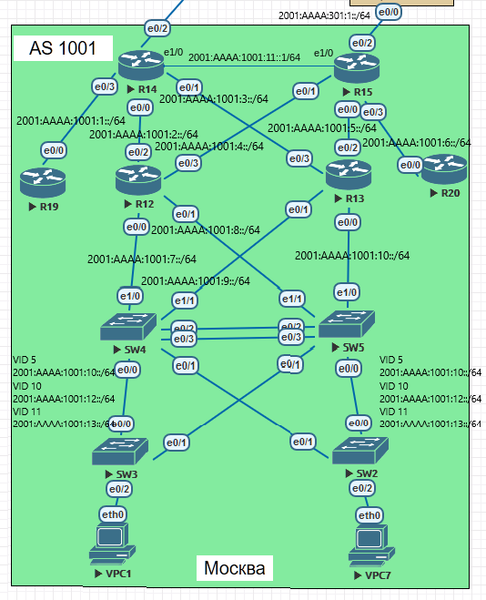

Лабораторная работа. OSPFv3. 
---------

Топология
---------



Задачи
---------
OSPF для IPv6
Настроить OSPF для IPv6, сохранив ту же логику работы, что у OSPF для IPv4
1. Настроите OSPF для IPv6. сохранив ту же логику работы(метрики, таймеры, фильтры - по возможности), что OSPF для IPv4
2. План работы и изменения зафиксированы в документации.

```
Примечание: так как согластно выбранной архитектуре сети, коммутаторы SW4 и SW5 будут участвовать в маршрутизации (L3 коммутаторы),
на них будет запущен процесс OSPF. Коммутаторы будут находится в Area 10.
```

Решение
---------

#### Настроим OSPFv3 на маршрутизаторах R14 и R15

##### Конфигурация R15:
 
```
ipv6 router ospf 10
 router-id 15.15.15.15
 area 10 stub
 passive-interface Ethernet0/2
ipv6 prefix-list DEAD_area101v6 seq 5 deny 2001:AAAA:1001:1::/64
ipv6 prefix-list DEAD_area101v6 seq 10 permit ::/0 le 128
interface Ethernet0/0
 ipv6 ospf 10 area 10
interface Ethernet0/1
 ipv6 ospf 10 area 10
interface Ethernet0/2
 ipv6 ospf 10 area 0
interface Ethernet0/3
 ipv6 ospf 10 area 102
```

##### Таблица маршрутизации R15:

```
R15#show ipv6 route ospf
IPv6 Routing Table - default - 21 entries
Codes: C - Connected, L - Local, S - Static, U - Per-user Static route
       B - BGP, HA - Home Agent, MR - Mobile Router, R - RIP
       H - NHRP, I1 - ISIS L1, I2 - ISIS L2, IA - ISIS interarea
       IS - ISIS summary, D - EIGRP, EX - EIGRP external, NM - NEMO
       ND - ND Default, NDp - ND Prefix, DCE - Destination, NDr - Redirect
       O - OSPF Intra, OI - OSPF Inter, OE1 - OSPF ext 1, OE2 - OSPF ext 2
       ON1 - OSPF NSSA ext 1, ON2 - OSPF NSSA ext 2, l - LISP
OI  ::/0 [110/21]
     via FE80::12, Ethernet0/1
     via FE80::13, Ethernet0/0
OI  2001:AAAA:101:1::/64 [110/30]
     via FE80::12, Ethernet0/1
     via FE80::13, Ethernet0/0
OI  2001:AAAA:1001:1::/64 [110/30]
     via FE80::12, Ethernet0/1
     via FE80::13, Ethernet0/0
O   2001:AAAA:1001:2::/64 [110/20]
     via FE80::12, Ethernet0/1
O   2001:AAAA:1001:3::/64 [110/20]
     via FE80::13, Ethernet0/0
O   2001:AAAA:1001:7::/64 [110/20]
     via FE80::12, Ethernet0/1
O   2001:AAAA:1001:8::/64 [110/20]
     via FE80::12, Ethernet0/1
O   2001:AAAA:1001:9::/64 [110/20]
     via FE80::13, Ethernet0/0
O   2001:AAAA:1001:10::/64 [110/20]
     via FE80::13, Ethernet0/0
O   2001:AAAA:1001:11::/64 [110/21]
     via FE80::12, Ethernet0/1
     via FE80::13, Ethernet0/0
O   2001:AAAA:1001:12::/64 [110/21]
     via FE80::12, Ethernet0/1
     via FE80::13, Ethernet0/0
O   2001:AAAA:1001:13::/64 [110/21]
     via FE80::12, Ethernet0/1
     via FE80::13, Ethernet0/0
```

##### Конфигурация R14:

```
ipv6 router ospf 10
 router-id 14.14.14.14
 area 10 stub
 area 101 stub no-summary
 passive-interface Ethernet0/2
interface Ethernet0/0
 ipv6 ospf 10 area 10
interface Ethernet0/1
 ipv6 ospf 10 area 10
interface Ethernet0/2
 ipv6 ospf 10 area 0
interface Ethernet0/3
 ipv6 ospf 10 area 101
```


##### Таблица маршрутизации R14:

```
R14#show ipv6 route ospf
IPv6 Routing Table - default - 21 entries
Codes: C - Connected, L - Local, S - Static, U - Per-user Static route
       B - BGP, HA - Home Agent, MR - Mobile Router, R - RIP
       H - NHRP, I1 - ISIS L1, I2 - ISIS L2, IA - ISIS interarea
       IS - ISIS summary, D - EIGRP, EX - EIGRP external, NM - NEMO
       ND - ND Default, NDp - ND Prefix, DCE - Destination, NDr - Redirect
       O - OSPF Intra, OI - OSPF Inter, OE1 - OSPF ext 1, OE2 - OSPF ext 2
       ON1 - OSPF NSSA ext 1, ON2 - OSPF NSSA ext 2, l - LISP
OI  ::/0 [110/21]
     via FE80::12, Ethernet0/0
     via FE80::13, Ethernet0/1
OI  2001:AAAA:301:1::/64 [110/30]
     via FE80::12, Ethernet0/0
     via FE80::13, Ethernet0/1
O   2001:AAAA:1001:4::/64 [110/20]
     via FE80::12, Ethernet0/0
O   2001:AAAA:1001:5::/64 [110/20]
     via FE80::13, Ethernet0/1
OI  2001:AAAA:1001:6::/64 [110/30]
     via FE80::12, Ethernet0/0
     via FE80::13, Ethernet0/1
O   2001:AAAA:1001:7::/64 [110/20]
     via FE80::12, Ethernet0/0
O   2001:AAAA:1001:8::/64 [110/20]
     via FE80::12, Ethernet0/0
O   2001:AAAA:1001:9::/64 [110/20]
     via FE80::13, Ethernet0/1
O   2001:AAAA:1001:10::/64 [110/20]
     via FE80::13, Ethernet0/1
O   2001:AAAA:1001:11::/64 [110/21]
     via FE80::12, Ethernet0/0
     via FE80::13, Ethernet0/1
O   2001:AAAA:1001:12::/64 [110/21]
     via FE80::12, Ethernet0/0
     via FE80::13, Ethernet0/1
O   2001:AAAA:1001:13::/64 [110/21]
     via FE80::12, Ethernet0/0
     via FE80::13, Ethernet0/1
```

#### Настроим OSPFv3 на маршрутизаторах R12 и R13

##### Конфигурация R12:

```
ipv6 router ospf 10
 router-id 12.12.12.12
 area 10 stub
interface Ethernet0/0
 ipv6 ospf 10 area 10
interface Ethernet0/1
 ipv6 ospf 10 area 10
interface Ethernet0/2
 ipv6 ospf 10 area 10
interface Ethernet0/3
 ipv6 ospf 10 area 10
```

##### Таблица маршрутизации R12:

```
R12#show ipv6 route ospf
IPv6 Routing Table - default - 21 entries
Codes: C - Connected, L - Local, S - Static, U - Per-user Static route
       B - BGP, HA - Home Agent, MR - Mobile Router, R - RIP
       H - NHRP, I1 - ISIS L1, I2 - ISIS L2, IA - ISIS interarea
       IS - ISIS summary, D - EIGRP, EX - EIGRP external, NM - NEMO
       ND - ND Default, NDp - ND Prefix, DCE - Destination, NDr - Redirect
       O - OSPF Intra, OI - OSPF Inter, OE1 - OSPF ext 1, OE2 - OSPF ext 2
       ON1 - OSPF NSSA ext 1, ON2 - OSPF NSSA ext 2, l - LISP
OI  ::/0 [110/11]
     via FE80::14, Ethernet0/2
     via FE80::15, Ethernet0/3
OI  2001:AAAA:101:1::/64 [110/20]
     via FE80::14, Ethernet0/2
OI  2001:AAAA:301:1::/64 [110/20]
     via FE80::15, Ethernet0/3
OI  2001:AAAA:1001:1::/64 [110/20]
     via FE80::14, Ethernet0/2
O   2001:AAAA:1001:3::/64 [110/20]
     via FE80::14, Ethernet0/2
O   2001:AAAA:1001:5::/64 [110/20]
     via FE80::15, Ethernet0/3
OI  2001:AAAA:1001:6::/64 [110/20]
     via FE80::15, Ethernet0/3
O   2001:AAAA:1001:9::/64 [110/20]
     via FE80::4, Ethernet0/0
O   2001:AAAA:1001:10::/64 [110/20]
     via FE80::5, Ethernet0/1
O   2001:AAAA:1001:11::/64 [110/11]
     via FE80::4, Ethernet0/0
     via FE80::5, Ethernet0/1
O   2001:AAAA:1001:12::/64 [110/11]
     via FE80::4, Ethernet0/0
     via FE80::5, Ethernet0/1
O   2001:AAAA:1001:13::/64 [110/11]
     via FE80::4, Ethernet0/0
     via FE80::5, Ethernet0/1
```

##### Конфигурация R13:

```
ipv6 router ospf 10
 router-id 13.13.13.13
 area 10 stub
interface Ethernet0/0
 ipv6 ospf 10 area 10
interface Ethernet0/1
 ipv6 ospf 10 area 10
interface Ethernet0/2
 ipv6 ospf 10 area 10
interface Ethernet0/3
 ipv6 ospf 10 area 10
```

##### Таблица маршрутизации R13:

```
R13#show ipv6 route ospf
IPv6 Routing Table - default - 21 entries
Codes: C - Connected, L - Local, S - Static, U - Per-user Static route
       B - BGP, HA - Home Agent, MR - Mobile Router, R - RIP
       H - NHRP, I1 - ISIS L1, I2 - ISIS L2, IA - ISIS interarea
       IS - ISIS summary, D - EIGRP, EX - EIGRP external, NM - NEMO
       ND - ND Default, NDp - ND Prefix, DCE - Destination, NDr - Redirect
       O - OSPF Intra, OI - OSPF Inter, OE1 - OSPF ext 1, OE2 - OSPF ext 2
       ON1 - OSPF NSSA ext 1, ON2 - OSPF NSSA ext 2, l - LISP
OI  ::/0 [110/11]
     via FE80::15, Ethernet0/2
     via FE80::14, Ethernet0/3
OI  2001:AAAA:101:1::/64 [110/20]
     via FE80::14, Ethernet0/3
OI  2001:AAAA:301:1::/64 [110/20]
     via FE80::15, Ethernet0/2
OI  2001:AAAA:1001:1::/64 [110/20]
     via FE80::14, Ethernet0/3
O   2001:AAAA:1001:2::/64 [110/20]
     via FE80::14, Ethernet0/3
O   2001:AAAA:1001:4::/64 [110/20]
     via FE80::15, Ethernet0/2
OI  2001:AAAA:1001:6::/64 [110/20]
     via FE80::15, Ethernet0/2
O   2001:AAAA:1001:7::/64 [110/20]
     via FE80::4, Ethernet0/1
O   2001:AAAA:1001:8::/64 [110/20]
     via FE80::5, Ethernet0/0
O   2001:AAAA:1001:11::/64 [110/11]
     via FE80::4, Ethernet0/1
     via FE80::5, Ethernet0/0
O   2001:AAAA:1001:12::/64 [110/11]
     via FE80::4, Ethernet0/1
     via FE80::5, Ethernet0/0
O   2001:AAAA:1001:13::/64 [110/11]
     via FE80::4, Ethernet0/1
     via FE80::5, Ethernet0/0
```

#### Настроим OSPFv3 на L3 коммутаторах SW4 и SW5

##### Конфигурация SW4:

```
ipv6 router ospf 10
 router-id 4.4.4.4
 area 10 stub
 passive-interface default
 no passive-interface Ethernet1/0
 no passive-interface Ethernet1/1
interface Ethernet1/0
 ipv6 ospf 10 area 10
interface Ethernet1/1
 ipv6 ospf 10 area 10
interface Vlan5
 ipv6 ospf 10 area 10
interface Vlan10
 ipv6 ospf 10 area 10
interface Vlan11
 ipv6 ospf 10 area 10
```

##### Таблица маршрутизации SW4:

```
SW4#show ipv6 route ospf
IPv6 Routing Table - default - 22 entries
Codes: C - Connected, L - Local, S - Static, U - Per-user Static route
       B - BGP, R - RIP, I1 - ISIS L1, I2 - ISIS L2
       IA - ISIS interarea, IS - ISIS summary, D - EIGRP, EX - EIGRP external
       ND - ND Default, NDp - ND Prefix, DCE - Destination, NDr - Redirect
       RL - RPL, O - OSPF Intra, OI - OSPF Inter, OE1 - OSPF ext 1
       OE2 - OSPF ext 2, ON1 - OSPF NSSA ext 1, ON2 - OSPF NSSA ext 2
       a - Application
OI  ::/0 [110/21]
     via FE80::13, Ethernet1/1
     via FE80::12, Ethernet1/0
OI  2001:AAAA:101:1::/64 [110/30]
     via FE80::13, Ethernet1/1
     via FE80::12, Ethernet1/0
OI  2001:AAAA:301:1::/64 [110/30]
     via FE80::13, Ethernet1/1
     via FE80::12, Ethernet1/0
OI  2001:AAAA:1001:1::/64 [110/30]
     via FE80::13, Ethernet1/1
     via FE80::12, Ethernet1/0
O   2001:AAAA:1001:2::/64 [110/20]
     via FE80::12, Ethernet1/0
O   2001:AAAA:1001:3::/64 [110/20]
     via FE80::13, Ethernet1/1
O   2001:AAAA:1001:4::/64 [110/20]
     via FE80::12, Ethernet1/0
O   2001:AAAA:1001:5::/64 [110/20]
     via FE80::13, Ethernet1/1
OI  2001:AAAA:1001:6::/64 [110/30]
     via FE80::13, Ethernet1/1
     via FE80::12, Ethernet1/0
O   2001:AAAA:1001:8::/64 [110/20]
     via FE80::12, Ethernet1/0
O   2001:AAAA:1001:10::/64 [110/20]
     via FE80::13, Ethernet1/1
```

##### Конфигурация SW5:

```
ipv6 router ospf 10
 router-id 5.5.5.5
 area 10 stub
 passive-interface default
 no passive-interface Ethernet1/0
 no passive-interface Ethernet1/1
interface Ethernet1/0
 ipv6 ospf 10 area 10
interface Ethernet1/1
 ipv6 ospf 10 area 10
interface Vlan5
 ipv6 ospf 10 area 10
interface Vlan10
 ipv6 ospf 10 area 10
interface Vlan11
 ipv6 ospf 10 area 10
```

##### Таблица маршрутизации SW5:

```
SW5#show ipv6 route ospf
IPv6 Routing Table - default - 22 entries
Codes: C - Connected, L - Local, S - Static, U - Per-user Static route
       B - BGP, R - RIP, I1 - ISIS L1, I2 - ISIS L2
       IA - ISIS interarea, IS - ISIS summary, D - EIGRP, EX - EIGRP external
       ND - ND Default, NDp - ND Prefix, DCE - Destination, NDr - Redirect
       RL - RPL, O - OSPF Intra, OI - OSPF Inter, OE1 - OSPF ext 1
       OE2 - OSPF ext 2, ON1 - OSPF NSSA ext 1, ON2 - OSPF NSSA ext 2
       a - Application
OI  ::/0 [110/21]
     via FE80::12, Ethernet1/1
     via FE80::13, Ethernet1/0
OI  2001:AAAA:101:1::/64 [110/30]
     via FE80::12, Ethernet1/1
     via FE80::13, Ethernet1/0
OI  2001:AAAA:301:1::/64 [110/30]
     via FE80::13, Ethernet1/0
     via FE80::12, Ethernet1/1
OI  2001:AAAA:1001:1::/64 [110/30]
     via FE80::12, Ethernet1/1
     via FE80::13, Ethernet1/0
O   2001:AAAA:1001:2::/64 [110/20]
     via FE80::12, Ethernet1/1
O   2001:AAAA:1001:3::/64 [110/20]
     via FE80::13, Ethernet1/0
O   2001:AAAA:1001:4::/64 [110/20]
     via FE80::12, Ethernet1/1
O   2001:AAAA:1001:5::/64 [110/20]
     via FE80::13, Ethernet1/0
OI  2001:AAAA:1001:6::/64 [110/30]
     via FE80::13, Ethernet1/0
     via FE80::12, Ethernet1/1
O   2001:AAAA:1001:7::/64 [110/20]
     via FE80::12, Ethernet1/1
O   2001:AAAA:1001:9::/64 [110/20]
     via FE80::13, Ethernet1/0
```

#### Настроим OSPFv3 на маршрутизаторах R19 и R20

##### Конфигурация R19:

```
ipv6 router ospf 10
 router-id 19.19.19.19
 area 101 stub
interface Ethernet0/0
 ipv6 ospf 10 area 101
```

##### Таблица маршрутизации R19:

```
R19#show ipv6 route ospf
IPv6 Routing Table - default - 4 entries
Codes: C - Connected, L - Local, S - Static, U - Per-user Static route
       B - BGP, HA - Home Agent, MR - Mobile Router, R - RIP
       H - NHRP, I1 - ISIS L1, I2 - ISIS L2, IA - ISIS interarea
       IS - ISIS summary, D - EIGRP, EX - EIGRP external, NM - NEMO
       ND - ND Default, NDp - ND Prefix, DCE - Destination, NDr - Redirect
       O - OSPF Intra, OI - OSPF Inter, OE1 - OSPF ext 1, OE2 - OSPF ext 2
       ON1 - OSPF NSSA ext 1, ON2 - OSPF NSSA ext 2, l - LISP
OI  ::/0 [110/11]
     via FE80::14, Ethernet0/0
```

##### Конфигурация R20:

```
ipv6 router ospf 10
 router-id 20.20.20.20
interface Ethernet0/0
 ipv6 ospf 10 area 102
```

##### Таблица маршрутизации R20:

```
R20#show ipv6 route ospf
IPv6 Routing Table - default - 15 entries
Codes: C - Connected, L - Local, S - Static, U - Per-user Static route
       B - BGP, HA - Home Agent, MR - Mobile Router, R - RIP
       H - NHRP, I1 - ISIS L1, I2 - ISIS L2, IA - ISIS interarea
       IS - ISIS summary, D - EIGRP, EX - EIGRP external, NM - NEMO
       ND - ND Default, NDp - ND Prefix, DCE - Destination, NDr - Redirect
       O - OSPF Intra, OI - OSPF Inter, OE1 - OSPF ext 1, OE2 - OSPF ext 2
       ON1 - OSPF NSSA ext 1, ON2 - OSPF NSSA ext 2, l - LISP
OI  2001:AAAA:301:1::/64 [110/20]
     via FE80::15, Ethernet0/0
OI  2001:AAAA:1001:2::/64 [110/30]
     via FE80::15, Ethernet0/0
OI  2001:AAAA:1001:3::/64 [110/30]
     via FE80::15, Ethernet0/0
OI  2001:AAAA:1001:4::/64 [110/20]
     via FE80::15, Ethernet0/0
OI  2001:AAAA:1001:5::/64 [110/20]
     via FE80::15, Ethernet0/0
OI  2001:AAAA:1001:7::/64 [110/30]
     via FE80::15, Ethernet0/0
OI  2001:AAAA:1001:8::/64 [110/30]
     via FE80::15, Ethernet0/0
OI  2001:AAAA:1001:9::/64 [110/30]
     via FE80::15, Ethernet0/0
OI  2001:AAAA:1001:10::/64 [110/30]
     via FE80::15, Ethernet0/0
OI  2001:AAAA:1001:11::/64 [110/31]
     via FE80::15, Ethernet0/0
OI  2001:AAAA:1001:12::/64 [110/31]
     via FE80::15, Ethernet0/0
OI  2001:AAAA:1001:13::/64 [110/31]
     via FE80::15, Ethernet0/0
```


