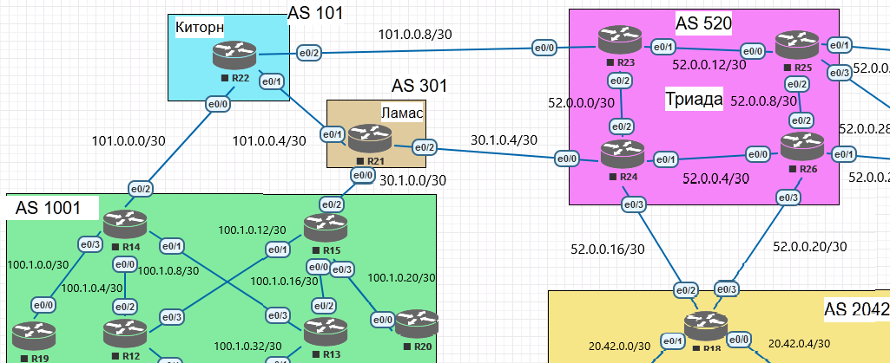

Лабораторная работа. BGP. Основы. 
---------

Топология
---------



Задачи
---------

Настроить BGP между автономными системами Организовать доступность между офисами Москва и С.-Петербург.
В этой самостоятельной работе следующие задачи:
1. eBGP между офисом Москва и двумя провайдерами - Киторн и Ламас;
2. Настроите eBGP между провайдерами Киторн и Ламас;
3. Настроите eBGP между Ламас и Триада;
4. eBGP между офисом С.-Петербург и провайдером Триада;
5. Организуете IP доступность между офисами Москва и С.-Петербург;
6. План работы и изменения зафиксированы в документации.

Решение
---------

#### Настроим eBGP на маршрутизаторах AS 1001 (R14/15)

##### Конфигурация R14:

```
router bgp 1001
 bgp router-id 14.14.14.14
 bgp log-neighbor-changes
 network 100.1.0.0 mask 255.255.252.0
 neighbor 101.0.0.1 remote-as 101
ip route 100.1.0.0 255.255.252.0 Null0
```

##### Таблица маршрутизации R14:

```
R14#show ip route bgp
Codes: L - local, C - connected, S - static, R - RIP, M - mobile, B - BGP
       D - EIGRP, EX - EIGRP external, O - OSPF, IA - OSPF inter area
       N1 - OSPF NSSA external type 1, N2 - OSPF NSSA external type 2
       E1 - OSPF external type 1, E2 - OSPF external type 2
       i - IS-IS, su - IS-IS summary, L1 - IS-IS level-1, L2 - IS-IS level-2
       ia - IS-IS inter area, * - candidate default, U - per-user static route
       o - ODR, P - periodic downloaded static route, H - NHRP, l - LISP
       + - replicated route, % - next hop override

Gateway of last resort is not set

      20.0.0.0/22 is subnetted, 1 subnets
B        20.42.0.0 [20/0] via 101.0.0.1, 10:22:27
      30.0.0.0/28 is subnetted, 1 subnets
B        30.1.0.0 [20/0] via 101.0.0.1, 10:42:12
      52.0.0.0/26 is subnetted, 1 subnets
B        52.0.0.0 [20/0] via 101.0.0.1, 10:36:06
      101.0.0.0/8 is variably subnetted, 3 subnets, 3 masks
B        101.0.0.0/28 [20/0] via 101.0.0.1, 10:55:16
```

##### Конфигурация R15:

```
router bgp 1001
 bgp router-id 15.15.15.15
 bgp log-neighbor-changes
 network 100.1.0.0 mask 255.255.252.0
 neighbor 30.1.0.1 remote-as 301
ip route 100.1.0.0 255.255.252.0 Null0
```

##### Таблица маршрутизации R15:

```
R15#show ip route bgp
Codes: L - local, C - connected, S - static, R - RIP, M - mobile, B - BGP
       D - EIGRP, EX - EIGRP external, O - OSPF, IA - OSPF inter area
       N1 - OSPF NSSA external type 1, N2 - OSPF NSSA external type 2
       E1 - OSPF external type 1, E2 - OSPF external type 2
       i - IS-IS, su - IS-IS summary, L1 - IS-IS level-1, L2 - IS-IS level-2
       ia - IS-IS inter area, * - candidate default, U - per-user static route
       o - ODR, P - periodic downloaded static route, H - NHRP, l - LISP
       + - replicated route, % - next hop override

Gateway of last resort is not set

      20.0.0.0/22 is subnetted, 1 subnets
B        20.42.0.0 [20/0] via 30.1.0.1, 10:21:05
      30.0.0.0/8 is variably subnetted, 3 subnets, 3 masks
B        30.1.0.0/28 [20/0] via 30.1.0.1, 10:44:49
      52.0.0.0/26 is subnetted, 1 subnets
B        52.0.0.0 [20/0] via 30.1.0.1, 10:34:43
      101.0.0.0/28 is subnetted, 1 subnets
B        101.0.0.0 [20/0] via 30.1.0.1, 10:40:49
```

#### Настроим eBGP на маршрутизаторе AS 101 R22

##### Конфигурация R22:

```
router bgp 101
 bgp router-id 22.22.22.22
 bgp log-neighbor-changes
 network 101.0.0.0 mask 255.255.255.240
 neighbor 101.0.0.2 remote-as 1001
 neighbor 101.0.0.6 remote-as 301
ip route 101.0.0.0 255.255.255.240 Null0
```

##### Таблица маршрутизации R22:

```
R22#show ip route bgp
Codes: L - local, C - connected, S - static, R - RIP, M - mobile, B - BGP
       D - EIGRP, EX - EIGRP external, O - OSPF, IA - OSPF inter area
       N1 - OSPF NSSA external type 1, N2 - OSPF NSSA external type 2
       E1 - OSPF external type 1, E2 - OSPF external type 2
       i - IS-IS, su - IS-IS summary, L1 - IS-IS level-1, L2 - IS-IS level-2
       ia - IS-IS inter area, * - candidate default, U - per-user static route
       o - ODR, P - periodic downloaded static route, H - NHRP, l - LISP
       + - replicated route, % - next hop override

Gateway of last resort is not set

      20.0.0.0/22 is subnetted, 1 subnets
B        20.42.0.0 [20/0] via 101.0.0.6, 10:24:57
      30.0.0.0/28 is subnetted, 1 subnets
B        30.1.0.0 [20/0] via 101.0.0.6, 10:44:41
      52.0.0.0/26 is subnetted, 1 subnets
B        52.0.0.0 [20/0] via 101.0.0.6, 10:38:36
      100.0.0.0/22 is subnetted, 1 subnets
B        100.1.0.0 [20/0] via 101.0.0.2, 10:55:35
```

#### Настроим eBGP на маршрутизаторе AS 301 R21

##### Конфигурация R21:

```
router bgp 301
 bgp router-id 21.21.21.21
 bgp log-neighbor-changes
 network 30.1.0.0 mask 255.255.255.240
 neighbor 30.1.0.2 remote-as 1001
 neighbor 30.1.0.6 remote-as 520
 neighbor 101.0.0.5 remote-as 101
ip route 30.1.0.0 255.255.255.240 Null0
```

##### Таблица маршрутизации R21:

```
R21#show ip route bgp
Codes: L - local, C - connected, S - static, R - RIP, M - mobile, B - BGP
       D - EIGRP, EX - EIGRP external, O - OSPF, IA - OSPF inter area
       N1 - OSPF NSSA external type 1, N2 - OSPF NSSA external type 2
       E1 - OSPF external type 1, E2 - OSPF external type 2
       i - IS-IS, su - IS-IS summary, L1 - IS-IS level-1, L2 - IS-IS level-2
       ia - IS-IS inter area, * - candidate default, U - per-user static route
       o - ODR, P - periodic downloaded static route, H - NHRP, l - LISP
       + - replicated route, % - next hop override

Gateway of last resort is not set

      20.0.0.0/22 is subnetted, 1 subnets
B        20.42.0.0 [20/0] via 30.1.0.6, 10:26:35
      52.0.0.0/26 is subnetted, 1 subnets
B        52.0.0.0 [20/0] via 30.1.0.6, 10:40:14
      100.0.0.0/22 is subnetted, 1 subnets
B        100.1.0.0 [20/0] via 30.1.0.2, 10:49:11
      101.0.0.0/8 is variably subnetted, 3 subnets, 3 masks
B        101.0.0.0/28 [20/0] via 101.0.0.5, 10:46:20
```

#### Настроим eBGP на маршрутизаторах AS 520 (R24,R26)

##### Конфигурация R24:

```
router bgp 520
 bgp router-id 24.24.24.24
 bgp log-neighbor-changes
 network 52.0.0.0 mask 255.255.255.192
 neighbor 30.1.0.5 remote-as 301
 neighbor 52.0.0.18 remote-as 2042
ip route 52.0.0.0 255.255.255.192 Null0
```

##### Таблица маршрутизации R24:

```
R24#show ip route bgp
Codes: L - local, C - connected, S - static, R - RIP, M - mobile, B - BGP
       D - EIGRP, EX - EIGRP external, O - OSPF, IA - OSPF inter area
       N1 - OSPF NSSA external type 1, N2 - OSPF NSSA external type 2
       E1 - OSPF external type 1, E2 - OSPF external type 2
       i - IS-IS, su - IS-IS summary, L1 - IS-IS level-1, L2 - IS-IS level-2
       ia - IS-IS inter area, * - candidate default, U - per-user static route
       o - ODR, P - periodic downloaded static route, H - NHRP, l - LISP
       + - replicated route, % - next hop override

Gateway of last resort is not set

      20.0.0.0/22 is subnetted, 1 subnets
B        20.42.0.0 [20/0] via 52.0.0.18, 10:28:42
      30.0.0.0/8 is variably subnetted, 3 subnets, 3 masks
B        30.1.0.0/28 [20/0] via 30.1.0.5, 10:43:55
      100.0.0.0/22 is subnetted, 1 subnets
B        100.1.0.0 [20/0] via 30.1.0.5, 10:43:55
      101.0.0.0/28 is subnetted, 1 subnets
B        101.0.0.0 [20/0] via 30.1.0.5, 10:43:55
```

##### Конфигурация R26:

```
router bgp 520
 bgp router-id 26.26.26.26
 bgp log-neighbor-changes
 network 52.0.0.0 mask 255.255.255.192
 neighbor 52.0.0.22 remote-as 2042
ip route 52.0.0.0 255.255.255.192 Null0
```

##### Таблица маршрутизации R26:

```
R26#show ip route bgp
Codes: L - local, C - connected, S - static, R - RIP, M - mobile, B - BGP
       D - EIGRP, EX - EIGRP external, O - OSPF, IA - OSPF inter area
       N1 - OSPF NSSA external type 1, N2 - OSPF NSSA external type 2
       E1 - OSPF external type 1, E2 - OSPF external type 2
       i - IS-IS, su - IS-IS summary, L1 - IS-IS level-1, L2 - IS-IS level-2
       ia - IS-IS inter area, * - candidate default, U - per-user static route
       o - ODR, P - periodic downloaded static route, H - NHRP, l - LISP
       + - replicated route, % - next hop override

Gateway of last resort is not set

      20.0.0.0/22 is subnetted, 1 subnets
B        20.42.0.0 [20/0] via 52.0.0.22, 10:30:49
```

#### Настроим eBGP на маршрутизаторе AS 2042 R18

##### Конфигурация R18:

```
router bgp 2042
 bgp router-id 18.18.18.18
 bgp log-neighbor-changes
 network 20.42.0.0 mask 255.255.252.0
 neighbor 52.0.0.17 remote-as 520
 neighbor 52.0.0.21 remote-as 520
ip route 20.42.0.0 255.255.252.0 Null0
```

##### Таблица маршрутизации R18:

```
R18#show ip route bgp
Codes: L - local, C - connected, S - static, R - RIP, M - mobile, B - BGP
       D - EIGRP, EX - EIGRP external, O - OSPF, IA - OSPF inter area
       N1 - OSPF NSSA external type 1, N2 - OSPF NSSA external type 2
       E1 - OSPF external type 1, E2 - OSPF external type 2
       i - IS-IS, su - IS-IS summary, L1 - IS-IS level-1, L2 - IS-IS level-2
       ia - IS-IS inter area, * - candidate default, U - per-user static route
       o - ODR, P - periodic downloaded static route, H - NHRP, l - LISP
       + - replicated route, % - next hop override

Gateway of last resort is not set

      30.0.0.0/28 is subnetted, 1 subnets
B        30.1.0.0 [20/0] via 52.0.0.17, 10:36:44
      52.0.0.0/8 is variably subnetted, 5 subnets, 3 masks
B        52.0.0.0/26 [20/0] via 52.0.0.21, 10:38:46
      100.0.0.0/22 is subnetted, 1 subnets
B        100.1.0.0 [20/0] via 52.0.0.17, 10:36:44
      101.0.0.0/28 is subnetted, 1 subnets
B        101.0.0.0 [20/0] via 52.0.0.17, 10:36:44
```

#### Проверим IP связаность между офисами Москва и С.-Петербург

##### Ping от маршрутизатора R14 до маршрутизатора R18:

```
R14#ping 20.42.0.1
Type escape sequence to abort.
Sending 5, 100-byte ICMP Echos to 20.42.0.1, timeout is 2 seconds:
!!!!!
Success rate is 100 percent (5/5), round-trip min/avg/max = 1/1/1 ms
```

##### Ping от маршрутизатора R15 до маршрутизатора R18:

```
R15#ping 20.42.0.1
Type escape sequence to abort.
Sending 5, 100-byte ICMP Echos to 20.42.0.1, timeout is 2 seconds:
!!!!!
Success rate is 100 percent (5/5), round-trip min/avg/max = 1/1/1 ms
```