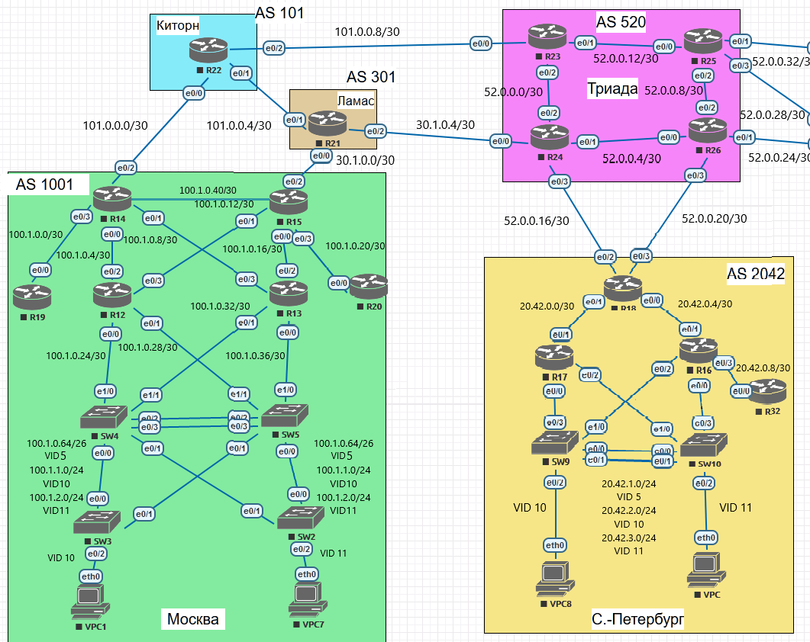

Лабораторная работа. BGP Filter.
---------

Топология
---------



Задачи
---------

Настроить фильтрацию для офиса Москва, настроить фильтрацию для офиса С.-Петербург.
1. Настроить фильтрацию в офисе Москва так, чтобы не появилось транзитного трафика(As-path)
2. Настроить фильтрацию в офисе С.-Петербург так, чтобы не появилось транзитного трафика(Prefix-list)
3. Настроить провайдера Киторн так, чтобы в офис Москва отдавался только маршрут по-умолчанию
4. Настроить провайдера Ламас так, чтобы в офис Москва отдавался только маршрут по-умолчанию и префикс офиса С.-Петербург
5. Все сети в лабораторной работе должны иметь IP связность
6. План работы и изменения зафиксированы в документации

Решение
---------

#### Настроим фильрацию на маршрутизаторах AS 1001 (R14/15)

##### Конфигурация R14:

```
ip as-path access-list 1 permit ^$
ip as-path access-list 1 deny .*
router bgp 1001
 neighbor 101.0.0.1 remote-as 101
 neighbor 101.0.0.1 filter-list 1 out
```

##### Конфигурация R15:

```
ip as-path access-list 1 permit ^$
ip as-path access-list 1 deny .*
router bgp 1001
 neighbor 30.1.0.1 remote-as 301
 neighbor 30.1.0.1 filter-list 1 out
```

##### Таблица BGP AS101 (UP-Link для R14):

```
R22#show ip bgp
BGP table version is 9, local router ID is 22.22.22.22
Status codes: s suppressed, d damped, h history, * valid, > best, i - internal,
              r RIB-failure, S Stale, m multipath, b backup-path, f RT-Filter,
              x best-external, a additional-path, c RIB-compressed,
Origin codes: i - IGP, e - EGP, ? - incomplete
RPKI validation codes: V valid, I invalid, N Not found

     Network          Next Hop            Metric LocPrf Weight Path
     0.0.0.0          0.0.0.0                                0 i
 *   20.42.0.0/22     101.0.0.6                              0 301 520 2042 i
 *>                   101.0.0.10                             0 520 2042 i
 *   30.1.0.0/28      101.0.0.10                             0 520 301 i
 *>                   101.0.0.6                0             0 301 i
 *   52.0.0.0/26      101.0.0.6                              0 301 520 i
 *>                   101.0.0.10               0             0 520 i
 *   100.1.0.0/22     101.0.0.10                             0 520 301 1001 i
 *>                   101.0.0.6                              0 301 1001 i
 *                    101.0.0.2                0             0 1001 1001 1001 1001 1001 i
 *>  101.0.0.0/28     0.0.0.0                  0         32768 i

```

##### Таблица BGP AS301 (UP-Link для R15):

```
R21#show ip bgp
BGP table version is 8, local router ID is 21.21.21.21
Status codes: s suppressed, d damped, h history, * valid, > best, i - internal,
              r RIB-failure, S Stale, m multipath, b backup-path, f RT-Filter,
              x best-external, a additional-path, c RIB-compressed,
Origin codes: i - IGP, e - EGP, ? - incomplete
RPKI validation codes: V valid, I invalid, N Not found

     Network          Next Hop            Metric LocPrf Weight Path
     0.0.0.0          0.0.0.0                                0 i
 *   20.42.0.0/22     101.0.0.5                              0 101 520 2042 i
 *>                   30.1.0.6                               0 520 2042 i
 *>  30.1.0.0/28      0.0.0.0                  0         32768 i
 *   52.0.0.0/26      101.0.0.5                              0 101 520 i
 *>                   30.1.0.6                 0             0 520 i
 *>  100.1.0.0/22     30.1.0.2                 0             0 1001 i
 *   101.0.0.0/28     30.1.0.6                               0 520 101 i
 *>                   101.0.0.5                0             0 101 i

```

#### Настроим фильрацию на маршрутизаторе AS 2042 R18

##### Конфигурация R18:

```
ip prefix-list 1 seq 5 permit 20.42.0.0/22
ip prefix-list 1 seq 10 deny 0.0.0.0/0 le 32
router bgp 2042
 neighbor AS2042_OUT peer-group
 neighbor AS2042_OUT remote-as 520
 neighbor AS2042_OUT prefix-list 1 out
 neighbor 52.0.0.17 peer-group AS2042_OUT
 neighbor 52.0.0.21 peer-group AS2042_OUT
```

##### Таблица BGP AS520 R24 (UP-Link для R18):

```
R24#show ip bgp
BGP table version is 6, local router ID is 24.24.24.24
Status codes: s suppressed, d damped, h history, * valid, > best, i - internal,
              r RIB-failure, S Stale, m multipath, b backup-path, f RT-Filter,
              x best-external, a additional-path, c RIB-compressed,
Origin codes: i - IGP, e - EGP, ? - incomplete
RPKI validation codes: V valid, I invalid, N Not found

     Network          Next Hop            Metric LocPrf Weight Path
 *>  20.42.0.0/22     52.0.0.18                0             0 2042 i
 *>  30.1.0.0/28      30.1.0.5                 0             0 301 i
 * i 52.0.0.0/26      23.23.23.23              0    100      0 i
 *>                   0.0.0.0                  0         32768 i
 *>  100.1.0.0/22     30.1.0.5                               0 301 1001 i
 *   101.0.0.0/28     30.1.0.5                               0 301 101 i
 *>i                  23.23.23.23              0    100      0 101 i

```

##### Таблица BGP AS520 R26 (UP-Link для R18):

```
R26#show ip bgp
BGP table version is 6, local router ID is 26.26.26.26
Status codes: s suppressed, d damped, h history, * valid, > best, i - internal,
              r RIB-failure, S Stale, m multipath, b backup-path, f RT-Filter,
              x best-external, a additional-path, c RIB-compressed,
Origin codes: i - IGP, e - EGP, ? - incomplete
RPKI validation codes: V valid, I invalid, N Not found

     Network          Next Hop            Metric LocPrf Weight Path
 * i 20.42.0.0/22     24.24.24.24              0    100      0 2042 i
 *>                   52.0.0.22                0             0 2042 i
 *>i 30.1.0.0/28      24.24.24.24              0    100      0 301 i
 * i 52.0.0.0/26      23.23.23.23              0    100      0 i
 *>                   0.0.0.0                  0         32768 i
 *>i 100.1.0.0/22     24.24.24.24              0    100      0 301 1001 i
 *>i 101.0.0.0/28     23.23.23.23              0    100      0 101 i
```

#### Настроим фильрацию на маршрутизаторе AS 101 (Киторн)

##### Конфигурация R22:

```
ip as-path access-list 1 deny .*
router bgp 101
 neighbor 101.0.0.2 remote-as 1001
 neighbor 101.0.0.2 default-originate
 neighbor 101.0.0.2 filter-list 1 out
```

##### Таблица маршрутизации AS1001 R14 (клиент Киторн):

```
R14#show ip route bgp
Codes: L - local, C - connected, S - static, R - RIP, M - mobile, B - BGP
       D - EIGRP, EX - EIGRP external, O - OSPF, IA - OSPF inter area
       N1 - OSPF NSSA external type 1, N2 - OSPF NSSA external type 2
       E1 - OSPF external type 1, E2 - OSPF external type 2
       i - IS-IS, su - IS-IS summary, L1 - IS-IS level-1, L2 - IS-IS level-2
       ia - IS-IS inter area, * - candidate default, U - per-user static route
       o - ODR, P - periodic downloaded static route, H - NHRP, l - LISP
       + - replicated route, % - next hop override

Gateway of last resort is 101.0.0.1 to network 0.0.0.0

B*    0.0.0.0/0 [20/0] via 101.0.0.1, 00:15:59
      20.0.0.0/22 is subnetted, 1 subnets
B        20.42.0.0 [200/0] via 15.15.15.15, 00:15:09
```

#### Настроим фильрацию на маршрутизаторе AS 301 (Ламас)

##### Конфигурация R21:

```
ip as-path access-list 1 permit _2042_
ip as-path access-list 1 deny .*
router bgp 301
 neighbor 30.1.0.2 remote-as 1001
 neighbor 30.1.0.2 default-originate
 neighbor 30.1.0.2 filter-list 1 out
```

##### Таблица маршрутизации AS1001 R15 (клиент Ламас):

```
R15#show ip route bgp
Codes: L - local, C - connected, S - static, R - RIP, M - mobile, B - BGP
       D - EIGRP, EX - EIGRP external, O - OSPF, IA - OSPF inter area
       N1 - OSPF NSSA external type 1, N2 - OSPF NSSA external type 2
       E1 - OSPF external type 1, E2 - OSPF external type 2
       i - IS-IS, su - IS-IS summary, L1 - IS-IS level-1, L2 - IS-IS level-2
       ia - IS-IS inter area, * - candidate default, U - per-user static route
       o - ODR, P - periodic downloaded static route, H - NHRP, l - LISP
       + - replicated route, % - next hop override

Gateway of last resort is 30.1.0.1 to network 0.0.0.0

B*    0.0.0.0/0 [20/0] via 30.1.0.1, 00:20:44
      20.0.0.0/22 is subnetted, 1 subnets
B        20.42.0.0 [20/0] via 30.1.0.1, 00:19:55
```