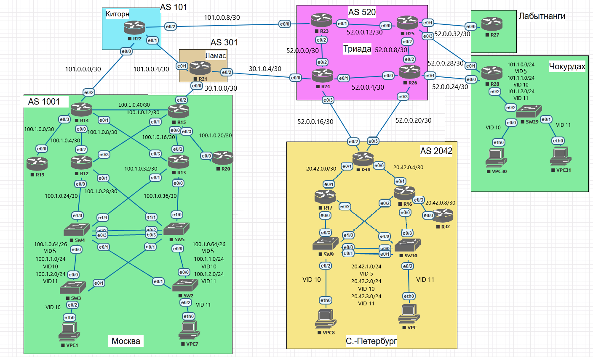

Лабораторная работа. DHCP/NAT/NTP.
---------

Топология
---------



Задачи
---------

Настроить DHCP в офисе Москва Настроить синхронизацию времени в офисе Москва Настроить NAT в офисе Москва, C.-Перетбруг и Чокурдах
1. Настроите NAT(PAT) на R14 и R15. Трансляция должна осуществляться в адрес автономной системы AS1001
2. Настроите NAT(PAT) на R18. Трансляция должна осуществляться в пул из 5 адресов автономной системы AS2042
3. Настроите статический NAT для R20
4. Настроите NAT так, чтобы R19 был доступен с любого узла для удаленного управления
5. Настроите статический NAT(PAT) для офиса Чокурдах
6. Настроите DHCP сервер в офисе Москва на маршрутизаторах R12 и R13. VPC1 и VPC7 должны получать сетевые настройки по DHCP
7. Настроите NTP сервер на R12 и R13. Все устройства в офисе Москва должны синхронизировать время с R12 и R13
8. Все офисы в лабораторной работе должны иметь IP связность
9. План работы и изменения зафиксированы в документации

Решение
---------

#### Настроим маршрутизаторы AS 1001

##### Конфигурация R14:

```
interface Ethernet0/0
 ip nat inside
interface Ethernet0/1
 ip nat inside
interface Ethernet0/2
 ip nat outside
interface Ethernet0/3
 ip nat inside
interface Ethernet1/0
 ip nat inside
ip nat pool N-POOL1 100.1.0.254 100.1.0.254 prefix-length 30
ip nat inside source list 2 pool N-POOL1 overload
ntp server 100.1.0.6
```

##### NAT таблица R14:

```
R14#show ip nat translations
Pro Inside global      Inside local       Outside local      Outside global
icmp 100.1.0.254:45140 100.1.2.11:45140   52.0.0.1:45140     52.0.0.1:45140
icmp 100.1.0.254:45652 100.1.2.11:45652   52.0.0.1:45652     52.0.0.1:45652
icmp 100.1.0.254:46164 100.1.2.11:46164   52.0.0.1:46164     52.0.0.1:46164
icmp 100.1.0.254:46676 100.1.2.11:46676   52.0.0.1:46676     52.0.0.1:46676
```

##### Конфигурация R15:

```
interface Ethernet0/0
 ip nat inside
interface Ethernet0/1
 ip nat inside
interface Ethernet0/2
 ip nat outside
interface Ethernet0/3
 ip nat inside
interface Ethernet1/0
 ip nat inside
ip nat pool N-POOL1 100.1.0.254 100.1.0.254 prefix-length 30
ip nat inside source list 2 pool N-POOL1 overload
ip nat inside source static 100.1.0.2 100.1.0.253
ntp server 100.1.0.18
```

##### NAT таблица R15:

```
R15#show ip nat translations
Pro Inside global      Inside local       Outside local      Outside global
--- 100.1.0.253        100.1.0.2          ---                ---
icmp 100.1.0.254:40531 100.1.2.11:40531   52.0.0.1:40531     52.0.0.1:40531
icmp 100.1.0.254:40787 100.1.2.11:40787   52.0.0.1:40787     52.0.0.1:40787
icmp 100.1.0.254:41043 100.1.2.11:41043   52.0.0.1:41043     52.0.0.1:41043
icmp 100.1.0.254:41299 100.1.2.11:41299   52.0.0.1:41299     52.0.0.1:41299
```

##### Конфигурация R12:

```
clock timezone MSK 3 0
ip dhcp excluded-address 100.1.1.1 100.1.1.10
ip dhcp excluded-address 100.1.1.250 100.1.1.255
ip dhcp pool VID10_POOL
 network 100.1.1.0 255.255.255.0
 default-router 100.1.1.1
 dns-server 100.1.1.1
 domain-name Moskov10.lan
ntp master 2
ntp update-calendar
```

##### DHCP таблица R12:

```
R12#show ip dhcp binding
Bindings from all pools not associated with VRF:
IP address          Client-ID/              Lease expiration        Type
                    Hardware address/
                    User name
100.1.1.11          0100.5079.6668.01       Jun 27 2020 11:03 AM    Automatic
```


##### Конфигурация R13:

```
clock timezone MSK 3 0
ip dhcp excluded-address 100.1.2.1 100.1.2.10
ip dhcp excluded-address 100.1.2.250 100.1.2.255
ip dhcp pool VID11_POOL
 network 100.1.2.0 255.255.255.0
 default-router 100.1.2.1
 dns-server 100.1.2.1
 domain-name Moskov11.lan
ntp master 2
ntp update-calendar
```

##### DHCP таблица R13:

```
R13#show ip dhcp binding
Bindings from all pools not associated with VRF:
IP address          Client-ID/              Lease expiration        Type
                    Hardware address/
                    User name
100.1.2.11          0100.5079.6668.07       Jun 27 2020 11:06 PM    Automatic
```

##### Конфигурация SW4:

```
interface Vlan10
 ip helper-address 100.1.0.25
interface Vlan11
 ip helper-address 100.1.0.33
ntp server 100.1.0.26
```

##### Конфигурация SW5:

```
interface Vlan10
 ip helper-address 100.1.0.29
interface Vlan11
 ip helper-address 100.1.0.37
ntp server 100.1.0.37
```

##### Конфигурация R20:

```
interface Ethernet0/0
 ip nat outside
interface Ethernet0/1
 ip address 100.1.0.129 255.255.255.192
 ip nat inside
ip nat inside source static 100.1.0.130 100.1.0.131
access-list 1 permit 100.1.0.0 0.0.3.255
ntp server 100.1.0.18
```


##### Конфигурация R19:

```
ntp server 100.1.0.6
```

#### Настроим маршрутизаторы AS 1001 (R18)

##### Конфигурация R18:

```
interface Ethernet0/0
 ip nat inside
interface Ethernet0/1
 ip nat inside
interface Ethernet0/2
 ip nat outside
interface Ethernet0/3
 ip nat outside
ip nat pool N-POOL1 20.42.0.249 20.42.0.254 prefix-length 24
ip nat inside source list 2 pool N-POOL1 overload
access-list 2 permit 20.42.0.0 0.0.3.255
```

##### NAT таблица R18:

```
R18#show ip nat translations
Pro Inside global      Inside local       Outside local      Outside global
icmp 20.42.0.249:25174 20.42.2.10:25174   101.0.0.1:25174    101.0.0.1:25174
icmp 20.42.0.249:25430 20.42.2.10:25430   101.0.0.1:25430    101.0.0.1:25430
icmp 20.42.0.249:25686 20.42.2.10:25686   101.0.0.1:25686    101.0.0.1:25686
icmp 20.42.0.249:25942 20.42.2.10:25942   101.0.0.1:25942    101.0.0.1:25942
icmp 20.42.0.249:26198 20.42.2.10:26198   101.0.0.1:26198    101.0.0.1:26198
```

#### Настроим маршрутизаторы Чокурдах (R28)

##### Конфигурация R28:

```
interface Ethernet0/0
 ip nat outside
interface Ethernet0/1
 ip nat outside
interface Ethernet0/2
 ip nat inside
interface Ethernet0/2.5
 ip nat inside
interface Ethernet0/2.10
 ip nat inside
interface Ethernet0/2.11
 ip nat inside
ip nat inside source list 1 interface Ethernet0/1 overload
ip nat inside source list 2 interface Ethernet0/0 overload
access-list 1 permit 101.1.1.0 0.0.0.255
access-list 2 permit 101.1.2.0 0.0.0.255
```

##### NAT таблица R28:

```
R28#show ip nat translations
Pro Inside global      Inside local       Outside local      Outside global
icmp 52.0.0.30:1623    101.1.1.10:1623    101.0.0.2:1623     101.0.0.2:1623
icmp 52.0.0.30:1879    101.1.1.10:1879    101.0.0.2:1879     101.0.0.2:1879
icmp 52.0.0.30:2135    101.1.1.10:2135    101.0.0.2:2135     101.0.0.2:2135
icmp 52.0.0.30:2391    101.1.1.10:2391    101.0.0.2:2391     101.0.0.2:2391
```
